## 前言

中心化交易所（CEX）是加密货币生态的核心基础设施。一个生产级 CEX 背后是多个高度耦合又职责分离的子系统：**撮合系统**负责将买卖订单匹配成交，**清算系统**负责计算交易结果、管理用户资产和仓位，**做市系统**负责提供流动性、维护健康的盘口深度。

本文从一个中型 CEX 的真实技术实现为蓝本，从以下四个核心系统展开：

1. **撮合系统（Matching Engine）** — 订单如何被匹配，盘口如何维护
2. **清算系统（Clearing & Settlement）** — 成交后资金如何清算，合约仓位如何管理，强平如何触发
3. **风控与限价体系** — 杠杆、强平、止盈止损、市场干预
4. **做市系统（Market Making）** — 做市机器人如何实现流动性管理，价格策略如何工作

配合三套生产级做市机器人（现货基础做市 / 智能策略做市 / 永续合约做市）的实现分析，完整呈现一套 CEX 做市基础设施的真实面貌。

## 一、CEX 整体架构概览

一个典型的 CEX 系统采用**分层+事件驱动**架构，从用户接入到资金管理共分为五层：

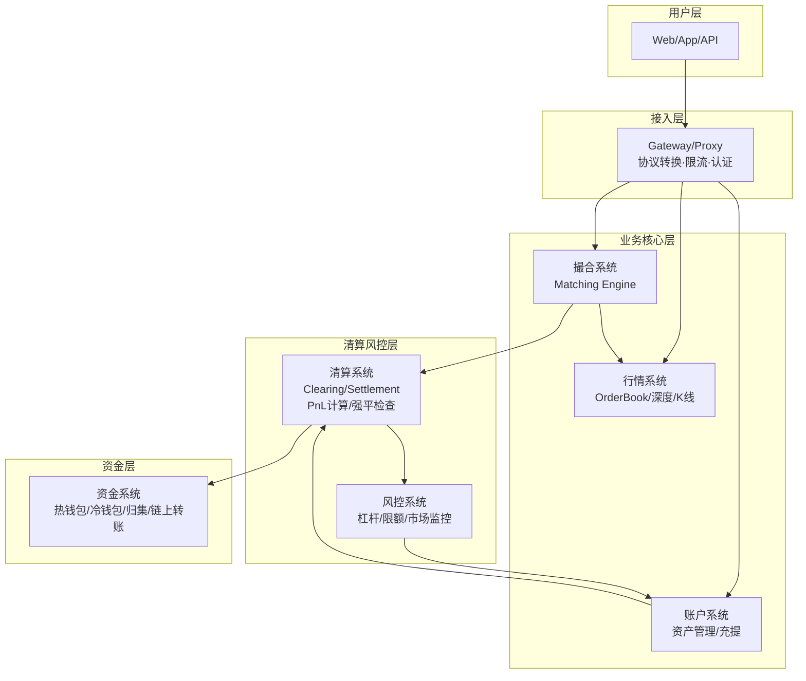

**分层设计的意义**：每一层都可以独立扩展、独立部署、独立故障。撮合系统需要毫秒级延迟，通常部署在裸金属服务器上靠近 CPU；而清算系统需要强一致性和事务保障，可以使用数据库集群；资金系统需要最高级别的安全隔离，通常运行在独立的网络环境中。

本文聚焦于**撮合系统**、**清算系统**和**做市系统**这三个最核心的子系统。

<!-- more -->
## 二、撮合系统（Matching Engine）

撮合系统是交易所的"心脏"。每一笔交易最终都要经过撮合引擎完成价格发现和订单匹配。

### 2.1 核心数据结构

撮合引擎的核心是两张**价格优先队列**——一种特殊的排序数据结构，支持在 O(log n) 时间内完成插入和取最值操作：

- **买单队列（Bid Queue）**：按价格**从高到低**排序（大价优先），价格相同按时间**从先到后**（早到优先）
- **卖单队列（Ask Queue）**：按价格**从低到高**排序（小价优先），价格相同按时间**从先到后**

这是经典的 **Price-Time Priority** 规则，也是绝大多数 CEX 采用的原则。

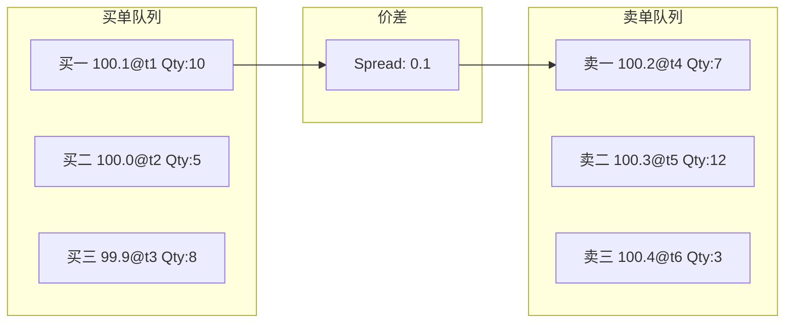

**数据结构选型**：生产环境中通常使用 **Skip List（跳表）** 或 **红黑树（Red-Black Tree）** 来实现价格队列，而不是简单的数组。原因是：
- 数组插入/删除需要 O(n) 的平移操作，性能无法满足微秒级要求
- Skip List 支持 O(log n) 的插入/删除/查询，且实现简单、并发友好
- 红黑树同样 O(log n)，但实现更复杂

### 2.2 订单类型与撮合逻辑

一个生产级撮合引擎需要支持多种订单类型，每种类型的处理路径不同：

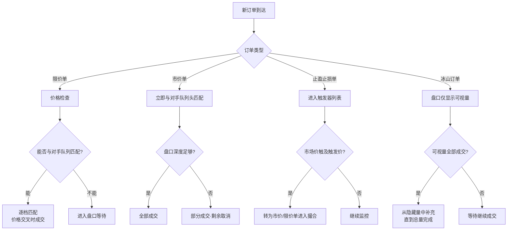

**限价单（Limit Order）**的完整匹配流程：

```
限价买单 价格=101, 数量=10
  ↓
① 检查卖单队列头：卖一 100.2
② 101 ≥ 100.2 → 价格交叉，可以成交
③ 成交价格 = 100.2（吃单方吃到了挂单价）
④ 卖一数量 7 < 买单数量 10 → 卖一全部成交，移除卖一
⑤ 继续检查新的卖一：卖二 100.3
⑥ 101 ≥ 100.3 → 继续成交
⑦ 成交数量 = min(剩余3, 卖二12) = 3
⑧ 买单剩余数量 = 0，成交结束
⑨ 卖二更新为 (100.3, 12-3=9)

成交明细：
  Fill 1: 100.2 @ 7
  Fill 2: 100.3 @ 3
  平均成交价: (100.2×7 + 100.3×3) / 10 = 100.23
```

**关键规则**：吃单方（Taker）总是以挂单方（Maker）的价格成交。这是 Maker-Taker 费率模型的根本——Maker 提供了流动性，所以手续费更低。

**市价单（Market Order）**的匹配逻辑——这里有一个常见误解需要澄清：

```
市价买单 数量=5
  ↓
① 不指定价格，直接与卖一匹配
② 卖一价格 100.2，可吃数量 7
③ 吃单数量 5 < 卖一可吃数量 7 → 部分成交卖一
④ 成交：价格=100.2, 数量=5
⑤ 买单完全成交，结束
⑥ 卖一更新为 (100.2, 2)

✅ 正确理解：买单数量 5 从卖一 7 中吃掉 5，卖一还剩 2
❌ 常见错误：误以为会吃掉整个卖一再吃下一档
```

**冰山订单（Iceberg Order）**：一种隐藏真实意图的高级订单类型。盘口只显示一个"可视量"，全部成交后从"隐藏量"中补充：

```
冰山买单: 总量=1000, 可视量=200, 价格=99.0
  ↓
盘口显示: 买五 99.0 Qty 200
  ↓ 该档被吃掉 200
自动补充: 买五 99.0 Qty 200（从隐藏量补充）
  ↓
盘口始终只看到 200，直到隐藏量也全部消耗
```

**止盈止损单（Stop Order）**：
这类订单不直接进入撮合队列，而是注册到**价格触发器（Price Trigger）**中。触发器持续监控标记价格，一旦触发条件满足，将止损单转化为市价单或限价单送入撮合引擎：

```python
# 止损触发器的核心逻辑
class StopPriceWatcher:
    def __init__(self):
        self.stop_orders = {}  # symbol -> list[StopOrder]
    
    def on_price_update(self, symbol, mark_price):
        for order in self.stop_orders.get(symbol, []):
            if order.trigger_condition == 'lte' and mark_price <= order.trigger_price:
                # 止损卖单触发 → 转化为市价卖单
                self.activate_stop_order(order, mark_price)
            elif order.trigger_condition == 'gte' and mark_price >= order.trigger_price:
                # 止损买单触发 → 转化为市价买单
                self.activate_stop_order(order, mark_price)
```

### 2.3 盘口数据推送

撮合引擎的每次状态变更（新订单、成交、撤单）都会产生**增量事件**，通过 WebSocket 推送给订阅用户：

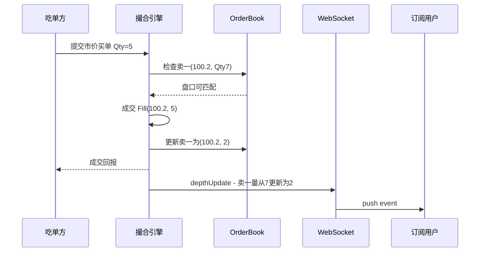

每次盘口推送的增量事件格式通常为：

```json
{
  "event": "depthUpdate",
  "symbol": "BTCUSDT",
  "bids": [["99900", "12.5"]],     // 新增或更新的买单档位
  "asks": [["100100", "3.2"]],     // 新增或更新的卖单档位
  "removes": ["100050.0"]          // 被移除的价格档位
}
```

这种**增量推送**比全量推送（每秒推送整个 OrderBook）带宽消耗低两个数量级，是生产级交易所的标配。

### 2.4 生产级挑战

真实撮合引擎面对的挑战远不止上述逻辑：

| 挑战 | 解决方案 | 原理 |
|------|----------|------|
| **低延迟** | 纯内存撮合，无锁数据结构 | 采用 Disruptor 模式或 CAS 自旋锁，避免上下文切换和 GC 停顿 |
| **高并发** | 按交易对分片 | 每个交易对有独立的撮合线程和内存空间，互不干扰，天然隔离 |
| **数据一致性** | WAL + 状态机复制 | Write-Ahead Log 先落盘再撮合，宕机后从 WAL 重建恢复 |
| **自成交预防** | STP 检查 | 订单进入队列前检查是否与同一用户的订单匹配 |
| **防插针** | 价格保护机制 | 市价单设置可成交价格范围，超出则自动取消 |
| **最小精度** | Tick Size 校验 | 拒绝不符合价格/数量精度的订单 |

**内存撮合的数据流**：

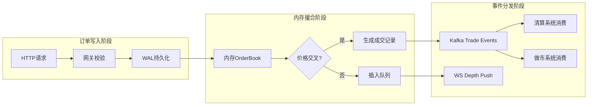

**为什么需要 WAL（Write-Ahead Log）**：
撮合引擎将订单写入 WAL 后才开始撮合。如果机器宕机，重启时从 WAL 重放所有已写入但未处理完的订单，**保证 at-least-once 语义**。WAL 本身采用顺序写入（append-only），性能远高于随机写入（~100x 差距）。

### 2.5 撮合系统的输出事件

撮合引擎产生的核心事件有两个，被下游多个系统消费：

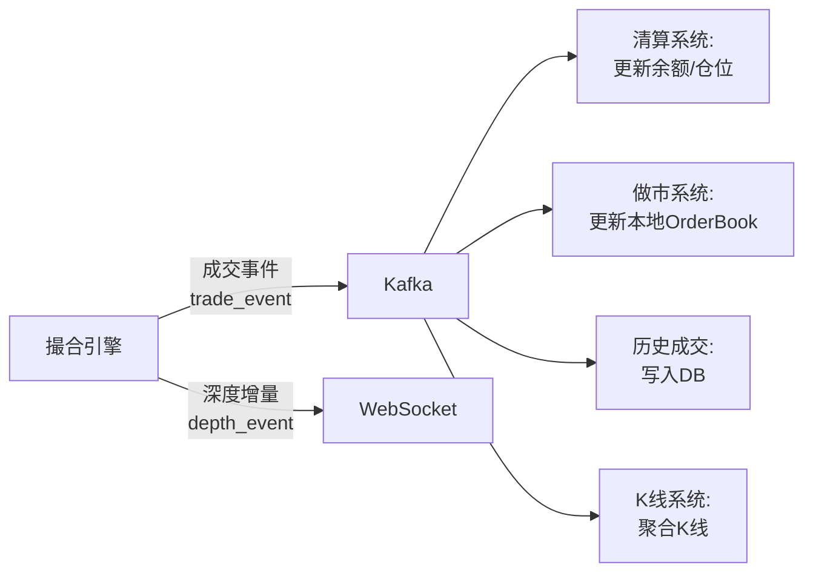

其中成交事件（Trade Event）的结构包含：

```json
{
  "event_type": "trade",
  "symbol": "BTCUSDT",
  "trade_id": 123456789,
  "maker_order_id": "M-abc",
  "taker_order_id": "T-def",
  "price": "100200.00",
  "quantity": "0.500",
  "side": "sell",          // taker 的方向
  "trade_time": 1700000000123,
  "is_taker_buy": false    // taker 是卖出方
}
```

做市系统消费这个事件来更新本地维护的订单簿——移除已成交订单，确保下一轮做市操作基于准确的盘口状态：

```python
# 做市机器人的 Kafka 消费逻辑
msg = consumer.poll(timeout=1.0)
if msg:
    matched_event = json.loads(msg.value().decode('utf-8'))
    side = matched_event['side']     # BUY / SELL
    price = matched_event['price']
    volume = matched_event['volume']
    order_id = matched_event['maker_order_id']
    # 从本地 OrderBook 中移除已成交的做市订单
    order_book.remove(order_id=order_id)
```

## 三、清算系统（Clearing & Settlement）

撮合系统产出的每一笔成交记录，都需要由清算系统处理。清算系统的核心职责是：

1. **资产清算**：扣除买方资产，增加卖方资产
2. **仓位管理**：对合约交易，更新用户的持仓方向和数量
3. **已实现盈亏计算**：平仓时结算 PnL
4. **保证金与杠杆管理**：维持保证金率检查，触发强平
5. **资金费率结算**：永续合约每 8 小时结算一次资金费率

### 3.1 清算的核心流程

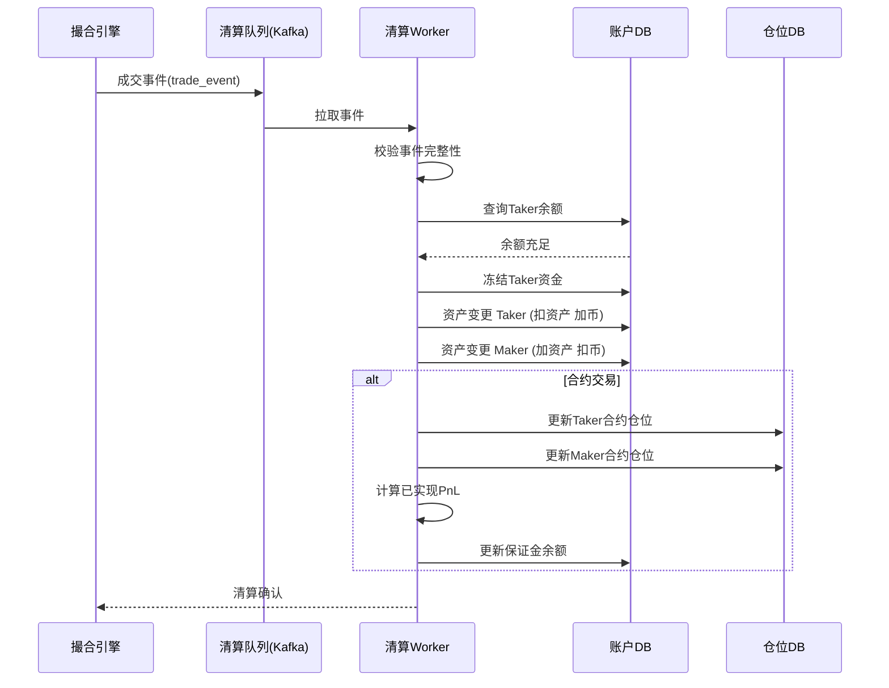

### 3.2 现货清算

现货交易的清算是最直接的资产交换：

```
用户A 买入 1 BTC @ 100,000 USDT
用户B 卖出 1 BTC @ 100,000 USDT

清算处理：
① 校验：用户A USDT余额 ≥ 100,000？
② 冻结：用户A USDT 余额减少 100,000（冻结状态）
③ 成交：撮合引擎返回成交确认
④ 清算：
    用户A: USDT -100,000, BTC +1
    用户B: USDT +100,000, BTC -1
⑤ 各用户的资产变更记录写入流水表
```

**现货清算的关键设计**：采用**两级余额模型**，即将账户余额分为"可用余额"和"冻结余额"：

```
account_balance: {
  "USDT": { "available": 50000, "frozen": 100000, "total": 150000 },
  "BTC":  { "available": 0.5,    "frozen": 0,      "total": 0.5   }
}
```

- 用户下单时，资产从 `available` 转入 `frozen`
- 撤单时，资产从 `frozen` 退回 `available`
- 成交时，冻结资产真正扣除，对手方资产增加

做市商通过交易所 API 下单时，下单接口内部就包含了这个**资产冻结检查**——这是清算系统的第一道防线：

```python
# 交易所 API 的下单请求处理
def create_order(symbol, side, type, volume, price=None):
    # 服务端校验：
    # 1. 账户资产是否充足 (available >= required)
    # 2. 是否超过风控限制 (单笔上限、24h 交易量限制)
    # 3. 价格是否在允许范围内 (价格保护、最小 Tick)
    # 4. 该交易对是否处于可交易状态
    check_account_balance(user_id, symbol, side, volume, price)
    check_risk_controls(user_id, symbol, volume)
    
    # 冻结资产
    freeze_asset(user_id, symbol, side, volume, price)
    
    # 发送到撮合引擎
    return submit_to_matching_engine(user_id, order)
```

### 3.3 合约清算

永续合约的清算远比现货复杂。核心概念包括：

| 概念 | 公式/说明 |
|------|-----------|
| **起始保证金** | 仓位价值 ÷ 杠杆倍数。例：1 BTC @ 100,000, 10x 杠杆 → 起始保证金 = 10,000 USDT |
| **维持保证金** | 维持仓位不被强平的最低资金，通常为起始保证金的 50% |
| **标记价格** | 用于计算未实现盈亏和强平触发，取多家交易所价格加权，防止操纵 |
| **未实现盈亏** | (标记价格 - 开仓均价) × 持仓数量 × 方向(多=1, 空=-1) |
| **已实现盈亏** | 已平仓部分的实际盈亏 |
| **保证金率** | 账户权益 ÷ 仓位价值，低于维持保证金率时触发强平 |

**完整的强平触发逻辑**：

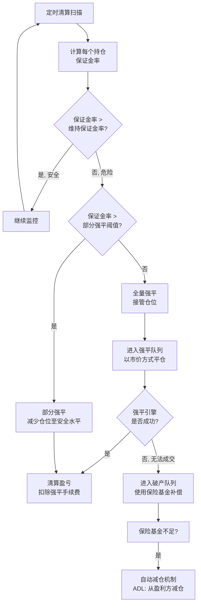

**保证金率计算的详细公式**：

```
全仓模式（Cross Margin）：
  账户权益 = 账户余额 + 所有仓位的未实现盈亏
  保证金率 = 账户权益 / 占用保证金
  强平触发：保证金率 ≤ 维持保证金率

逐仓模式（Isolated Margin）：
  仓位权益 = 该仓位的起始保证金 + 未实现盈亏 + 追加保证金
  保证金率 = 仓位权益 / 仓位价值
  强平触发：保证金率 ≤ 维持保证金率
```

这两个模式的差异在于：全仓模式下，所有仓位共享一个保证金池，一个仓位的亏损会从其他仓位的利润中扣除；逐仓模式下，每个仓位的保证金是隔离的，亏损不会波及到其他仓位。

### 3.4 资金费率机制

永续合约通过**资金费率**来实现价格与现货的锚定，这是永续合约区别于交割合约的核心设计：

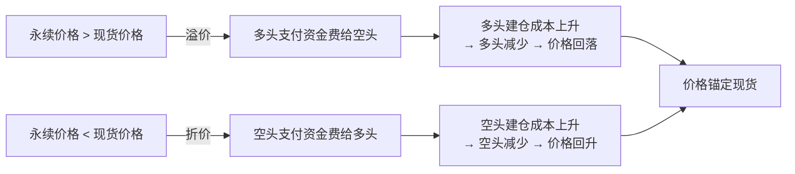

资金费率的计算公式：

```
资金费率(F) = 溢价指数(P) + clamp(利率(I) - 溢价指数(P), -0.05%, 0.05%)

其中：
  溢价指数(P) = (标记价格 - 现货指数价格) / 现货指数价格
  利率(I) = 0.01% (通常是固定的)

当 F > 0: 多头向空头支付
当 F < 0: 空头向多头支付
```

**做市机器人如何应对资金费率**：
永续合约做市机器人通过调整双边挂单量来对冲资金费率成本：

```python
# 永续合约做市中根据资金费率调整订单数量
def adjust_orderbook_by_funding_rate(orderbook, funding_rate, funding_rate_params):
    """
    funding_rate_params 结构:
    {
        "funding_rate_threshold": 0.0001,  # 资金费率阈值
        "bid_adjust_factor": 0.8,           # 买单调整系数
        "ask_adjust_factor": 1.2           # 卖单调整系数
    }
    """
    if abs(funding_rate) < funding_rate_params['funding_rate_threshold']:
        return orderbook  # 费率正常，不做调整
    
    if funding_rate > 0:
        # 多头付空头 → 减少买单（少收资金费），增加卖单（多收资金费）
        orderbook.bids.volume *= funding_rate_params['bid_adjust_factor']
        orderbook.asks.volume *= funding_rate_params['ask_adjust_factor']
    else:
        # 空头付多头 → 增加买单（多收资金费），减少卖单（少收资金费）
        orderbook.bids.volume /= funding_rate_params['ask_adjust_factor']
        orderbook.asks.volume /= funding_rate_params['bid_adjust_factor']
    
    return orderbook
```

这种策略的本质是：做市商在多头付空头时减少买单（少做多头仓位），增加卖单（多做空头仓位），从而**净收取资金费而非支付**。

### 3.5 清算架构设计

一个分布式清算系统采用事件驱动架构，通过 Kafka 解耦撮合与清算：

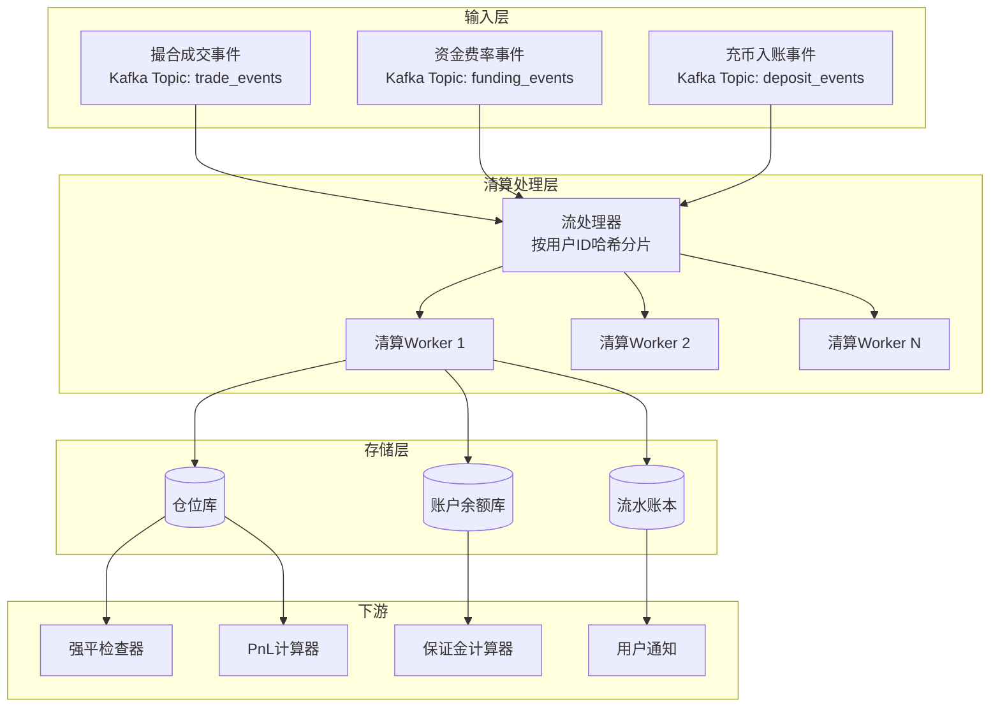

**关键设计决策**：
- **按用户 ID 哈希分片**：同一用户的所有事件路由到同一个 Worker，避免分布式事务
- **状态机模式**：每个仓位的状态变化遵循固定状态机（无仓位 → 持多 → 持空 → 平仓），非法状态转换直接拒绝
- **流水账本（Ledger）**：每一笔余额变动记录到不可变的流水表，支持全链路审计和回滚

## 四、做市系统（Market Making）

做市系统是 CEX 的"流动性引擎"。它的核心任务是：

1. **提供双边报价**：同时在买单和卖单侧挂单，提供市场深度
2. **缩小价差**：通过竞争性报价降低交易成本
3. **锚定主流价格**：跟随主流交易所的价格，防止价差偏离引发套利
4. **流动性支持**：在盘口深度不足时补足流动性

做市系统通常按市场类型分为三套：

| 做市类型 | 市场 | 核心功能 |
|----------|------|----------|
| **基础现货做市** | 现货 | 基础双边报价 + 刷量，适合流动性较差的交易对 |
| **智能策略做市** | 现货 | 多种价格策略（拉升/打压/震荡/跟随）+ 风控 + 资产监控 |
| **永续合约做市** | 永续合约 | 合约做市 + 标记价格 + 资金费率对冲 + 大节点分片 |

### 4.1 系统整体架构

三套做市系统共享同一套基础架构设计：

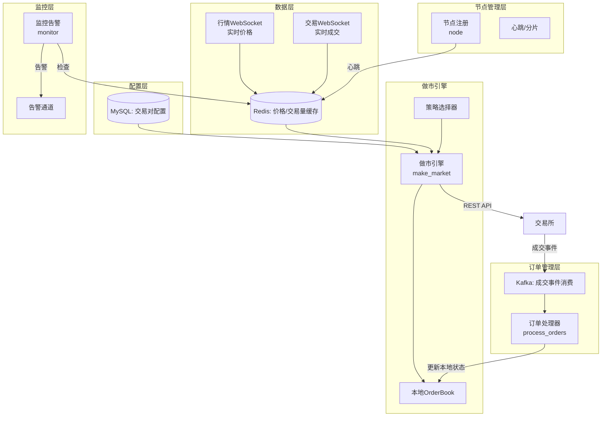

### 4.2 多源价格聚合（优雅降级设计）

做市系统的前提是有一个**可靠的外部参考价格**。系统从多个交易所通过 WebSocket 订阅实时行情，数据源覆盖主流行情交易所。

**价格聚合策略**——带优先级的优雅降级：

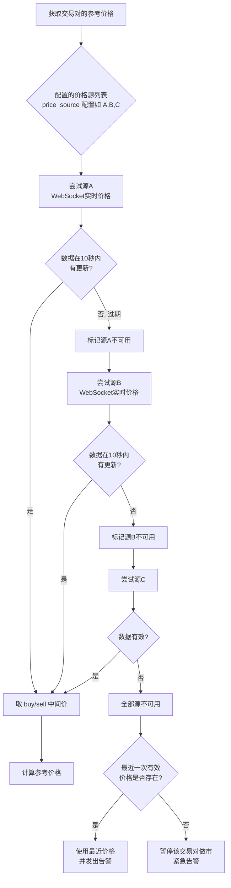

```python
# 价格聚合核心逻辑（伪代码，描述通用流程）
# 实际实现位于各项目的 external_price_*.py 中，
# 但核心流程高度相似：循环价格源列表 → 取第一个有效的中间价

def calculate_mid_price(symbol):
    """
    按优先级依次检查各数据源，取第一个最新的有效价格。
    
    实际 Redis key 格式因项目而异：
      - 现货做市 (spot):   LP:SPOT:{SYMBOL}      (汇总多源后的中间价)
      - 智能做市 (smm):    LP:SMM:{SYMBOL}:{EXCHANGE}  (各源独立)
      - 永续合约 (swap):   LP:SWAP:{SYMBOL}      (汇总多源后的中间价)
    
    value 包含字段：
      - last_price: 中间价
      - timestamp:  更新时间戳
      - ts_event:   事件时间戳
      - note:       备注
    
    价格过期阈值 max_price_update_interval 由数据库字段配置：
      - spot:  默认 60 秒
      - smm:   默认 30 秒
      - swap:  默认值在配置中自定义
    """
    price_sources = get_price_sources(symbol)  # 从DB读取，如 "bian,bybit,mexc"
    max_age = get_max_price_update_interval(symbol)
    
    for exchange in price_sources:
        # 各项目实际 key 格式略不同，这里用变量示意
        key = f"LP:{MARKET}:{SYMBOL}:{exchange}"
        data = redis.get(key)
        if not data:
            continue
        
        price_info = json.loads(data)
        age = current_timestamp() - price_info['timestamp']
        
        if age <= max_age:
            mid_price = float(price_info['last_price'])
            logger.info(f"使用价格源 {exchange}, {symbol} mid_price={mid_price}, age={age}ms")
            return mid_price
        else:
            logger.warning(f"价格源 {exchange} 数据过期: age={age}ms > {max_age}ms")
            # 实际行为：触发告警 + 自动重新订阅该源（不会自动切换到下一源，
            # 下一源的尝试是 for 循环自然推进）
    
    # 全部源过期 → 实际行为是告警 + 维持上一次有效价格
    # 三个项目都没有显式的"暂停做市+紧急告警"分支
    logger.error(f"{symbol} 全部价格源过期")
    alarm.send("PriceAllExpired", f"{symbol} 全部价格源过期")
    return get_last_valid_price(symbol)  # 实际是 Redis 中上次有效值
```

**关于价格聚合的实际情况**：

- **三个项目的实现细节不同**：
  - `spot` 项目：4 个外部源（Binance/Bybit/MEXC/Gate），汇总写入单一 key
  - `smm` 项目：3 个外部源（Binance/Bybit/MEXC），每个源独立 key
  - `swap` 项目：7 个外部源（含 Huobi/OKX/Bitget），汇总写入单一 key
- **过期处理**：超期源不"标记不可用"——实际是触发告警 + 自动重订阅，下一源由 for 循环自然推进
- **fallback 机制**：三个项目都没有"无价格则停做市"的逻辑，价格取不到时维持上一次有效值继续做市（由调用方兜底）

这是一个**优雅降级**的设计——单个交易所的数据源故障不会导致做市系统停摆。

### 4.3 订单簿管理

订单簿管理是做市系统的核心模块。三个项目都基于配置驱动的订单簿生成器，但**配置结构存在差异**：

```python
# 实际项目中的 orderbook_params 配置（来自 orderbook.py）
# spot/swap 项目：orderbook_params 是列表，按档位区间分段配置
# 形如: [[start_level, end_level, min_interval, max_interval, min_vol, max_vol], ...]
# 每个区间定义一组相邻档位的参数

# smm 项目：分两种类型 (spread/percentage)，由 type 字段切换
# 形如: {"type": "spread"|"percentage", "params": [...档位参数...]}

# 订单生成的核心逻辑（伪代码，描述通用流程）
def generate_orderbook(mid_price, symbol_config):
    """
    根据中间价和订单簿参数配置，生成双边订单簿。
    """
    orders = {'bids': [], 'asks': []}
    
    # 买单侧：从中间价向下均匀分布
    for i in range(symbol_config['bid_levels']):
        price = mid_price - (i + 1) * symbol_config['bid_tick_size']
        if price <= 0:
            break
        
        # 基础挂单量在范围内随机
        volume = random.randint(min_vol, max_vol)  # 实际用 random.randint
        
        # 随机大单——前 10 档有 random_max_volume_ratio 概率放大 max_volume_multiple 倍
        # 注意：倍数是配置的固定值，不是 3-10 范围
        if i < 10 and random.random() < symbol_config['random_max_volume_ratio']:
            volume = volume * symbol_config['max_volume_multiple']
            logger.debug(f"随机大单: 第{i}档, x{symbol_config['max_volume_multiple']}")
        
        # 精度裁剪
        volume = round_down(volume, symbol_config['precision_volume'])
        price = round_price(price, symbol_config['precision_price'])
        
        orders['bids'].append({'price': price, 'volume': volume})
    
    # 卖单侧逻辑类似
    return orders
```

**关键设计要点（基于实际代码）**：

| 特性 | 说明 |
|------|------|
| **多类型配置** | `smm` 项目有 spread（点差）和 percentage（百分比）两种点位分布模式 |
| **区间化档位** | `spot/swap` 的 `orderbook_params` 按 `[start, end, interval, volume]` 区间分段，可针对不同价位段使用不同密度 |
| **随机大单** | 前 10 档以 `random_max_volume_ratio` 概率放大 `max_volume_multiple` 倍（**倍数是固定配置值**） |
| **小波动优化** | `spot` 项目的 `update_volume_only`：每轮价格不变化时，前 10 档随机选 3 档重做挂单（`random.sample(range(10), 3)`） |
| **定期全量同步** | 每 10 分钟（600 秒）从交易所拉取实际挂单，纠正本地与交易所差异 |
| **价格变化保护** | 单次价格变化超过 50% 时触发全量撤单（`make_market.py` 中 `> 0.5` 阈值），跳过本轮更新 |
| **价格精度** | 严格按 `precision_price` 和 `precision_volume` 字段做 round，避免下单被拒 |

### 4.4 智能价格策略

> **范围说明**：本节描述的"智能价格策略"**仅属于 robot-smm 项目**。`spot` 和 `swap` 项目都只有基础做市（围绕外部中间价均匀挂单），**不含策略引擎**。

基础做市的逻辑很简单：围绕外部中间价均匀挂单。但在实际生产中，做市商需要更复杂的策略来主动控制价格走势——`smm` 项目就实现了这样的策略引擎。

智能策略系统将价格策略分为**控制型**和**跟随型**两大类：

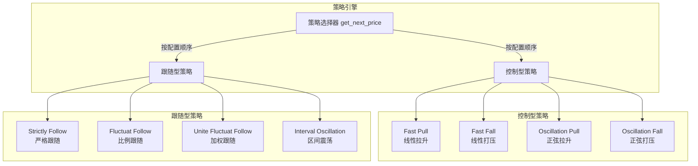

**策略选择器**（`make_market.py::get_next_price`）的实际行为：

- 遍历 `symbol['parameters']['control']` 和 `symbol['parameters']['price']` 两个分组
- **短路执行**：找到第一个 `enabled=1` 的策略即返回（不是链式执行）
- disabled 的策略被 `pop` 掉，下一轮不再检查

**各策略的代码实现位置**（`make_market.py`）：

| 策略 | 方法名 | 行号 | 分组 |
|------|--------|------|------|
| Fast Pull | `handle_fast_pull_price` | ~102 | control |
| Fast Fall | `handle_fast_fall_price` | ~126 | control |
| Oscillation Pull | `handle_oscillation_pull` | ~150 | control |
| Oscillation Fall | `handle_oscillation_fall` | ~182 | control |
| Strictly Follow | `handle_strictly_follow` | ~214 | price |
| Fluctuat Follow | `handle_fluctuat_follow` | ~241 | price |
| Unite Fluctuat Follow | `handle_unite_fluctuat_follow` | ~274 | price |
| Interval Oscillation | `handle_interval_oscillation` | ~314 | price |

**控制型策略的消耗监控**：

- `fast_pull_price` / `fast_fall_price` / `oscillation_pull` / `oscillation_fall` / `interval_oscillation` 都有 `consume_quote` / `consume_base` 阈值
- 实际资产消耗超过阈值时主动告警（`_send_alert` 方法）
- 跟随型 3 个策略（`strictly_follow` / `fluctuat_follow` / `unite_fluctuat_follow`）**没有**消耗监控

**Strictly Follow 的实际实现**（`make_market.py::handle_strictly_follow`）：

```python
# 伪代码，描述实际行为
def handle_strictly_follow(symbol):
    """
    严格跟随外部交易所的某个交易对价格。
    """
    # 读取外部参考价
    external_price = get_external_price(symbol)
    if not external_price:
        return symbol['previous_price']
    
    # 计算与上次的偏离
    if symbol['previous_price']:
        deviation = abs(external_price - symbol['previous_price']) / symbol['previous_price']
        if deviation > symbol['deviation_rate']:
            # 偏离过大，跳过本轮更新（不撤单，由 50% 保护机制兜底）
            return None
    
    return external_price
```

**控制型策略的安全机制**（实际存在于 `make_market.py`）：

- 价格变化超过 50% 时调用 `cancel_my_orders` 触发**全量撤单**，跳过本轮更新
- 资产消耗超过 `consume_quote` / `consume_base` 配置阈值时主动告警
- `oscillation_fall` 中存在疑似 bug：`consumed_base > params['consume_quote']` 应为 `consume_base`（不同策略对应不同资产的消耗监控）

### 4.5 永续合约做市的差异

> **范围说明**：本节描述的"永续合约做市"**仅属于 robot-swap 项目**。`spot` 和 `smm` 项目都只做现货。

`swap` 项目做永续合约做市比现货做市多了几个核心差异：

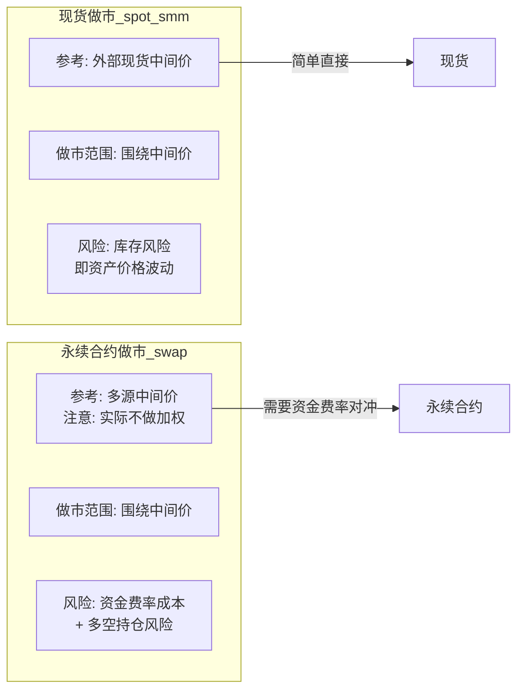

**1. 多源中间价（不是加权"标记价格"）**

`swap` 项目的做市参考价来自**多家交易所的中间价**（由 `external_price_usd.py` / `external_price_usdt.py` 汇总），但**实际实现不做加权平均**——而是按 `price_source` 配置的优先级，取第一个有效源的中间价。这与传统意义上的"标记价格（Mark Price）"不同：

- **传统 Mark Price**：多交易所加权平均，用于计算未实现盈亏和强平触发
- **swap 项目中间价**：按优先级取一家的中间价，仅用于做市订单簿的中心定价

**2. 资金费率对冲（`funding_rate_params`）**

`swap` 项目特有的资金费率对冲机制——根据当前资金费率方向，动态调整双边挂单量：

```python
# 实际代码（utils/orderbook.py::generate_volume）
# 资金费率配置是按 side 嵌套的，而不是扁平的 bid_factor/ask_factor

# 实际配置结构（来自数据库 robot_info_swap 表）：
funding_rate_params = {
    "buy": {                           # 买单侧
        "below": {                     # 资金费率低于此值时
            "rate": -0.0001,           # 触发阈值
            "ratio": 1.2               # 挂单量乘数（放大）
        },
        "above": {                     # 资金费率高于此值时
            "rate": 0.0001,
            "ratio": 0.8               # 挂单量乘数（缩小）
        }
    },
    "sell": { ... }                    # 卖单侧独立配置
}

def generate_volume(symbol, side, min_vol, max_vol):
    volume = random.randint(min_vol, max_vol)
    fr = symbol['funding_rate']
    params = symbol['funding_rate_params'][side]
    
    if fr < params['below']['rate']:
        volume = volume * params['below']['ratio']  # 费率低，多挂买单吃费率
    elif fr > params['above']['rate']:
        volume = volume * params['above']['ratio']  # 费率高，少挂买单让出仓位
    
    return int(volume)
```

**资金费率的数据来源**：
- 资金费率**不来自 7 个外部交易所**——而是从交易所自身接口 `/swap/inner/robot/flag_list` 获取
- `make_market.py::update_founding_rate()`（注意原文拼写为 `founding` 而非 `funding`）每 300 秒（5 分钟）调用一次

**3. 做市价格范围（不存在于代码中）**

文章原描述的"基于标记价格计算做市范围，超出范围的订单直接跳过"在代码中**没有对应实现**——`swap` 项目没有 `max_deviation` 这种价格范围限制字段。`make_market.py` 仅在 `next_price` 与 `previous_price` 偏差 >50% 时触发全量撤单。

### 4.6 分布式节点架构

当交易对数量达到数百个时，单机无法承载所有交易对的做市任务。系统采用**多节点分片架构**。

**关键配置差异**（三套项目）：

| 项目 | section_count | status_update_interval (心跳) | timeout (剔除) |
|------|---------------|-------------------------------|----------------|
| **spot** | 16 | 5 秒 | 10 秒 |
| **smm** | 6 | 6 秒 | 30 秒 |
| **swap** | 16 | 3 秒 | 30 秒 |

> **重要细节**：文章原描述统一为"16 个分片 / 3 秒心跳 / 30 秒剔除"——这**只对 swap 项目准确**。spot/smm 的实际参数如上表。

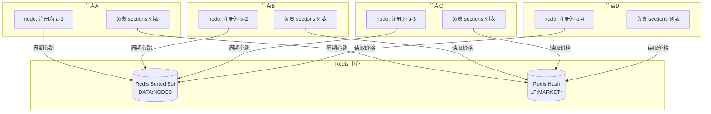

**节点分片的实际实现（两阶段）**：

```python
# === 阶段 1: 离线预计算（utils/common.py::get_section） ===
# 由 tools/update-section.py 调用，对数据库中每个交易对计算并写回 section 字段

def get_section(symbol, section_num=16):
    """
    交易对的 section 离线预计算。
    
    注意三个项目的 section_num 默认值不同：
      - spot: 16
      - smm:  6
      - swap: 16
    
    MD5 使用完整 32 字符 hex（不是前 8 字符）。
    """
    symbol = symbol.lower().replace('/', '').replace('-', '') if symbol else ''
    hash_value = hashlib.md5(symbol.encode('utf-8')).hexdigest()
    return int(hash_value, 16) % section_num


# === 阶段 2: 运行时加载（core/base.py::get_non_preview_symbols） ===
# 节点启动时根据 Redis 中的活跃节点列表，动态计算自己负责的 sections，
# 然后用 WHERE section IN (...) 从数据库拉取交易对

def get_non_preview_symbols(self):
    section_count = int(self.config.get('nodes', 'section_count', 1))
    node_name = self.common_util.generate_node_name()   # 取 socket.gethostname()
    redis_key = self.config.get('nodes', 'redis_key')    # DATA:NODES
    
    # 关键差异：按字符串字典序排序，不是按 score 降序
    nodes = self.redis_client.zrangebyscore(redis_key, int(time.time()) - node_timeout, '+inf')
    nodes.sort()                                          # Python 默认字符串升序
    
    node_index = nodes.index(node_name)
    node_count = len(nodes)
    
    # 计算当前节点负责的 sections
    my_sections = [i for i in range(section_count) if i % node_count == node_index]
    
    # 从数据库加载（SQL WHERE section IN (...)）
    sql = f'SELECT * FROM {table_name} WHERE section IN ({",".join(my_sections)}) ...'
    return self.db_client.query(sql)
```

**节点发现与故障转移**：

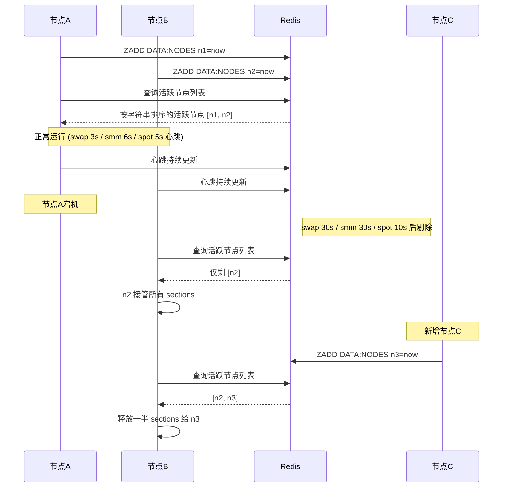

**关于"运行时计算 sections"的常见误解**：

- 文章原描述的 `get_my_sections` + `is_my_symbol` 是**伪代码**，实际项目中**没有这两个函数**
- 实际实现是：**离线预计算 + 运行时 SQL 过滤**——`get_section` 一次性写入 DB，`get_non_preview_symbols` 运行时用 `WHERE section IN (...)` 拉取
- 节点名取自 `socket.gethostname()`，不是配置中写死的 a-1, a-2

这种设计使得做市集群可以**水平扩展**：增加节点时，交易对自动重新分配；节点宕机时，其他节点无缝接管。

### 4.7 交易量生成（刷量）系统

做市系统通常包含交易量生成模块，这是做市商激励计划或流动性项目方需求的核心支撑。

> **实际行为 vs 常见误解**：三个项目都包含 `update_trade` 模块，但其行为是**根据外部成交量按固定比例刷量**，不是文章原描述的"在盘口间随机取价 + 数量随机拆分"。

```python
# 实际行为（make_market.py::update_trade）
# 伪代码，描述通用流程
def update_trade(symbol_config):
    """
    根据外部成交量按比例刷量。
    
    核心参数 trade_volume_ratio：
      例如配置为 0.5，外部每发生 100万 U 交易量，本地刷 50万 U
    """
    # 从 Redis 读取外部交易量（TD:* key 累积 30 秒内的成交量）
    external_volume = get_external_trade_volume(symbol_config['symbol'])
    
    if not external_volume or external_volume <= 0:
        return
    
    # 按配置比例计算目标刷量
    target_volume = external_volume * symbol_config['trade_volume_ratio']
    
    # 调用交易所对敲接口（place_trade_orders）
    # 价格不是"在盘口间随机取"，而是使用盘口的 bid/ask 价
    # （trade_sb_status==1 时才取盘口价，否则用 mid_price）
    self.bydfi_client.place_trade_orders(
        symbol=symbol_config['symbol'],
        volume=target_volume,
        bid_price=orderbook.get_best_bid(),
        ask_price=orderbook.get_best_ask(),
        is_buy=random.choice([True, False])
    )
```

**关键点**：
- `update_trade` 是项目里**真实存在**的刷量函数
- 但**没有** `split_into_random_parts` 这样的数量拆分工具
- 刷量价格：实际是 `bid_price` / `ask_price` 盘口价（`trade_sb_status` 开关），不是"盘口间 random.uniform"
- 调用的接口是交易所**专用对敲接口** `place_trade_orders`（含 `isBuy/askPrice/bidPrice/contract/orderVersion/matchId` 字段），与正常下单 API 不同
- `spot` 和 `swap` 都有这个模块；`smm` 项目里 `process_orders.py` 提供类似能力

## 五、风控与监控体系

做市系统和交易所本身在运营过程中面临**市场操纵、用户违规、资金安全、合规审计**等多维度风险。一个生产级 CEX 的风控体系是一个**多层级、立体化**的防御系统，涵盖从用户行为、交易行为、链上资产到内部流程的全方位风险识别与处置。

### 5.1 总体架构：外部风控与内部风控

风控体系按"防御对象"分为两大部分——**外部风控**（面向用户和市场）和**内部风控**（面向员工和流程）：

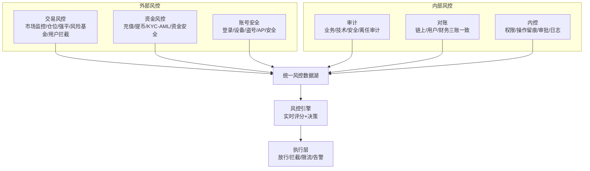

**外部风控**关注"从市场到用户"的风险传导链：

| 子系统 | 核心职责 | 关键场景 |
|--------|----------|----------|
| **交易风控** | 市场操纵识别、仓位监控、强平控制、风险基金对账、恶意用户拦截 | 拉盘砸盘、虚假交易、自成交、插针、过度杠杆 |
| **资金风控** | 充值入账校验、提币规则引擎、KYC/AML 合规、资金安全审计 | 黑钱充值、跑分提币、分散提现、可疑交易上报 |
| **账号安全** | 注册登录风控、设备与行为识别、盗号检测、API 安全 | 撞库、暴力破解、设备指纹冒用、API 越权 |

**内部风控**关注"从员工到流程"的风险传导链：

| 子系统 | 核心职责 |
|--------|----------|
| **审计** | 业务审计（订单异常）、技术审计（系统变更）、安全审计（权限滥用）、离任审计（员工离职前的权限回收） |
| **对账** | 链上资产账 vs 用户资产账 vs 财务账的三账对账，每日核对 |
| **内控** | 权限管理（分级授权）、操作留痕（全链路日志）、审批流程（双人复核）、日志审计 |

### 5.2 核心风控流程：风险评分与策略决策

风控的标准化处理流程是**风险识别 → 风险评分 → 策略决策 → 处置执行**四步闭环：

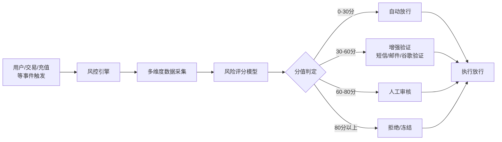

**风险分级处置策略**：

| 风险分值 | 风险等级 | 处置动作 | 典型场景 |
|----------|----------|----------|----------|
| **0-30 分** | 低风险（正常） | 自动放行 | 老用户、常用设备、小额交易 |
| **30-60 分** | 中风险（注意） | 短信/邮件/谷歌验证 | 新设备登录、中额提币 |
| **60-80 分** | 高风险（审核） | 人工审核 | 大额提币、首次充值、异常 IP |
| **80+ 分** | 极高风险（拒绝） | 直接拒绝/冻结 | 黑名单设备、关联黑钱地址、攻击行为 |

### 5.3 风险评分模型：六维度评估

风险评分模型从 **6 个维度** 量化风险，每维度有自己的分值范围，总分经过加权计算后映射到上面的分级：

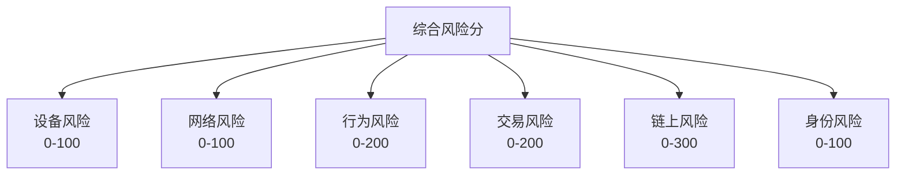

| 维度 | 关键指标 | 分值范围 | 加权理由 |
|------|----------|----------|----------|
| **设备风险** | 新设备、模拟器、Root 设备、设备指纹异常 | 0-100 | 模拟器/Root 是盗号与攻击的高发特征 |
| **网络风险** | 代理 IP、恶意 IP、异常国家/地区 | 0-100 | 异常地理位置常常伴随欺诈 |
| **行为风险** | 异常登录、批量操作、频繁操作、深夜高频 | 0-200 | 行为模式偏离基线时风险高 |
| **交易风险** | 大额交易、洗盘模式（自成交）、关联交易 | 0-200 | 直接涉及资金安全 |
| **链上风险** | 黑客地址、混币器、制裁地址、资金溯源命中 | 0-300 | **链上风险权最高**——一旦命中基本就是黑钱 |
| **身份风险** | 未 KYC、KYC 等级低、身份信息不完整 | 0-100 | 合规底线 |

**总分计算示例**：

```python
def calculate_risk_score(user_context):
    weights = {
        'device': 1.0,
        'network': 1.0,
        'behavior': 2.0,
        'trade': 2.0,
        'chain': 3.0,
        'identity': 1.0,
    }

    total_score = (
        user_context['device_score'] * weights['device'] +
        user_context['network_score'] * weights['network'] +
        user_context['behavior_score'] * weights['behavior'] +
        user_context['trade_score'] * weights['trade'] +
        user_context['chain_score'] * weights['chain'] +
        user_context['identity_score'] * weights['identity']
    )

    risk_level = (
        'low'      if total_score < 200  else
        'medium'   if total_score < 400  else
        'high'     if total_score < 700  else
        'critical'
    )

    return total_score, risk_level
```

### 5.4 交易风控核心指标

交易风控的监控项按"市场→盘口→持仓→杠杆"四个层次组织：

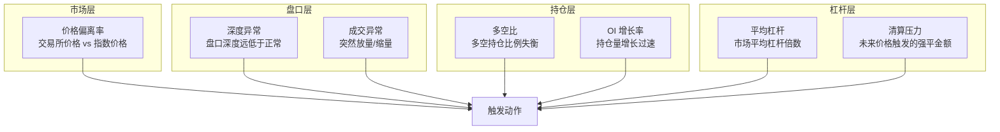

| 指标 | 说明 | 预警阈值 | 熔断阈值 | 触发动作 |
|------|------|----------|----------|----------|
| **价格偏离率** | 交易所价格与指数价格的偏离度 | > 3% | > 5% | 预警、熔断（停止该交易对交易） |
| **深度异常** | 盘口深度低于正常水平 | < 正常深度的 50% | < 20% | 告警、做市商补单 |
| **成交异常** | 突然放量/缩量、自成交率过高 | 自成交率 > 5% | > 15% | 暂停相关账户、调查 |
| **多空比** | 多头持仓 / 空头持仓 | > 3 或 < 0.3 | > 5 或 < 0.2 | 告警、调整风险基金 |
| **OI 增长率** | 持仓量增长过速 | 10 分钟 > 20% | > 30% | 告警、限制新开仓 |
| **平均杠杆** | 市场平均杠杆倍数 | > 20x | > 50x | 预警、限制新开仓杠杆 |
| **清算压力** | 未来价格 X% 范围内触发的强平金额 | 单边清算 > 5000 万 USD | > 1 亿 USD | 启动保险基金、暂停部分交易 |

**清算压力监控**的实现：

```python
def calculate_liquidation_pressure(symbol, price_range_pct=0.1):
    mark_price = get_mark_price(symbol)
    upper_trigger = mark_price * (1 + price_range_pct)
    lower_trigger = mark_price * (1 - price_range_pct)

    pressure_long = 0.0
    pressure_short = 0.0

    for position in get_all_positions(symbol):
        if position.is_long:
            if position.liquidation_price >= lower_trigger:
                pressure_long += position.margin
        else:
            if position.liquidation_price <= upper_trigger:
                pressure_short += position.margin

    return {
        'symbol': symbol,
        'mark_price': mark_price,
        'long_liquidation_usd': pressure_long,
        'short_liquidation_usd': pressure_short,
        'total_pressure_usd': pressure_long + pressure_short,
    }
```

### 5.5 提币风控规则引擎

提币是资金流出的最后一道关卡，规则引擎按**触发条件 → 规则匹配 → 处置动作**的模式工作：

```mermaid
flowchart LR
    A[用户发起提币] --> B[规则引擎]
    B --> C{规则链匹配}
    C --> D[WD001<br/>首次提币]
    C --> E[WD002<br/>新设备提币]
    C --> F[WD003<br/>异地提币]
    C --> G[WD004<br/>大额提币]
    C --> H[WD005<br/>高频提币]
    C --> I[WD006<br/>高危地址提币]
    C --> J[WD007<br/>小额拆分提币]

    D --> K[合并处理]
    E --> K
    F --> K
    G --> K
    H --> K
    I --> K
    J --> K
    K --> L[执行最终动作]
```

**规则示例**：

| 规则 ID | 规则名称 | 触发条件 | 动作 |
|---------|----------|----------|------|
| WD001 | 首次提币 | `withdraw_count = 0`（用户从未提过币） | 冷静期 24 小时 + 邮件确认 |
| WD002 | 新设备提币 | 设备首次使用 < 24 小时 | 人工审核 |
| WD003 | 异地提币 | 国家/地区发生变化 | 短信验证 + 人工审核 |
| WD004 | 大额提币 | 金额 > 50,000 USDT | 人工审核 + 视频认证（可选） |
| WD005 | 高频提币 | 24 小时内提币 > 3 次 | 限制提币频率 + 审核 |
| WD006 | 高危地址提币 | `AddressRiskScore > 80` | 直接拒绝提币 |
| WD007 | 小额拆分提币 | 拆分数 > 10（疑似跑分） | 合并审核 |

**规则引擎的实现**：

```python
class WithdrawalRuleEngine:
    def __init__(self):
        self.rules = [
            FirstTimeWithdrawalRule(),
            NewDeviceWithdrawalRule(),
            GeoAnomalyWithdrawalRule(),
            LargeAmountWithdrawalRule(),
            HighFrequencyWithdrawalRule(),
            HighRiskAddressWithdrawalRule(),
            SplitWithdrawalRule(),
        ]

    def evaluate(self, withdrawal_request):
        triggered_rules = []
        final_action = 'APPROVE'
        review_reasons = []

        for rule in self.rules:
            result = rule.evaluate(withdrawal_request)
            if result.action != 'APPROVE':
                triggered_rules.append({
                    'rule_id': result.rule_id,
                    'rule_name': result.rule_name,
                    'action': result.action,
                    'reason': result.reason,
                })
                if result.action == 'BLOCK':
                    final_action = 'BLOCK'
                elif result.action == 'REVIEW' and final_action != 'BLOCK':
                    final_action = 'REVIEW'
                    review_reasons.append(result.rule_name)

        return {
            'final_action': final_action,
            'triggered_rules': triggered_rules,
            'review_reasons': review_reasons,
        }


class HighRiskAddressWithdrawalRule:
    def evaluate(self, ctx):
        address_risk = query_address_risk_score(ctx.to_address)
        if address_risk > 80:
            return RuleResult(
                rule_id='WD006',
                rule_name='高危地址提币',
                action='BLOCK',
                reason=f'目标地址风险分 {address_risk}，疑似黑钱/混币/制裁'
            )
        return RuleResult(action='APPROVE')
```

### 5.6 AML 链上风控

链上资产（充值入账）需要经过专门的 AML 流程——KYT（Know Your Transaction）链上扫描与风险标签：

```mermaid
flowchart LR
    A[链上充值确认] --> B[交易入账]
    B --> C[KYT 链上扫描]
    C --> D[资金溯源分析]
    D --> E[风险标签打标]
    E --> F{风险评级}
    F -->|正常| G1[允许交易]
    F -->|观察| G2[人工复核]
    F -->|高风险| G3[限制功能]
    F -->|极高风险| G4[冻结账户<br/>上报合规]
```

**常见风险标签**：

| 风险标签 | 风险等级 | 处置方式 |
|----------|----------|----------|
| 黑客地址 | 极高 | 冻结账户、上报 |
| 制裁地址 | 极高 | 冻结账户、上报 |
| 混币器（Tornado、CoinJoin） | 高 | 限制功能 |
| 赌博平台 | 高 | 人工复核 |
| 暗网市场 | 极高 | 冻结账户、上报 |
| 诈骗平台 | 高 | 限制功能 |
| 欺诈地址 | 极高 | 冻结账户、上报 |
| 正常交易 | 低 | 允许 |

**KYT 链上扫描的实现**：

```python
def kyt_check(deposit_event):
    from_address = deposit_event['from_address']
    amount = deposit_event['amount']

    direct_risk = kyt_service.get_address_risk(from_address)
    if direct_risk.is_blacklisted:
        return AMLResult(
            risk_level='critical',
            tags=['黑名单地址'],
            action='FREEZE',
            reason=f'发送方 {from_address} 命中黑名单'
        )

    upstream_risks = kyt_service.trace_upstream(
        from_address,
        depth=5,
        min_amount=amount * 0.1
    )
    if upstream_risks:
        return AMLResult(
            risk_level='high',
            tags=['资金溯源命中风险'],
            action='REVIEW',
            reason=f'上游链路命中: {[r.source for r in upstream_risks]}'
        )

    if kyt_service.has_passed_mixer(from_address, hop_count=10):
        return AMLResult(
            risk_level='high',
            tags=['经过混币器'],
            action='RESTRICT',
            reason='资金链路上发现混币器'
        )

    return AMLResult(risk_level='low', tags=[], action='APPROVE')
```

### 5.7 权限管理分级

内部操作的权限按风险等级分为 L1-L4 四级，**高风险操作必须双人审批**：

| 等级 | 权限范围 | 典型操作 | 审批要求 |
|------|----------|----------|----------|
| **L1** | 日常操作 | 查看数据、普通查询、生成报表 | 无需审批 |
| **L2** | 敏感操作 | 修改手续费、上线新币种、调整参数 | 单人审批 |
| **L3** | 高风险操作 | 大额提币、调整杠杆、清算参数 | 双人审批 |
| **L4** | 紧急操作 | 熔断、回滚交易、紧急关停 | 双人审批 + 全链路记录 |

```python
class PermissionChecker:
    def check_permission(self, user, operation):
        user_level = user.permission_level
        op_level = operation.required_level

        if user_level < op_level:
            raise PermissionDenied(f'用户 {user.id} 权限不足')

        if op_level >= 3:
            if not operation.has_dual_approval():
                raise ApprovalRequired(f'{op_level}级操作需要双人审批')

        if op_level == 4:
            if not operation.has_emergency_audit():
                raise EmergencyApprovalRequired('L4 紧急操作需独立审计员审批')

        self.write_audit_log(user, operation)
        return True
```

### 5.8 风控事件处置流程

风控事件按严重程度分为 P1-P4 四个等级，每个等级有明确的**响应时间**：

```mermaid
flowchart TD
    A[风险事件触发] --> B{事件等级}
    B -->|P1 紧急| C1[5分钟内响应<br/>大额盗币/系统被攻击]
    B -->|P2 高| C2[30分钟内响应<br/>异常提币/市场操纵]
    B -->|P3 中| C3[2小时内响应<br/>批量注册/异常交易]
    B -->|P4 低| C4[24小时内响应<br/>设备风险/IP风险]

    C1 --> D[事件识别与评估]
    C2 --> D
    C3 --> D
    C4 --> D

    D --> E[采取风控措施]
    E --> F[记录与审计]
    F --> G[复盘与优化]
```

| 事件等级 | 定义 | 响应时间 | 典型场景 |
|----------|------|----------|----------|
| **P1 紧急** | 可能造成重大损失 | 5 分钟内 | 大额盗币、系统被攻击、数据库泄露 |
| **P2 高** | 可能造成较大损失 | 30 分钟内 | 异常提币、市场操纵、关联账户异动 |
| **P3 中** | 可能造成一般损失 | 2 小时内 | 批量注册、异常交易、套利行为 |
| **P4 低** | 影响较小 | 24 小时内 | 设备风险、IP 风险、登录异常 |

### 5.9 数据对账：三账一致

对账系统确保**链上资产账、用户资产账、财务账**每日一致——这是 CEX 资产安全的最重要保障：

```mermaid
flowchart LR
    subgraph 链上资产账
        A1[钱包地址]
        A2[链上余额]
        A3[区块链数据]
    end

    subgraph 用户资产账
        B1[用户资产]
        B2[内部账本]
        B3[账户余额]
    end

    subgraph 财务账
        C1[公司资产]
        C2[会计账务]
        C3[资金流水]
    end

    A1 -->|对账程序每日核对| A2
    A2 -->|校验一致性| B2
    B2 -->|校验一致性| C2
```

**对账逻辑**：

```python
class ReconciliationEngine:
    def run_daily_reconciliation(self):
        results = {
            'chain_vs_user': self.compare_chain_user(),
            'user_vs_finance': self.compare_user_finance(),
            'chain_vs_finance': self.compare_chain_finance(),
        }

        for name, result in results.items():
            if not result.is_consistent:
                alarm.send('P1', f'{name} 对账失败: diff={result.diff}')
                self.freeze_operations_if_needed(result)

        return results

    def compare_chain_user(self):
        chain_balances = self.get_chain_balances()
        user_balances = self.aggregate_user_balances()

        for asset in chain_balances:
            diff = chain_balances[asset] - user_balances[asset]
            platform_reserve = self.get_platform_reserve(asset)

            if abs(diff - platform_reserve) > self.tolerance:
                return ReconciliationResult(
                    is_consistent=False,
                    diff=diff - platform_reserve,
                    asset=asset,
                    reason='链上与用户资产差异超出容差'
                )
        return ReconciliationResult(is_consistent=True)
```

### 5.10 资产安全与紧急制动

> **范围说明**：本节描述的"资产监控+紧急制动"**仅属于 robot-smm 项目**（其 `monitor.py::check_emergency` 实现了这个功能）。`spot` 和 `swap` 项目**没有资产监控和紧急制动模块**——它们只关心价格策略和订单簿，不监控自己的账户余额。

智能做市系统（`smm`）的资产监控模块包含了**资产快照**和**紧急制动**——做市商自己的账户也需要风控：

```mermaid
flowchart TD
    A[每180秒定时检查] --> B[查询账户余额]
    B --> C{基础资产<br/>crypto_amount > base_total?}
    C -->|是| D1[emergency_action<br/>告警 + 按比例撤单 + 禁用功能]
    C -->|否| E{报价资产<br/>quote_amount > quote_total?}
    E -->|是| D2[emergency_action<br/>告警 + 按比例撤单 + 禁用功能]
    E -->|否| G[正常监控]

    D1 --> H[告警通知]
    D2 --> H
```

**实际行为**（`smm/monitor.py::check_emergency` + `emergency_action`）：

```python
# monitor.py 简化版
def check_emergency(self, symbol):
    """
    紧急制动检查——基于资产阈值。
    
    实际只有两个分支（基础/报价），没有"双重不足"独立分支：
    - 任一资产超阈值都会触发 emergency_action
    - 触发后调用 disable_all_symbol_function 禁用所有 enabled 策略
    - 按 cancel_order_rate 比例撤单（不是全量）
    """
    crypto_amount = symbol['crypto_amount']    # 基础资产
    quote_amount = symbol['quote_amount']      # 报价资产
    base_total = symbol['base_total']          # 基础资产阈值
    quote_total = symbol['quote_total']        # 报价资产阈值
    
    if crypto_amount > base_total:
        self.emergency_action(symbol)
    elif quote_amount > quote_total:
        self.emergency_action(symbol)

def emergency_action(self, symbol):
    """触发紧急制动"""
    # 1. 禁用所有策略 (递归把所有 enabled 字段置 0)
    self.disable_all_symbol_function(symbol)
    
    # 2. 按配置比例撤单（不是全量撤单！）
    cancel_rate = symbol['cancel_order_rate']  # 默认 0%，可配置 0-100
    self.bydfi_client.cancel_my_orders(symbol['symbol'], symbol['robot_id'])
    # 注：cancel_rate 实际是"是否触发撤单"开关，不是百分比
    
    # 3. 告警（send_interval = 60 秒，不是文章原说的 300 秒）
    self.send_lark('EMERGENCY', f"{symbol} 紧急制动", send_interval=60)
    self.send_emails('EMERGENCY', f"{symbol} 紧急制动", send_interval=60)
```

**关于"按方向撤单"的常见误解**：
- 文章原描述"基础资产不足→取消买单，报价资产不足→取消卖单"——代码中**没有这种按方向撤单**
- 实际撤单是**统一调用 `cancel_my_orders`**（即 cancelAll），不区分买卖方向
- `spot` 项目**完全没有资产监控代码**（`grep` 不到 `min_base_balance`、`cancel_buy_orders` 等函数）

**定时资产快照**——`smm/update_assets.py` 每 5 分钟记录一次（与时钟对齐）：

```python
# update_assets.py 简化版
def get_wait_seconds(self):
    """等待到下一个 5 分钟边界（0, 5, 10, ..., 55 分钟）"""
    current_time = datetime.now()
    minutes_to_wait = 5 - (current_time.minute % 5)
    return minutes_to_wait * 60 - current_time.second

def run(self):
    while True:
        wait = self.get_wait_seconds()
        time.sleep(wait)
        self.job()

def job(self):
    """实际资产快照逻辑（不是文章原描述的 take_asset_snapshot 伪代码）"""
    for symbol in self.symbols:
        current_assets = self.fetch_current_assets(symbol)
        last_assets = self.get_last_snapshot(symbol)
        
        # 实际计算的不是简单的 delta/capital_delta
        # 而是细分：time_change（期间变化）、init_change（相对初始变化）
        change = self.calculate_asset_change(symbol, current_assets, last_assets)
        
        self.db_api.insert_snapshot({
            'symbol': symbol,
            'init_crypto_amount': change.init_crypto,
            'init_quote_amount': change.init_quote,
            'crypto_time_change': change.crypto_time_change,
            'quote_time_change': change.quote_time_change,
            'crypto_time_price': change.crypto_time_price,
            'crypto_init_change': change.crypto_init_change,
            'quote_init_change': change.quote_init_change,
            'crypto_init_price': change.crypto_init_price,
        })
```

### 5.11 告警通道与防刷机制

> **关于防刷机制的实现差异**：
> - **spot 项目**：用 Redis Sorted Set（`ALARM:SENT` + zadd/zscore）
> - **smm 项目**：用**进程内字典**（`self.messages_sent = {}`），**不是 Redis**
> - 两者都能防刷，但**横向扩展语义不同**——smm 的进程内字典在进程重启后会重置频率状态

#### spot 项目（Redis Sorted Set 实现）

```python
# utils/alarm.py 简化版
class Alarm:
    def __init__(self, redis):
        self.redis = redis
        self.redis_key_messages_sent = 'ALARM:SENT'  # Sorted Set key

    def send_message(self, group, message_content, message_name=None, send_interval=0):
        """
        发送告警到 Lark 群组。
        
        message_name: 告警唯一标识（用于去重）
        send_interval: 防刷间隔（秒），0 表示不限制
        """
        # 1. 检查是否在防刷窗口内
        if message_name and send_interval > 0:
            score = self.redis.zscore(self.redis_key_messages_sent, message_name)
            if score and score > time.time():
                return  # 仍在防刷窗口，跳过
        
        # 2. 发送 Lark 消息（实际 msg_type 是 'text'，不是 'interactive'）
        try:
            response = requests.post(
                f'https://open.larksuite.com/open-apis/bot/v2/hook/{group}',
                json={'msg_type': 'text', 'content': {'text': message_content}},
                timeout=10
            )
            if response.status_code == 200:
                # 3. 写入 Sorted Set（score = 过期时间戳）
                if message_name and send_interval > 0:
                    self.redis.zadd(
                        self.redis_key_messages_sent,
                        {message_name: time.time() + send_interval}
                    )
        except Exception as e:
            logger.exception(f'告警发送异常: {e}')
```

#### smm 项目（进程内字典实现）

```python
# utils/alarm.py 简化版
class Alarm:
    def __init__(self):
        self.messages_sent = {}  # 进程内字典（不是 Redis！）
        self.emails_sent = {}

    def send_message(self, group, message_content, message_name=None, send_interval=0):
        """
        send_interval 默认 0（不限制），不是文章原描述的 300 秒。
        emergency 场景实际用 60 秒。
        """
        # 检查防刷窗口
        if message_name and send_interval > 0:
            expire_at = self.messages_sent.get(message_name, 0)
            if expire_at > time.time():
                return  # 仍在防刷窗口
        
        # 发送 Lark 消息
        try:
            requests.post(...)
            if message_name and send_interval > 0:
                self.messages_sent[message_name] = time.time() + send_interval
        except Exception:
            pass
```

**实际调用场景的 send_interval**：

| 场景 | send_interval |
|------|---------------|
| balance 4 个子项 | `balance_interval * 60`（配置项，可自定义） |
| kline 价格上下限、无成交 | `interval * 60`（配置项） |
| kline 插针幅度 | 0（不限制） |
| orderbook 3 个子项 | `interval * 60`（配置项） |
| emergency 紧急制动 | **60 秒**（1 分钟，不是文章原说的 300 秒） |

### 5.12 风控体系建设的五大要点

一个完善的风控体系应满足以下建设原则：

```mermaid
mindmap
  root((风控体系<br/>建设要点))
    实时监控
      7×24小时监控
      关键指标全覆盖
      异常秒级响应
    多层防护
      规则+模型+人工
      防御纵深化
      各层互为备份
    数据驱动
      实时计算风险分数
      历史数据回溯分析
      机器学习辅助决策
    合规优先
      KYC/AML/CTF合规
      监管报表自动化
      配合司法调查
    持续优化
      复盘迭代风控策略
      误报漏报监控
      攻防演练常态化
```

## 六、总结

从撮合引擎到清算系统，再到做市机器人的生产级实现，可以总结出 CEX 技术架构的几个核心原则：

### 6.1 分层解耦

每一层都有明确的职责边界，通过事件（Kafka）和缓存（Redis）异步通信：

```mermaid
graph LR
    A[撮合系统] -->|成交事件| B[清算系统]
    B -->|账户更新| C[账户系统]
    D[做市系统] -->|下单| A
    D -->|读取价格| E[Redis]
    F[风控系统] -->|强平指令| B
    B -->|PnL更新| G[用户通知]
```

每一层都可以独立扩展、独立部署、独立故障。

### 6.2 事件驱动

从撮合引擎的成交事件，到做市系统的订单簿更新，再到清算系统的 PnL 计算，**事件驱动架构**是贯穿所有子系统的核心模式。Kafka 作为事件总线，确保了事件的可靠传递和下游的异步处理。

### 6.3 优雅降级

做市系统必须"假设一切都会出错"：

- 交易所 API 可能超时 → 重试 + 退避
- WebSocket 可能断开 → 自动重连
- 价格源可能卡死 → 优雅切换到备用源
- 资产可能不足 → 部分撤单而非全量崩溃
- 节点可能宕机 → 其他节点自动接管

每一层都需要**优雅降级**、**熔断保护**和**告警通知**。

### 6.4 配置驱动

所有行为差异都由配置驱动：

| 配置维度 | 示例 |
|----------|------|
| 环境切换 | development / testing / preview / simulation / production |
| 交易对参数 | 点差、精度、档位数、挂单量范围 |
| 价格策略 | 跟随/控制/震荡，按优先级链式执行 |
| 数据源选择 | 每个交易对可独立指定价格源和交易源 |
| 监控阈值 | 每个交易对独立的告警阈值 |

这允许做市策略先在仿真环境中运行验证，确认无误后再推向生产。

---

做市系统是交易所流动性生态的核心支柱。从订单的撮合到资产的清算，从价格的锚定到风险的监控，每一个环节都体现了分布式系统设计的工程智慧。上述三套做市系统在 CEX 生产环境中已稳定运行多年，管理着数百个交易对的流动性，是 CEX 基础设施中不可或缺的一环。
