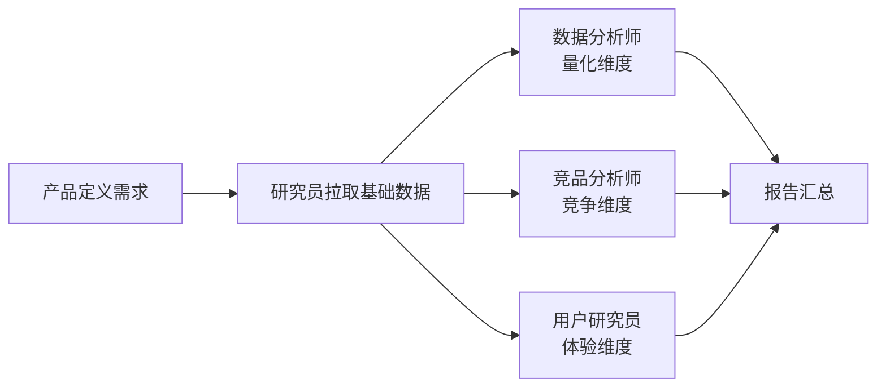
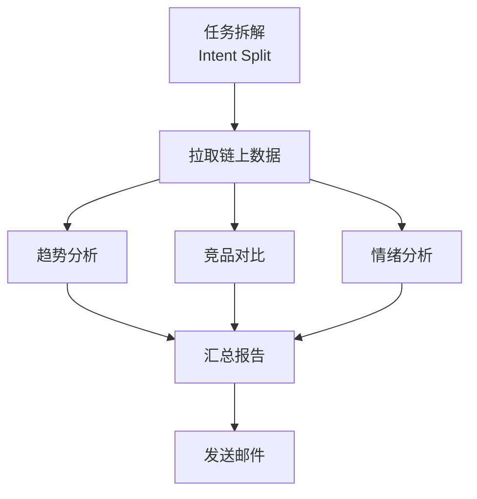
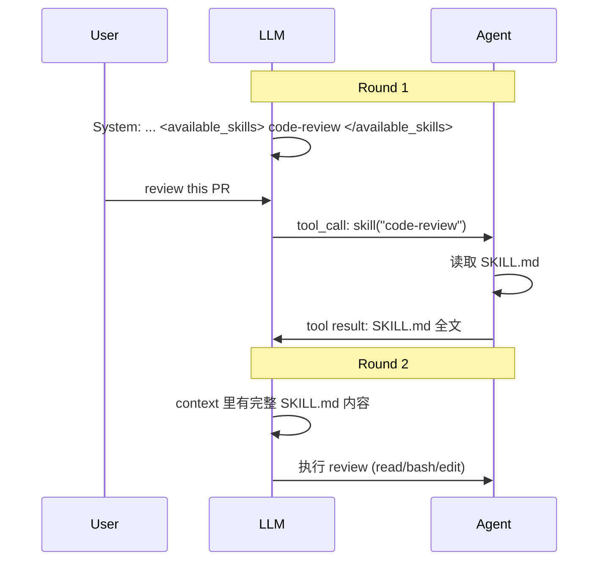
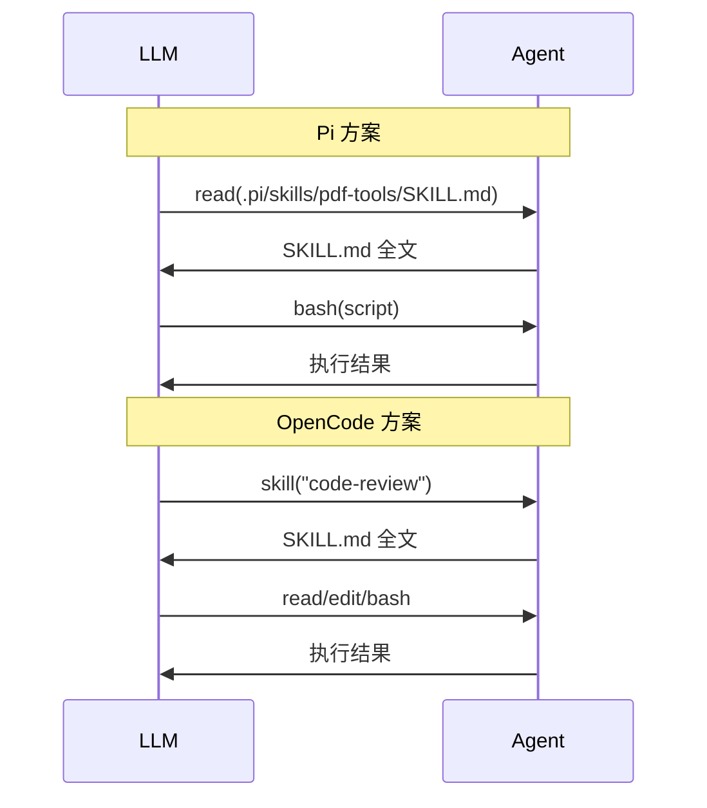
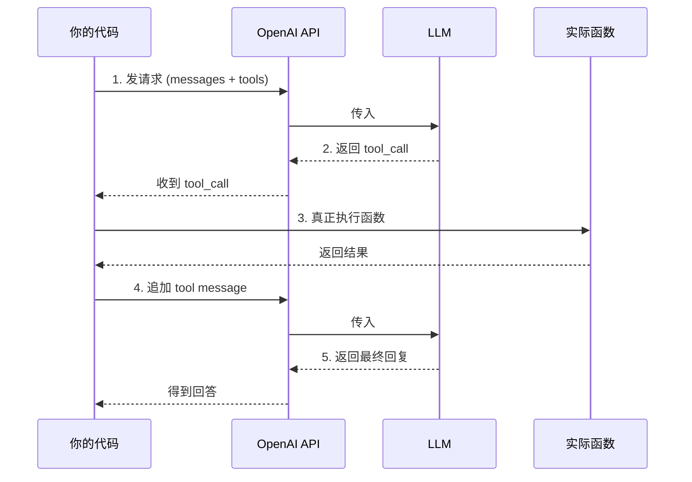
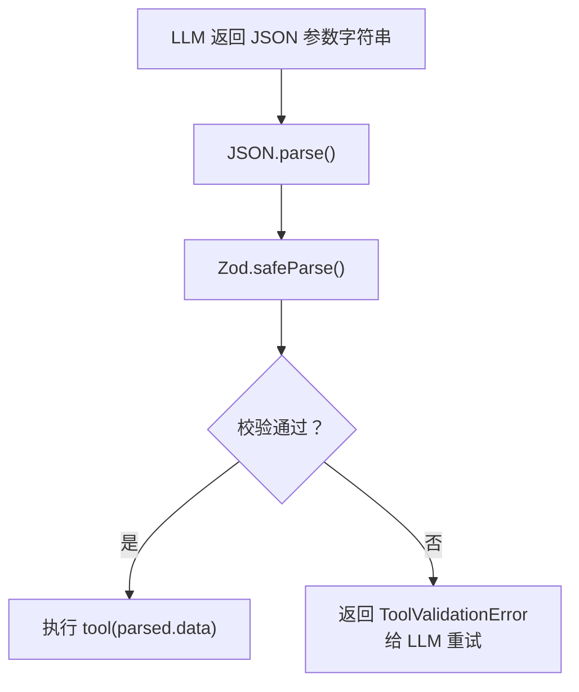
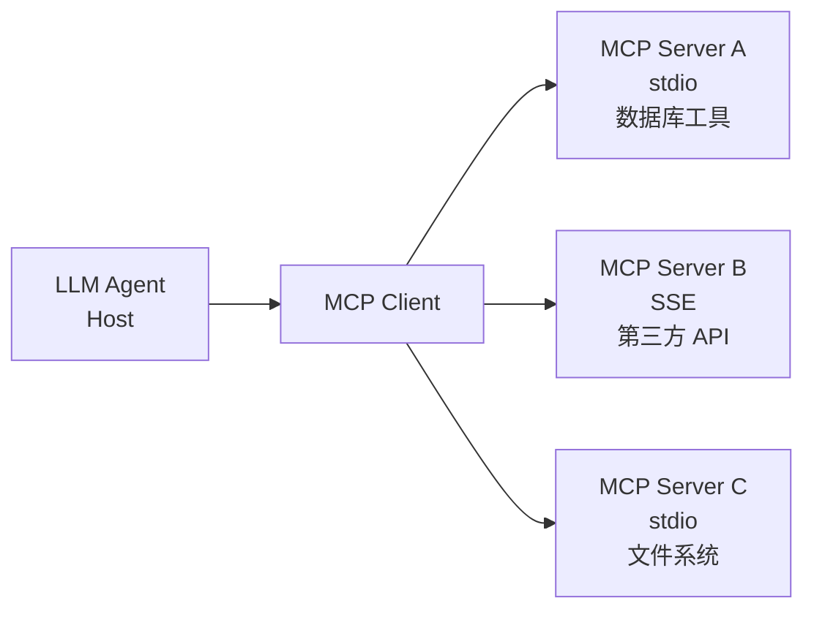
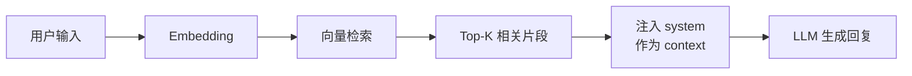
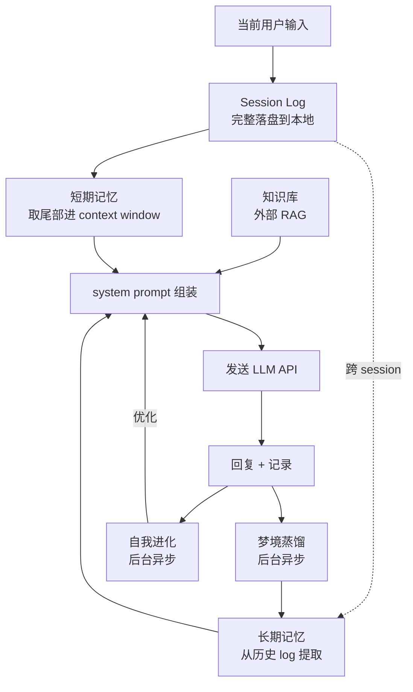
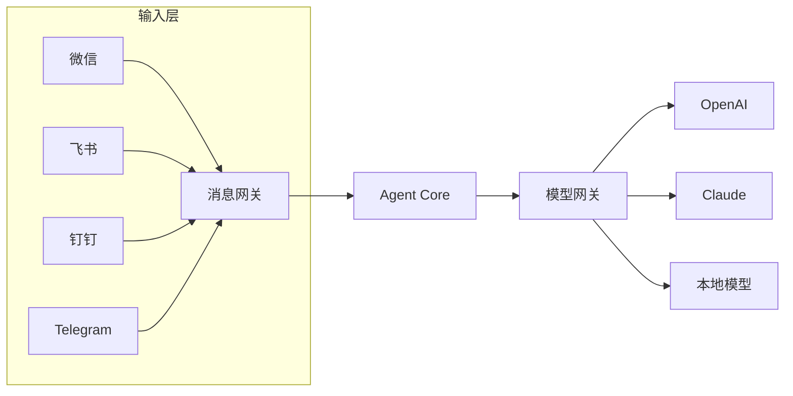

一个 LLM Agent，归根结底是四个要素的组合：

```
Agent = LLM + Prompt + Tool + Memory
```

这四个东西拼在一起，就是一个可组装 Pipeline。最基础的形态是**顺序多轮对话**——一步接一步走下去，当前步的输出是下一步的输入。LangChain 就是这个思路的典型代表。

但是现实任务往往没这么规整。三个分析步骤可以并行跑；查完数据之后，是发邮件还是继续分析，取决于数据的值。这时候你需要一张 **有向无环图（DAG）**——节点是操作，边是依赖，LLM 在节点处做决策。而加上循环和持久化状态，就从 DAG 扩展到了完整的图编排——**LangGraph** 就是这个思路。

这就是本文要讲的：**从线性 Pipeline 到 DAG，把 Agent 的四个要素拆开，看每一层在 API 层面到底发生了什么。**

我们会先画出 DAG 这张执行蓝图，然后深入 API 的消息协议理解节点间通信，接着给模型注册能力、加上参数校验闭环，再看 MCP 如何把工具集成标准化，最后理解记忆——**记忆的本质就是状态管理**，无论是 LangGraph 的 StateGraph 还是 Agent 的记忆系统，都是在解决同一个问题：跨步骤的数据怎么保持、怎么读取、怎么更新。

---

## 一、从最简单的调用到任务编排

### 一次调用就够了？

先看最基础的用法——问一句答一句：

```typescript
const reply = await openai.chat.completions.create({
  model: "gpt-4o",
  messages: [
    { role: "user", content: "以太坊创始人是谁" },
  ],
})
console.log(reply.choices[0].message.content)
// "以太坊创始人是 Vitalik Buterin..."
```

简单 Q&A 场景，一次调用够了。但真实需求不会这么乖。假设用户说：

> "查一下以太坊最近7天的链上活跃地址趋势，发邮件给我"

这条指令背后需要：

1. 查 Dune 仪表盘拿到原始数据
2. 分析数据判断趋势（增长 / 下降 / 震荡）
3. 写一段分析报告
4. 调用邮件 API 发送出去

一个 `chat.completions.create` 做不到——模型不会帮你查 Dune，不会发邮件。你需要把一个大问题拆成多个步骤，分步执行，再把结果串起来。

### 用团队分工来理解

想象一个项目组接到任务"出一份以太坊近期链上分析报告"：



<!-- more -->
**角色分工：**

| 角色 | 工作内容 | 依赖 |
|------|---------|------|
| 产品 | 定义"要分析什么" | 无 |
| 研究员 | 拉取链上数据、行业报告 | 依赖产品定义 |
| 数据分析师 | 做数据统计和趋势分析 | 依赖研究员的数据 |
| 竞品分析师 | 对比其他 L1/L2 的表现 | 依赖研究员的数据 |
| 用户研究员 | 分析用户反馈和社区热度 | 依赖研究员的数据 |
| 报告汇总 | 整合三份分析，输出最终报告 | 依赖三个分析师 |

三个分析师共享同一份基础数据，但**彼此没有依赖关系**——他们可以同时开工，互不阻塞。这是并行的来源：不是硬加的调度策略，而是业务本身决定的。

### 从团队到 DAG

如果把上图画成更抽象的形式——节点是任务，边是依赖关系，没有环（你不可能等报告汇总完了再去查数据）——这就是**有向无环图（DAG）**。



LLM 在这里扮演**项目经理**的角色——它不亲自查数据库，也不亲自发邮件。它只做三件事：

1. **决定下一步**——接下来该执行哪个步骤
2. **提供参数**——传给该步骤的输入由上下文决定
3. **判断终点**——什么时候所有步骤完成，该生成最终回复

### DAG 的工程意义

项目组分工会自然画出 DAG，但把它当工程结构用，好处不止"看着明白"：

- **可追踪**：每个节点是一次独立执行，输入输出可以精确记录
- **可重试**：趋势分析节点失败了？只重跑它，不用重查链上数据
- **可并行**：三个分析节点互不依赖，框架可以同时执行它们

每个节点有明确的输入输出规格，LLM 只做决策，执行交给具体的代码。

---

这样就构成了 Agent 的执行骨架——一张 DAG。接下来问题来了：DAG 的节点之间靠什么通信？项目经理（LLM）怎么知道上一步的结果是什么？这就需要聊到底层 API 的消息结构了。

---

## 二、Messages 结构：API 的通信协议

DAG 说清楚了，现在回答那个过渡问题：**节点之间怎么传数据？**

答案是 `messages` 数组——LLM API 唯一的通信协议。项目经理（LLM）看到的"上下文"，就是不断增长的 messages 列表。每个角色有自己的发言格式：

### Role 体系

| Role | 发送者 | 内容特征 |
|------|--------|---------|
| `system` | 开发者 | 指令性、不可违抗的规则。放在 messages 首位，不参与窗口裁剪 |
| `user` | 用户 | 问题、指令、上下文。可以包含多模态数据（图片、文件） |
| `assistant` | 模型 | 文本回复 或 tool_calls。一个 message 可以同时包含 content + tool_calls |
| `tool` | 你的程序 | 工具执行结果。必须与 assistant 返回的 tool_call_id 一一对应 |

### 一个典型的请求体

```json
[
  {"role": "system", "content": "你是数据分析助手。用户查询链上数据时，必须先查再分析，不能编造数字。"},
  {"role": "user",   "content": "ETH 最近7天的活跃地址趋势如何"},
  {"role": "assistant", "content": null, "tool_calls": [{
    "id": "call_abc",
    "function": {"name": "query_dune", "arguments": "{\"query_id\": 123}"}
  }]},
  {"role": "tool",   "content": "{\"days\": [\"2026-06-11\", ...], \"values\": [5200, ...]}", "tool_call_id": "call_abc"},
  {"role": "assistant", "content": "过去7天 ETH 活跃地址从 5200 增长到 6800，涨幅约 30%..."}
]
```

关键设计点：

- **system prompt 是唯一的"硬约束"位置**，模型优先服从这里的内容。用户消息无法覆盖 system 指令（某些模型还可以设置 `strict` 模式强制约束）
- **assistant message 可以纯 tool_calls 不带 content**（如果模型判断需要调工具）
- **tool message 必须配对**：每个 `tool_call_id` 对应一个先前的 `assistant.tool_calls[i].id`，顺序可以打乱但必须完整
- **隐式排序保证**：messages 数组的顺序就是时间线，LLM 不会重排

---

## 三、Skill 到底是什么？一个常见的概念混淆

Messages 解决了节点间如何通信的问题，但 Agent 还需要一个机制来**知道自己有什么能力可用**。这就引出了编码 Agent 领域一个高频但常被误解的概念——Skill。很多人把它和 LLM API 的 `tools` 混为一谈——**它们是两个层次的东西。**

### Skill 不是 "Tool 的别名"，它是 Tool-backed Prompt Retrieval

以 OpenCode 为例。目录结构是这样的：

```
.opencode/
└── skills/
    └── code-review/
        └── SKILL.md
```

`SKILL.md` 开头有 YAML frontmatter：

```markdown
---
name: code-review
description: Review code quality and architecture
---
```

**启动时只读 frontmatter：**

OpenCode 启动时扫描所有 `skills/*/SKILL.md`，提取 `name` + `description`，构建一个注册表：

```typescript
type Skill = {
  name: string
  description: string
  path: string
}
```

此时**不会把整个 markdown 放进上下文**。

**发给 LLM 的是 `<available_skills>` XML：**

首次请求的 system prompt 里多出一段 XML：

```xml
<available_skills>
  - code-review  Review code quality and architecture
  - write-adr   Create ADR documents
</available_skills>
```

模型只看到技能名字和一句话描述，看不到完整内容。

**Agent 注册了一个 `skill()` 原生 Tool：**

关键来了——系统中注册了一个叫 `skill` 的原生 Tool：

```typescript
Tool.define({
  name: "skill",
  description: "Load a skill by name",
  parameters: {
    name: z.string(),
  },
  execute({ name }) {
    return readSkillContent(name) // 读取对应的 SKILL.md
  },
})
```

这个 `skill` 工具和 `read`、`bash`、`edit` 并列在 `tools` 数组里。

### 完整链路

用户说 "review this PR"，完整链路由两次 LLM 调用完成：



所以一个 Skill 的加载不是一次 API 调用完成的，而是**两次**：

1. 第一次：LLM 知道你有哪些 Skill（通过 system prompt 的 XML），决定需要哪个，发出 `skill("code-review")` 的 tool_call
2. 第二次：`skill` 工具的返回内容（即完整的 SKILL.md）通过 tool role 消息注入上下文，LLM 据此工作

### 为什么这样设计？

假如你有 100 个 Skill，每个 1000 token。如果启动时全塞进 system prompt：

```
100 × 1000 = 100,000 token
```

直接超出大多数模型的上下文窗口。所以 OpenCode 的设计是：

```
Skill Catalog（name + description，不到 1 token/个）
    ↓ LLM 判断需要哪个
Skill Tool（调用 skill("name")）
    ↓
加载具体 SKILL.md 到 tool result
```

这实际上是一个**小型 RAG 系统**——只检索你需要的 prompt 注入当前请求。

### Skill vs Plugin

| | Skill | Plugin |
|--|-------|--------|
| 文件 | `SKILL.md`（纯文本 markdown） | 可执行代码（TypeScript 等） |
| 机制 | 注册为 `skill()` 工具，返回 prompt 文本 | 直接在 runtime 注册新 tool |
| 模型看到 | `{"tool": "skill", "result": "# Review..."}` | `{"name": "jira_search", "description": "..."}` 在 tools 数组 |
| 返回内容 | 非结构化 markdown 文本 | 结构化 JSON 数据 |
| 本质 | Tool-backed Prompt Retrieval | Runtime Capability Extension |

一个常见的实验性插件 `opencode-skills` 甚至把每个 Skill 注册成独立 tool：

```
原生实现：skill("review")
插件实现：skills_review()   ← 每个 skill 一个专属 tool
```

这让 LLM 可以直接调 `skills_review()` 而不是先 `skill("review")`，减少了 tool_call 的轮次。

### 对比 Pi 的另一种实现

开源 Agent **Pi** 的做法不同：它没有专门的 `skill()` 工具，Skill 内容直接用 `read()` 读取。模型看到 `<available-skills>` 后，自己决定调 `read(.pi/skills/pdf-tools/SKILL.md)` 来加载。



Pi 的优点是**不需要额外注册一个 tool**（复用已有的 read 工具），但缺点是不直观——模型需要自己拼路径。OpenCode 用专用工具封装后，模型只需要传名字即可。

两种方案殊途同归：**Skill 本质是 Tool-backed Prompt Retrieval，而不是 System Prompt 的静态注入。**

用一句话总结：

> **Skill 是一个"返回提示词的 Tool"——它不在 system prompt 里，而是通过 `skill()` tool call → tool result 的链路注入上下文。Tool 是执行入口，Skill 是知识注入。**

---

## 四、Tool 定义：从 JSON Schema 到 API 调用

有了 DAG 的编排和 messages 的通信协议，下一步就是**把具体能力注册给 LLM**。这就是 `tools` 参数的由来。

### Tool 的结构

每个 tool 本质上是一份 JSON Schema 描述。你把它塞进请求的 `tools` 数组，LLM 据此知道"有哪些函数可用、参数长什么样、什么时候该调"。

先看 `weather_tool` 到底长什么样——它不是凭空来的变量，而是一个标准的 JSON 对象：

```typescript
const weather_tool = {
  type: "function" as const,
  function: {
    name: "get_weather",
    description: "查询指定城市的实时天气",
    parameters: {
      type: "object",
      properties: {
        city: {
          type: "string",
          description: "城市名，如 北京、Paris",
        },
        unit: {
          type: "string",
          enum: ["celsius", "fahrenheit"],
          description: "温度单位",
        },
      },
      required: ["city"],
    },
  },
}
```

这里本质上是在告诉 LLM：

> 我有一个函数叫 `get_weather(city, unit?)`，需要 `city` 参数（字符串），`unit` 可选（只能传 celsius 或 fahrenheit），返回天气信息。

关键理解：**模型不会执行这个函数。** 模型只负责输出 JSON 格式的 tool_call，真正执行函数的是你的代码。

多个 tool 就放到一个数组里：

```typescript
const tools = [weather_tool, search_web_tool, query_db_tool]
```

这就是 `tools` 的所有来源——你手写或用辅助函数生成的 JSON Schema 数组。

### 标准调用流程：五步循环

这是 Agent 系统最核心的工作流，所有框架本质上都是这五步的封装：



以 OpenAI TypeScript SDK 为例：

**第一步：发送请求，把 tools 传进去**

```typescript
const response = await openai.chat.completions.create({
  model: "gpt-4o",
  messages: [
    { role: "user", content: "上海天气怎么样" },
  ],
  tools: [weather_tool],
  tool_choice: "auto",
})
```

**第二步：模型返回 tool_call**

```json
{
  "tool_calls": [{
    "id": "call_123",
    "function": {
      "name": "get_weather",
      "arguments": "{\"city\":\"上海\",\"unit\":\"celsius\"}"
    }
  }]
}
```

**第三步：你的代码真正执行函数**

```typescript
const args = JSON.parse(response.choices[0].message.tool_calls[0].function.arguments)
const result = await get_weather(args.city, args.unit)
// 得到: { temp: 25, condition: "sunny" }
```

**第四步：把执行结果以 tool role 喂回模型**

```typescript
messages.push(response.choices[0].message)
messages.push({
  role: "tool",
  tool_call_id: response.choices[0].message.tool_calls[0].id,
  content: JSON.stringify(result),
})
```

**第五步：再次请求，模型基于工具结果生成最终回复**

```typescript
const final = await openai.chat.completions.create({
  model: "gpt-4o",
  messages,
})
// final.choices[0].message.content → "上海当前25°C，晴天。"
```

### tool_choice 的四种策略

这是 API 调用中**最容易被低估的参数**：

#### auto（默认）

```typescript
tool_choice: "auto",
```

模型自己决定是否调工具。

- "巴黎天气怎么样" → 调用 `get_weather`
- "1+1 等于几" → 直接回答 2

#### required

```typescript
tool_choice: "required",
```

必须调用至少一个工具，即使模型本来知道答案。适用于企业工作流，所有回答必须基于数据库，不允许模型凭记忆编造。

- "1+1=?" → 也会硬调用 `calculator`
- 用户随便聊天也一定会触发某个工具

#### none

```typescript
tool_choice: "none",
```

禁止工具调用。适用于纯聊天、写作、总结文档。

#### 强制指定某个工具

```typescript
tool_choice: {
  type: "function" as const,
  function: { name: "format_context" },
},
```

无论用户说什么，都只能调用 `format_context`。适用于先经过一道过滤器的路由场景。

### 多工具场景

Agent 中最常见的是多个 tool 并行可用：

```typescript
const tools = [search_web_tool, query_db_tool, send_email_tool, create_ticket_tool]
```

用户："帮我查订单123状态，然后发邮件通知客户"
模型可能依次调用：`query_db` → `send_email`

有些模型支持一次返回多个 tool_calls（parallel tool calls）。如果不希望这样，设置 `parallel_tool_calls: false`，让一个 step 只做一个决策——更容易调试，LLM 出错率也更低。

### 生产环境经验

很多新手喜欢把一个逻辑全部塞进一个 tool：

```typescript
const handleEverythingTool = { /* 一个万能 tool，接收任意字符串 */ }
```

一个万能 tool，实际上效果通常不好。tool 越具体：

- **选错概率越低**
- **参数更准确**
- **调试更容易**

更推荐拆成细粒度：

```typescript
getOrderStatus(orderId: string)
createRefund(orderId: string, reason: string)
sendEmail(email: string, content: string)
searchProducts(keyword: string)
```

这是大量 Agent 项目的经验。

### 推荐实践组合

```typescript
const response = await openai.chat.completions.create({
  model: "gpt-4o",
  messages,
  tools,
  tool_choice: "auto",
  parallel_tool_calls: false,
})
```

Tool 设计规范：

- 工具职责单一
- 参数 schema 写详细，description 写清楚"什么时候该调用我"
- 工具数量不要一次给太多。单次请求 tools 超过 20-30 个后，模型选择准确率明显下降。如果需要大量工具，做分层路由（先选 category，再选 specific tool）

---

## 五、Zod 校验：Agent 框架的双层防御

很多人以为在 TypeScript 中定义好类型就安全了：

```typescript
type WeatherArgs = { city: string }
```

但运行时从 LLM 拿到的 JSON 可能长这样：

```json
{ "city": 123 }
```

甚至：

```json
{ "city": null }
```

或者：

```json
{ "foo": "bar" }
```

TS 编译后类型检查就没了，`JSON.parse()` 之后不会做任何校验——你的 tool 可能收到完全不合法的数据。**必须加一层运行时校验。**

### 现代 Agent 框架的标准管线

MCP SDK、Vercel AI SDK、OpenAI Agent SDK 的内部流程完全一致：



而不是直接 `LLM 返回 → 直接调用 Tool`。

### MCP SDK 示例

```typescript
server.tool(
  "get_weather",
  {
    city: z.string(),
    days: z.number().optional(),
  },
  async ({ city, days }) => { /* runtime 收到的是校验后的类型安全数据 */ }
)
```

一份 Zod Schema 同时产生三种能力：

- **TypeScript 类型**：IDE 提示用
- **JSON Schema**：发给 LLM 做参数描述
- **运行时 Validator**：safeparse 拦截脏数据

```typescript
const parsed = schema.safeParse(toolArgs)
if (!parsed.success) {
  return { content: [{ type: "text", text: `参数校验失败: ${parsed.error}` }] }
}
return tool(parsed.data)
```

### 为什么是 Zod 不是 TS 类型

| | TS 类型 | Zod |
|--|---------|-----|
| 生效时机 | 编译期 | 运行时 |
| 编译后 | 消失 | 保留 |
| 拦截非法参数 | 否 | 是 |
| 生成 JSON Schema | 否 | 是（`zod-to-json-schema`） |
| 错误信息 | 无 | 结构化错误 |

**TS 类型 = 开发期保障，Zod = 运行时保险。两者不矛盾，但后者在 Agent 场景中不可替代。**

Zod 能实现"一份定义三处复用"：

```
同一个 Schema
    ├─ 给 IDE 类型提示
    ├─ 给 LLM 当 tool schema
    └─ 给运行时做校验
```

这也是 OpenAI Agent SDK、Vercel AI SDK 不约而同选择 Zod 的原因。

---

## 六、MCP：模型的工具发现协议

到目前为止，所有 tool 定义都是写在你的代码里的：手写 JSON Schema 或者用 Zod 生成，然后硬编码进 `tools` 数组。这在只有一个 Agent 时没问题——但当你开始有多个 Agent、多个数据源、多个工具服务时，问题就来了：**每个工具都要手动注册，没有统一的标准。**

### MCP 要解决什么

MCP（Model Context Protocol）是 Anthropic 提出的开放协议，目标是把工具集成从"手写胶水代码"变成"标准化的服务发现"。

```
传统方式：                     MCP 方式：
手写 tool JSON Schema         MCP Server 告诉客户端有什么工具
硬编码 endpoints              协议自动协商传输
每个 Agent 各自实现一套        任何 MCP 客户端都可以发现任何 MCP 服务端
```

你可以理解成 MCP 是 AI 界的 **USB 协议**——不管你插的是键盘还是鼠标，接口是统一的。MCP 定义了三种能力：

| 能力 | 说明 | 类比 HTTP |
|------|------|-----------|
| **Tools** | 可调用的函数（读 DB、查天气、发邮件） | POST 请求 |
| **Resources** | 可读取的数据（文件内容、日志、文档） | GET 请求 |
| **Prompts** | 可复用的提示词模板 | 模板引擎 |

对于本文的上下文，**Tools 是最核心的能力**——它直接对接我们前面讲的 function calling 流程。

### MCP 架构



每个 MCP Server 独立运行，通过标准传输协议暴露工具列表：

**stdio 传输**：Server 作为子进程运行，通过 stdin/stdout 通信。适合本地工具。
**SSE 传输**：Server 作为 HTTP 服务运行，适合远程工具和服务化部署。

### 代码示例：MCP Client

假设有一个 MCP Server 暴露了文件系统工具，客户端连接后自动发现所有工具并调用：

```typescript
import { Client } from "@modelcontextprotocol/sdk/client"
import { StdioClientTransport } from "@modelcontextprotocol/sdk/client/stdio"

// 连接 MCP Server
const transport = new StdioClientTransport({
  command: "node",
  args: ["filesystem-server.js"],
})
const client = new Client({ name: "my-agent", version: "1.0" })
await client.connect(transport)

// 自动发现工具
const { tools } = await client.listTools()
for (const tool of tools) {
  console.log(`${tool.name}: ${tool.description}`)
}
// 输出：
//   read_file: 读取文件内容
//   write_file: 写入文件
//   list_directory: 列出目录

// 调用工具
const result = await client.callTool({
  name: "read_file",
  arguments: { path: "/tmp/data.json" },
})
```

### MCP 如何融入 Agent 流程

回顾前面的五步循环，MCP 替代的是第三步的"你的代码执行函数"：

```
Step 1: 发送请求（含 tools 参数）
Step 2: 模型返回 tool_call
Step 3: 通过 MCP Client 发现并调用工具  ←  MCP 替代手写 handler
Step 4: 把结果追加为 tool message
Step 5: 继续下一轮（或最终回复）
```

这里的 `tools` 参数也不是你手写的了——MCP Client 拉取 Server 的 tool list 后，自动生成 JSON Schema 注入到请求里。

### 和前面内容的关系

- **Zod Schema** 是 MCP Server 实现中的标准工具——Server 用 Zod 定义工具参数，SDK 自动转成 JSON Schema 发给 LLM
- **Tool Choice** 策略在 MCP 场景下完全不变——LLM 还是通过 `auto`/`required` 等方式决定是否调用
- **Skill** 和 MCP 是互补的：Skill 是 prompt 注入工具，MCP 是能力发现协议——一个管"知道什么"，一个管"能做什么"

```typescript
// MCP Server 内部：用 Zod 定义工具参数
const ReadFileSchema = z.object({
  path: z.string().describe("文件路径"),
  encoding: z.enum(["utf-8", "base64"]).optional().describe("编码"),
})

// MCP SDK 自动将 Zod Schema 转为 JSON Schema 给 LLM
server.tool("read_file", "读取文件内容", ReadFileSchema.shape, async (args) => {
  const content = await fs.readFile(args.path, args.encoding || "utf-8")
  return { content: [{ type: "text", text: content }] }
})
```

### MCP 的真正价值

一个 MCP 生态下的 Agent 不需要知道任何工具的细节。启动时：

```
Agent 启动
  ↓
连接 MCP Server A（数据库工具）
连接 MCP Server B（GitHub API）
连接 MCP Server C（Slack Bot）
  ↓
MCP Client 把所有 tool 汇聚成 tools 数组
  ↓
Agent 正常工作，LLM 自动选择合适的工具

新增一个数据源？起一个新的 MCP Server，Agent 什么都不用改。
```

这就是协议的价值：**解耦能力提供方和能力消费方。** 工具不再硬编码在 Agent 代码里，而是通过标准协议动态发现。

---

## 七、记忆系统：从滑动窗口到自我进化

**记忆的本质是状态管理。** LangGraph 用 StateGraph 在节点间传递状态，而 Agent 的记忆系统做了同样的事——只是层级更多、策略更灵活。无论是 DAG 还是完整图编排，跨步骤的数据怎么保持、怎么读取、怎么更新，是同一个问题。

多轮对话是 Agent 区别于单次 API 调用的关键差异。实际生产环境中，**没人会把全部历史发给 LLM**——token 成本越来越高、响应越来越慢、上下文窗口有限（128K、200K、1M 也不是无限）。

但只做简单的"砍历史"是不够的。一个完整的记忆系统应该分层设计，模拟人类的记忆机制。在拆层之前，先搞清楚一件事：**每个 session 的完整对话历史都会落盘。**

### Session 持久化：一切记忆的基础

不管哪个 Agent 框架，每个 session 的完整消息历史都会被保存到本地磁盘：

| 框架 | 存储位置 | 格式 |
|------|---------|------|
| Claude Code | `~/.claude/projects/{cwd}.jsonl` | JSONL |
| Pi | `~/.pi/agent/sessions/{cwd}/{timestamp}.jsonl` | JSONL |
| PraisonAI | `~/.praisonai/sessions/{session_id}.json` | JSON |
| Ethos | `~/.ethos/sessions.db` | SQLite |
| nanobot | `sessions/{session_id}/memory/history.jsonl` | JSONL |

这些文件包含 session 里**每一条** user message、assistant reply、tool_call 和 tool result。Claude Code 的文档明确说：**"Session = conversation history. Not memory."** session 是原始日志，记忆是在此之上的提取和压缩。

理解了这个基础，再看记忆分层的全景就清晰了：

```
完整 Session Log 落盘（所有消息、tool_call、结果——永不丢失）
    │
    ├─→ 短期记忆 = 从 log 里取最近 N 条装进 context window
    │
    ├─→ 溢出压缩 = 早期消息替换为摘要（log 里还有完整的）
    │
    ├─→ 跨 session 长期记忆 = 从历史 session logs 中提取持久事实
    │
    └─→ 知识库 = 外部注入的领域知识，与 session 无关
```

短期记忆、溢出压缩、长期记忆都是在 session log 的基础上操作。


### 第一层：短期记忆（Short-Term Memory）

短期记忆不是"会话内的消息"——完整消息已经在 session log 里了。短期记忆是指**从 session log 中截取 context window 大小的尾部，喂给 LLM**。超出窗口的部分丢弃或压缩，但 session log 里始终保留完整副本。

最基础的实现是滑动窗口：保留最近 N 轮对话或最近的 N 个 token，超出部分直接丢弃。

```typescript
function buildShortTerm(messages: ChatMessage[], maxTokens = 8000): ChatMessage[] {
  const system = messages.filter(m => m.role === "system")
  const history = messages.filter(m => m.role !== "system")

  const window: ChatMessage[] = []
  let total = 0
  for (let i = history.length - 1; i >= 0; i--) {
    const tokens = countTokens(history[i].content ?? "")
    if (total + tokens > maxTokens) break
    window.unshift(history[i])
    total += tokens
  }
  return [...system, ...window]
}
```

也可以按轮数裁剪：

```typescript
function slidingWindow(messages: ChatMessage[], maxRounds = 10): ChatMessage[] {
  const system = messages.filter(m => m.role === "system")
  const recent = messages.filter(m => m.role !== "system").slice(-maxRounds * 2)
  return [...system, ...recent]
}
```

这是最基础的实现，缺点是早期关键信息会直接丢掉。

**改进方案：自动上下文压缩。** 当窗口快要撑满时，不是简单地丢弃最旧的消息，而是让 LLM 把早期对话压缩成一段摘要，用这条摘要替代被丢弃的部分：

```typescript
async function compressContext(messages: ChatMessage[], maxTokens = 8000): Promise<ChatMessage[]> {
  const system = messages.filter(m => m.role === "system")
  const history = messages.filter(m => m.role !== "system")

  // 如果未超限，不做处理
  if (countTokens(messages) <= maxTokens) return messages

  // 保留最近的 K 轮完整对话，压缩更早的部分
  const keepRecent = 4
  const recent = history.slice(-keepRecent * 2)
  const toCompress = history.slice(0, -keepRecent * 2)

  const response = await openai.chat.completions.create({
    model: "gpt-4o-mini",
    messages: [{
      role: "system",
      content: "将以下对话压缩为一段摘要，保留关键事实、用户偏好、已完成和待办事项。",
    }, {
      role: "user",
      content: toCompress.map(m => `${m.role}: ${m.content}`).join("\n"),
    }],
  })

  const summary: ChatMessage = {
    role: "system" as const,
    content: `[历史摘要] ${response.choices[0].message.content}`,
  }

  return [...system, summary, ...recent]
}
```

这种做法把"丢弃"变成了"压缩"：旧消息消失，但关键信息以摘要形式保留在上下文中。压缩和蒸馏的区别在于时机——压缩是实时的（发生在每次请求前），蒸馏是异步的（发生在空闲时）。

### 第二层：长期记忆（Long-Term Memory）

把对话中提取的关键事实持久化，每次请求时注入 system prompt。

```typescript
async function extractFacts(messages: ChatMessage[]): Promise<Fact[]> {
  const response = await openai.chat.completions.create({
    model: "gpt-4o-mini",
    messages: [{
      role: "user",
      content: `从以下对话中提取关于用户的持久事实（偏好、身份、关键信息），以 JSON 数组返回：\n${JSON.stringify(messages)}`,
    }],
  })
  return JSON.parse(response.choices[0].message.content!)
}

// 启动时加载
const userFacts = await loadFromVectorDb(userId)

// 每次请求时注入 system
const systemPrompt = `你是助手。关于用户已知信息：
${JSON.stringify(userFacts)}

遵循以下指令：...`
```

存储选型：

- **KV 存储**（Redis）：适合结构化事实，访问延迟 <1ms
- **向量数据库**（pgvector、Chroma）：适合语义检索，按相关性召回
- **SQLite**：适合单用户轻量场景，零运维成本

### 第三层：梦境蒸馏（Dream Distillation）

"梦境"是指模型在空闲时对一天（或一个 session）的对话进行**异步压缩和提炼**，把短期记忆中的信息蒸馏到长期记忆中。灵感来自人类睡眠时的记忆固化机制。

```typescript
async function dreamDistillation(sessionId: string): Promise<void> {
  const rawHistory = await getSessionMessages(sessionId)
  if (countTokens(rawHistory) < DREAM_THRESHOLD) return

  const response = await openai.chat.completions.create({
    model: "gpt-4o-mini",
    messages: [{
      role: "user",
      content: `你是记忆蒸馏师。分析以下对话，输出三部分 JSON：
1. facts: 新发现的用户事实
2. patterns: 用户的行为模式或偏好
3. summary: 对本 session 的一句话摘要

对话：${JSON.stringify(rawHistory)}`,
    }],
  })
  const result = JSON.parse(response.choices[0].message.content!)

  await mergeFacts(sessionId, result.facts)
  await mergePatterns(sessionId, result.patterns)
  await saveSummary(sessionId, result.summary)
  await markDistilled(sessionId)
}
```

关键设计：

- **异步执行**：不阻塞用户请求，在后台队列中运行
- **增量蒸馏**：只处理上次蒸馏后新增的内容
- **多级粒度**：session 摘要 → 日摘要 → 周摘要，层层压缩
- **冲突解决**：新发现的事实与旧记忆冲突时，保留新版本但标记变更记录

### 第四层：自我进化（Self-Evolution）

自我进化是 Agent 在长期运行中**主动优化自身行为**的能力。它观察用户的反馈模式，调整工具选择偏好、System Prompt、甚至工具参数。

```typescript
async function selfEvolve(userId: string): Promise<void> {
  const feedbacks = await getUserFeedbacks(userId)
  const patterns = analyzeFailurePatterns(feedbacks)

  const response = await openai.chat.completions.create({
    model: "gpt-4o",
    messages: [{
      role: "user",
      content: `分析以下用户反馈模式，给出 System Prompt 的优化建议：

最近反馈：${JSON.stringify(feedbacks)}
当前 System Prompt：${getCurrentSystemPrompt(userId)}

输出 JSON：
{
  "prompt_adjustments": "对 system prompt 的修改建议",
  "tool_preference_changes": ["应该优先调用哪些工具"],
  "new_rules": ["新增的硬性规则"]
}`,
    }],
  })

  const suggestion = JSON.parse(response.choices[0].message.content!)
  await applyEvolution(userId, suggestion, { requiresReview: true })
}
```

进化不是无节制的。需要设置：

- **进化速率限制**：每小时/每天不超过 N 次
- **回滚机制**：每次进化保留快照，可一键回退
- **审核守卫**：高危变更（修改 system prompt 中的约束规则）必须人工确认
- **A/B 测试**：进化后的配置只对部分流量生效，对比效果后再全量

### 第五层：知识库（Knowledge Base）

知识库不同于记忆——它不是从对话中提取的，而是**外部注入的结构化领域知识**。典型实现是 RAG：



```typescript
async function retrieveKnowledge(query: string, topK = 5): Promise<string> {
  const queryEmbedding = await embed(query)
  const results = await vectorDb.similaritySearch(queryEmbedding, topK)

  const context = results
    .map(r => `[${r.source}] ${r.content}`)
    .join("\n\n")

  return `你是一个专业助手。以下是相关知识库内容，请优先基于这些信息回答：

${context}

如果知识库中没有相关信息，请说明不知道，不要编造。`
}
```

知识库的存储选型直接影响检索效果。对比 ES 和向量数据库存数据的结构差异，就一目了然了：

```typescript
// ES：存的是文档（JSON 对象），关键词检索 / 结构化检索
// 索引一条文档：
// { title: "以太坊合并", content: "...", tags: ["ETH"], date: "2026-06-18" }
// 搜索：GET /docs/_search?q=tags:ETH

// 向量数据库：先 Embedding，再存向量
const doc = {
  title: "以太坊合并",
  content: "以太坊合并是以太坊从 PoW 转向 PoS 的关键升级",
  tags: ["ETH"],
}

// 1. 把整条文档转成向量（embed 的是完整的文本表示，字段全部参与语义编码）
const embedding = await openai.embeddings.create({
  model: "text-embedding-3-small",
  input: JSON.stringify(doc),
})
// embedding.data[0].embedding → [0.012, 0.534, -0.123, ...]  // 1536 维浮点数数组

// 2. 向量 + 原始数据一起存入向量库
await vectorDb.insert({
  id: "doc_1",
  vector: embedding.data[0].embedding,  // Embedding 向量
  metadata: doc,                         // 原始内容作为元数据附带上
})

// 3. 搜索时也一样——先把问题转向量，再去向量库搜
const query = "ETH 的共识机制有什么变化"
const queryEmbedding = await openai.embeddings.create({
  model: "text-embedding-3-small",
  input: query,
})
const results = await vectorDb.search(queryEmbedding.data[0].embedding, topK = 5)
// 返回按余弦距离排序的 metadata
```

| 对比项  | Elasticsearch                | 向量数据库                 |
| ---- | ---------------------------- | --------------------- |
| 数据模型 | document（JSON）               | embedding + metadata  |
| 索引结构 | 倒排索引 + doc values            | HNSW / IVF / PQ 等 ANN |
| 查询方式 | BM25 + filter + aggregation  | cosine / dot / L2 相似度 |
| 检索目标 | 精确匹配 + 结构化过滤                 | 语义相似度召回               |
| 典型用途 | keyword / filter / analytics | semantic search / RAG |
| 优势   | 精确、可解释、可过滤强                  | 语义理解强、抗改写             |
| 局限   | 不理解语义                        | 结构化能力弱                |

最近还有一种更轻量的思路在编码 Agent 领域兴起——**直接 grep**。不建索引、不做 Embedding，直接在代码库里按关键词或正则搜：

```typescript
// 最简单的"知识检索"：grep
const results = await bash(`grep -rn "以太坊" /docs/ --include="*.md"`)
// docs/guide.md:12: 以太坊合并是以太坊从 PoW 转向 PoS 的关键升级
// docs/faq.md:5: 以太坊的共识机制是什么
```

几个有代表性的开源项目：

- **Aider**：用 tree-sitter 解析源码提取符号定义，PageRank 排序后拼成 repo map 发给 LLM。没有 Embedding、没有向量库、不用 GPU，离线可用。它的 repo map 只需 1K token 就能让 LLM 了解整个仓库的结构
- **Claude Code / OpenCode**：不预建索引，而是在需要时直接调 `grep` / `glob` + `read` 去文件系统里搜。这种"即时 grep"的策略对频繁变更的代码库比预建索引更灵活
- **[Ripgrep](https://github.com/BurntSushi/ripgrep)**（底层工具）：20-50ms 就能搜完一个中型仓库，比任何 Embedding + 向量检索都快一个数量级

对于代码库和文档库这类**关键词高度密集**的场景，grep 的精确度往往高于向量检索——因为变量名、函数名、API 名称本身就是精确的标识符。向量检索适合模糊的开放域问答，grep 适合精确查找——两者不冲突。


### 完整记忆架构



| 层级 | 存储 | 时效 | 容量 | 更新方式 |
|------|------|------|------|---------|
| Session 原始日志 | 本地磁盘（JSONL / SQLite） | 持久化 | 不限 | 实时 append |
| 短期记忆 | 从 session log 截取尾部 | session 内 | ~8K tokens | 截取最新 N 条 |
| 长期记忆 | Redis / SQLite / Vector DB | 跨 session 持久化 | 不限 | 抽取 + 蒸馏 |
| 知识库 | Vector DB | 持久化 | 不限 | 外部导入 |
| 梦境蒸馏 | 后台队列 | session 结束时 | - | 异步触发 |
| 自我进化 | 配置中心 / DB | 持久化 | - | 周期性或在反馈后触发 |

### 现实世界中的实现对比

上面是理论分层，下面是三套真实系统如何落地的：

**nanobot：文件即记忆**

session 完整历史写入 `memory/history.jsonl`，短期记忆是从这个 log 中取尾部：

```
session log: memory/history.jsonl（完整，append-only）
                    ↓
短期记忆：session.messages（log 尾部，截取进 context window）
                    ↓ 超限触发 Consolidator
压缩：LLM summarize → 同样写入 history.jsonl
抽取：extract_facts → MEMORY.md、USER.md
长期：markdown 文件 + git 版本管理
```

nanobot 的 Dream 机制定时运行，对比当前 MEMORY.md 和最新对话，做 diff 后自动 git commit。核心逻辑可简化为：

```typescript
if (countTokens(session.messages) > threshold) {
  const old = session.messages.slice(0, -K)
  const summary = await llm.summarize(old)
  history.append(summary)                     // history.jsonl
  const facts = await extractFacts(old)
  writeFile("MEMORY.md", facts)               // 长期记忆
  session.messages = session.messages.slice(-K) // 截断
}
```

**opencode / openclaw：session 无状态 + hook 控制上下文流**

每个 session 的完整对话落盘到本地，但 **session 之间默认不共享记忆**——跨 session 的长期记忆靠插件补：

| 方案 | 存储 | 特点 |
|------|------|------|
| opencode-mem | 本地 SQLite + USearch 向量库 | 纯本地，自动生成画像，带 Web UI |
| opencode-memory-md | MEMORY.md / USER.md 文件 | 最轻量，免向量库 |
| opencode-hindsight | 需要跑后端服务 | 支持跨工具复用记忆 |

session 内每轮请求从零拼接 prompt：

```typescript
// 每次请求 = 从 session log 尾部 + 系统提示词 + 可选插件记忆
const context = systemPrompt + (pluginMemory ?? "") + lastMessages()
```

上下文超限时触发 `session.compacting` hook，由插件或默认逻辑处理压缩。

**pi：结构化事件流 + 投影式检索**

pi 的短期记忆不是 messages 数组，而是一个 **observation stream**（事件流）：

```typescript
observations.append({
  type: "tool_call" | "user_message" | "system_event",
  input: "query_dune(123)",
  output: "{ result: ... }",
  timestamp: Date.now(),
})
```

每次 LLM 请求时，上下文是这样组装的：

```typescript
prompt = systemPrompt
       + retrieveMemory(query)   // 投影：只取 top-K 相关记忆
       + compress(observations)  // 压缩最近事件流
       + currentState            // 当前工作状态
```

pi 的核心区别是 **memory projection**——不是把全部记忆塞进 prompt，而是按相关性投影（类似 RAG），和 nanobot 的"全量注入"路线形成鲜明对比。

### 本质是 Context Reconstruction

这三套系统的实现差异很大，但抽象到最顶层，它们在做同一件事：

> **每次 LLM 请求 = 重新拼装一个最优上下文。**

| 系统 | Session 落盘 | 短期 | 溢出 | 长期 | 一句话本质 |
|------|-------------|------|------|------|-----------|
| nanobot | history.jsonl | session.messages | Consolidator | markdown files | 写文件 + 定时摘要 |
| opencode | 本地 JSONL | loaded context | session compaction | 插件实现（默认不跨 session） | hook 控制 prompt 流 |
| pi | JSONL 文件 | observation stream | compression agent | retrieval memory | 事件 + 投影式检索 |

没有"记忆芯片"，没有"隐藏状态"。每一轮请求，Agent 都是从 system prompt、滑动窗口、长期事实、知识库中重新构造 messages 数组，发给 LLM。

这就是为什么本文从头到尾强调 **messages 结构是唯一的通信协议**——因为记忆系统做的所有事，最终都归结为：**怎么在发给 LLM 的 messages 数组中，放最合适的上下文。**

### Token 消耗预估

| 对话轮数 | 全量历史 | 滑动窗口(10轮) | 滑动窗口+蒸馏 |
|----------|---------|---------------|-------------|
| 10 轮    | ~2K     | ~2K           | ~2K         |
| 50 轮    | ~10K    | ~2K           | ~2.5K       |
| 200 轮   | ~40K    | ~2K           | ~3K         |
| 1000 轮  | ~200K   | ~2K           | ~3K         |

滑动窗口与蒸馏组合后，无论对话多长，token 消耗基本不会超过 3-4K（不含工具调用结果）。而工具调用的中间结果往往比对话本身大几个数量级——**这通常才是 token 的大头**，需要在设计时预留水位线。

### 实际注意事项

1. **system prompt 永远保留在最前面**，不参与窗口裁剪
2. **工具调用的中间结果也要算 token**，通常结果比对话本身还大
3. **蒸馏时机可以异步**：对话空闲时用低成本模型做，不要阻塞用户请求
4. **蒸馏丢失信息是必然的**，需要根据业务场景衡量"完整度"和"成本"的取舍
5. **不要等到撑爆了再压缩**，设置一个水位线提前触发
6. **工具调用中间结果的 token**：一次 Dune 查询可能返回几百行数据，比 50 轮对话还贵

---

## 八、最后两层：沙盒与 Gateway

至此 Agent 的核心链路已经完整。但生产环境还需要两个基础设施层兜底。

### 沙盒（Sandbox）：执行隔离

LLM 输出的 tool_call 不能直接操作宿主系统。沙盒是所有执行入口前的**隔离层**：

```
LLM → tool_call → Sandbox → 受限执行环境 → 返回结果
```

三个隔离维度：

| 维度 | 典型策略 | 实现方式 |
|------|---------|---------|
| 文件系统 | 限制读写范围 | chroot、容器挂载卷、tmpfs |
| 网络 | 限制外联 | 代理过滤、域名白名单 |
| shell 命令 | 限制可执行命令 | 命令白名单、参数校验、超时控制 |

```typescript
// 最简沙盒：拦截 + 校验 + 超时
async function sandboxed<T>(fn: () => Promise<T>, timeout = 30000): Promise<T> {
  const controller = new AbortController()
  const timer = setTimeout(() => controller.abort(), timeout)

  try {
    // 三把锁：允许的命令表、文件路径检查、环境变量清洗
    return await fn()
  } finally {
    clearTimeout(timer)
  }
}
```

沙盒不是安全银弹，它是**纵深防御的第一层**——让 LLM 即使被注入攻击，也炸不到宿主系统。

### Gateway：消息网关与模型网关

Gateway 不是一个组件，而是**两个方向**的统一入口：



#### 消息网关：多平台适配

Agent 的用户可能来自微信、飞书、钉钉、Telegram、Slack……每个平台的消息格式、认证方式、API 都不一样。消息网关就是把它们统一成内部消息格式：

```typescript
// 统一消息格式
interface InboundMessage {
  platform: "wechat" | "feishu" | "dingtalk" | "telegram"
  userId: string
  content: string
  messageId: string
}

// 消息网关：适配器模式
const platforms = {
  wechat: new WeChatAdapter(wechatConfig),
  feishu: new FeishuAdapter(feishuConfig),
  dingtalk: new DingTalkAdapter(dingtalkConfig),
  telegram: new TelegramAdapter(botToken),
}

// 统一入口
async function handleMessage(raw: unknown, platform: string) {
  const adapter = platforms[platform]
  const msg = adapter.parse(raw)               // 解析平台原生格式
  const reply = await agent.run(msg.content)   // 交给 Agent
  await adapter.reply(msg.userId, reply)       // 按平台格式回复
}
```

这样 Agent Core 不需要知道用户在哪个平台——它只处理统一的 `InboundMessage`，回复也由网关路由回对应平台。可以直接参考[cc-connect](https://github.com/chenhg5/cc-connect)

#### 模型网关：模型路由与治理

另一个方向是 Agent Core → LLM API。模型网关解决"多个模型、多个 API Key、多种策略"的问题：

```typescript
class ProviderGateway {
  async complete(request: ChatRequest): Promise<ChatResponse> {
    await this.rateLimit(request.user)       // 频率限制
    await this.spendCheck(request.user)       // 预算检查
    const model = this.route(request.model)   // 模型路由
    const result = await this.proxy(model, request) // 透明代理
    await this.logUsage(request, result)      // 用量日志
    return result
  }
}
```

核心职责：

```
Agent → Provider Gateway → LLM API
          ├─ 模型路由（普通用户 gpt-4o-mini，付费用户 gpt-4o）
          ├─ Fallback（gpt-4o 超时 → claude-3-opus）
          ├─ Key 池化（多个 API Key 自动负载均衡）
          ├─ 频率限制（RPM / TPM / 预算）
          ├─ 用量审计（每个用户 / 每个项目的 token 消耗）
          └─ Prompt 注入检测（拦截 prompt injection 攻击）
```

消息网关管**输入**，模型网关管**输出**——两层夹住 Agent Core，让它只关心编排逻辑。生产环境可直接使用开源方案：

- [sub2api](https://github.com/Wei-Shaw/sub2api)：API Key 分发与用量管理
- [new-api](https://github.com/QuantumNous/new-api)：多模型路由与 Key 池化

---

## 总结

本文从 Agent 的核心抽象——DAG 任务图出发，串联了 LLM API 调用的完整链路：

1. **DAG 定义任务拓扑**，每个节点是一个决策点，加上循环和状态就是完整的图编排
2. **Messages 是通信协议**，四种 role 各司其职
3. **Skills 是 Tool-backed Prompt Retrieval**，通过 `<available-skills>` XML 注入名字和描述，由 `skill()` tool call → tool result 链路按需加载完整内容
4. **Tools 通过 JSON Schema 注册到 API**，tool_choice 控制调用策略，五步循环是 Agent 的基础工作流
5. **Zod 在运行时做参数校验**，弥补 TS 类型在运行时的缺失，一份 Schema 三处复用
6. **MCP 把工具集成标准化**——Server 暴露能力、Client 发现能力，工具从硬编码变成动态发现
7. **记忆的本质是状态管理**，五层架构覆盖了短期上下文到长期行为优化的全部需求；而真实系统中，所有记忆系统本质上都是 **Context Reconstruction System**——每次请求重新拼装最优上下文
8. **沙盒隔离执行环境**，Gateway 统一 API 治理——它们是生产就绪 Agent 的最后两层保障

一个生产级 Agent 的 API 调用，从来不只是 `client.chat.completions.create(...)`。它是一套围绕 messages 结构设计的编排系统，核心原则是：**让 LLM 做最擅长的事（决策、生成），把不擅长的事（执行、存储、校验）交给确定的代码。**
