> SSB 生态系统完整技术参考，涵盖核心框架、插件体系、移动端集成及蓝牙模块。

---

## 目录

1. [SSB 简介](#1-ssb-简介)
2. [架构总览：SSB Sketch](#2-架构总览ssb-sketch)
   - 2.1 [核心框架层](#21-核心框架层)
   - 2.2 [插件生态全景图](#22-插件生态全景图)
   - 2.3 [模块分类详表](#23-模块分类详表)
3. [secret-stack 深度解析](#3-secret-stack-深度解析)
   - 3.1 [架构分层](#31-架构分层)
   - 3.2 [插件机制](#32-插件机制)
   - 3.3 [完整的 secret-stack 启动流程](#33-完整的-secret-stack-启动流程)
4. [pull-stream 流式模型](#4-pull-stream-流式模型)
   - 4.1 [四种流类型](#41-四种流类型)
   - 4.2 [组合方式](#42-组合方式)
5. [模块详解](#5-模块详解)
   - 5.1 [数据库模块](#51-数据库模块)
   - 5.2 [连接管理模块](#52-连接管理模块)
   - 5.3 [社交图谱模块](#53-社交图谱模块)
   - 5.4 [身份与密钥模块](#54-身份与密钥模块)
   - 5.5 [复制与同步模块](#55-复制与同步模块)
   - 5.6 [HTTP/邀请模块](#56-http邀请模块)
   - 5.7 [工具与辅助模块](#57-工具与辅助模块)
   - 5.8 [蓝牙相关模块](#58-蓝牙相关模块)
6. [React Native SSB Client](#6-react-native-ssb-client)
   - 6.1 [整体架构](#61-整体架构)
   - 6.2 [前后端分离模式](#62-前后端分离模式)
   - 6.3 [依赖树详解](#63-依赖树详解)
   - 6.4 [扩展模块详解](#64-扩展模块详解)
   - 6.5 [配置示例](#65-配置示例)
7. [SSB 依赖完整性树](#7-ssb-依赖完整性树)
   - 7.1 [依赖关系总览](#71-依赖关系总览)
   - 7.2 [关键依赖分析](#72-关键依赖分析)
8. [SSB 蓝牙模块架构](#8-ssb-蓝牙模块架构)
   - 8.1 [模块分层](#81-模块分层)
   - 8.2 [Socket 类型与通信](#82-socket-类型与通信)
   - 8.3 [Socket 命令 API](#83-socket-命令-api)
   - 8.4 [蓝牙连接建立流程](#84-蓝牙连接建立流程)
   - 8.5 [完整数据流](#85-完整数据流)
9. [附录](#9-附录)
   - 9.1 [相关组织与链接汇总](#91-相关组织与链接汇总)
   - 9.2 [术语表](#92-术语表)
   - 9.3 [常用命令速查](#93-常用命令速查)

---

## 1. SSB 简介

**Secure Scuttlebutt（SSB）** 是一个分布式的、**无需中心服务器**的点对点社交网络协议。它具有以下核心特性：

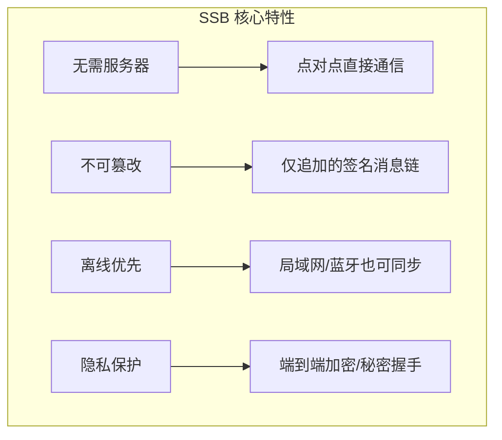
```mermaid
graph TD
    subgraph "SSB 核心特性"
        A[无需服务器] --> B[点对点直接通信]
        C[不可篡改] --> D[仅追加的签名消息链]
        E[离线优先] --> F[局域网/蓝牙也可同步]
        G[隐私保护] --> H[端到端加密/秘密握手]
    end
```

### 核心设计原则

| 特性 | 说明 |
|------|------|
| **无需主机（Hostless）** | 每台设备安装相同软件，网络中拥有平等权利 |
| **仅追加（Append-only）** | 消息链不可删除或修改，确保全网收敛到相同状态 |
| **身份即密钥** | 每个身份就是一个 ed25519 密钥对，公钥即为身份标识 |
| **内容哈希链接** | 消息通过哈希值引用其他消息、文件和 Feed |
| **全局八卦协议** | 信息通过 Gossip 协议在节点间传播，无需直接连接 |
| **局域网发现** | 通过多播 UDP 自动发现局域网内的其他节点 |

---

<!-- more -->

## 2. 架构总览：SSB Sketch

### 2.1 核心框架层

整个 SSB 生态建立在 `secret-stack` 框架之上，采用插件化架构：

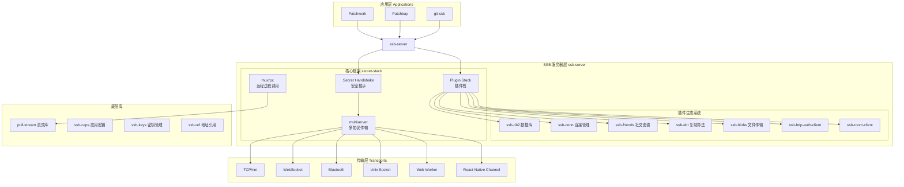
```mermaid
graph TB
    subgraph "应用层 Applications"
        Patchwork
        Patchbay
        git-ssb
    end

    subgraph "SSB 服务器层 ssb-server"
        subgraph "插件生态系统"
            DB[ssb-db2 数据库]
            CONN[ssb-conn 连接管理]
            FRIENDS[ssb-friends 社交图谱]
            EBT[ssb-ebt 复制算法]
            BLOBS[ssb-blobs 文件传输]
            AUTH[ssb-http-auth-client]
            ROOM[ssb-room-client]
        end
        subgraph "核心框架 secret-stack"
            SS[Secret Handshake<br/>安全握手]
            MS[multiserver<br/>多协议传输]
            RPC[muxrpc<br/>远程过程调用]
            PLUGIN[Plugin Stack<br/>插件栈]
        end
    end

    subgraph "传输层 Transports"
        NET[TCP/net]
        WS[WebSocket]
        BT[Bluetooth]
        UNIX[Unix Socket]
        WK[Web Worker]
        CH[React Native Channel]
    end

    subgraph "底层库"
        PS[pull-stream 流式库]
        CAPS[ssb-caps 应用密钥]
        KEYS[ssb-keys 密钥管理]
        REF[ssb-ref 地址引用]
    end

    Patchwork --> ssb-server
    Patchbay --> ssb-server
    git-ssb --> ssb-server
    ssb-server --> SS
    ssb-server --> PLUGIN
    PLUGIN --> DB & CONN & FRIENDS & EBT & BLOBS & AUTH & ROOM
    SS --> MS
    MS --> NET & WS & BT & UNIX & WK & CH
    RPC --> PS
```

### 2.2 插件生态全景图

以下是按功能分组的 SSB 插件生态全景图：

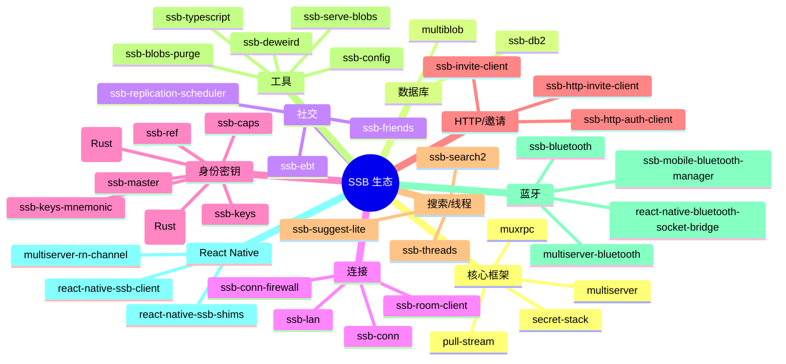
```mermaid
mindmap
  root((SSB 生态))
    核心框架
      secret-stack
      pull-stream
      muxrpc
      multiserver
    数据库
      ssb-db2
      multiblob
    社交
      ssb-friends
      ssb-replication-scheduler
      ssb-ebt
    连接
      ssb-conn
      ssb-conn-firewall
      ssb-lan
      ssb-room-client
    身份密钥
      ssb-keys
      ssb-keys-neon(Rust)
      ssb-keys-mnemonic
      ssb-keys-mnemonic-neon(Rust)
      ssb-caps
      ssb-master
      ssb-ref
    HTTP/邀请
      ssb-http-auth-client
      ssb-http-invite-client
      ssb-invite-client
    搜索/线程
      ssb-search2
      ssb-threads
      ssb-suggest-lite
    工具
      ssb-config
      ssb-typescript
      ssb-deweird
      ssb-blobs-purge
      ssb-serve-blobs
    蓝牙
      ssb-bluetooth
      multiserver-bluetooth
      ssb-mobile-bluetooth-manager
      react-native-bluetooth-socket-bridge
    React Native
      react-native-ssb-client
      react-native-ssb-shims
      multiserver-rn-channel
```

### 2.3 模块分类详表

| 分类 | 模块 | 版本 | 描述 |
|------|------|------|------|
| **核心框架** | secret-stack | - | 安全去中心化应用的插件框架 |
| **核心框架** | pull-stream | - | 轻量级流式编程库 |
| **核心框架** | muxrpc | ^6.4.2 | 多路复用 RPC 协议 |
| **核心框架** | multiserver | ^3.6.0 | 多协议统一服务器接口 |
| **数据库** | ssb-db2 | - | SSB 新一代数据库 |
| **数据库** | multiblob | - | 多哈希算法内容寻址存储 |
| **社交图谱** | ssb-friends | - | 基于 Contact 消息的社交关系计算 |
| **社交图谱** | ssb-replication-scheduler | - | 触发好友 Feed 复制 |
| **复制** | ssb-ebt | ^9.1.2 | 流行病广播树复制算法 |
| **连接** | ssb-conn | ^6.0.4 | CONN 连接管理（取代旧 gossip） |
| **连接** | ssb-conn-firewall | - | 入站连接防火墙 |
| **连接** | ssb-lan | - | 局域网 UDP 多播发现 |
| **连接** | ssb-room-client | - | Room 服务器客户端 |
| **密钥** | ssb-keys | - | 密钥文件操作 |
| **密钥** | ssb-keys-neon | - | ssb-keys 的 Rust 原生实现 |
| **密钥** | ssb-keys-mnemonic | - | 密钥与 BIP39 助记词互转 |
| **密钥** | ssb-keys-mnemonic-neon | - | ssb-keys-mnemonic 的 Rust 实现 |
| **安全** | ssb-caps | - | 应用级 Caps 密钥 |
| **安全** | ssb-master | - | Master ID 权限管理 |
| **工具** | ssb-ref | - | SSB 引用/地址验证 |
| **工具** | ssb-config | - | 配置文件生成 |
| **工具** | ssb-typescript | - | TypeScript 类型定义 |
| **HTTP** | ssb-http-auth-client | - | 通过 HTTP 进行 SSB 登录 |
| **HTTP** | ssb-http-invite-client | - | HTTP 邀请客户端 |
| **HTTP** | ssb-invite-client | - | Pub 邀请客户端 |
| **搜索** | ssb-search2 | - | ssb-db2 全文搜索 |
| **线程** | ssb-threads | - | 消息线程组织 |
| **蓝牙** | ssb-bluetooth | - | SSB 蓝牙顶层插件 |
| **蓝牙** | multiserver-bluetooth | - | multiserver 蓝牙传输 |
| **蓝牙** | ssb-mobile-bluetooth-manager | - | 移动端蓝牙管理器 |
| **蓝牙** | react-native-bluetooth-socket-bridge | ^1.2.0 | RN 蓝牙 Socket 桥接 |
| **RN** | react-native-ssb-client | ^7.1.0 | RN SSB 客户端 |
| **RN** | react-native-ssb-shims | ^5.1.0 | RN Node.js shims |
| **RN** | multiserver-rn-channel | ^1.3.0 | RN Channel 传输插件 |

---

## 3. secret-stack 深度解析

### 3.1 架构分层

`secret-stack` 是 SSB 生态的基石，它在底层集成了三大核心组件：

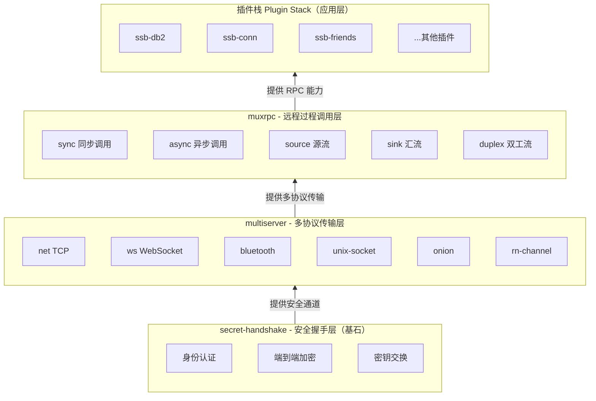
```mermaid
graph BT
    subgraph SG_SH["secret-handshake - 安全握手层（基石）"]
        SH_AUTH[身份认证]
        SH_ENCRYPT[端到端加密]
        SH_KEY_EXCHANGE[密钥交换]
    end

    subgraph SG_MS["multiserver - 多协议传输层"]
        MS_NET[net TCP]
        MS_WS[ws WebSocket]
        MS_BT[bluetooth]
        MS_UNIX[unix-socket]
        MS_ONION[onion]
        MS_CHANNEL[rn-channel]
    end

    subgraph SG_MUX["muxrpc - 远程过程调用层"]
        RPC_SYNC[sync 同步调用]
        RPC_ASYNC[async 异步调用]
        RPC_SOURCE[source 源流]
        RPC_SINK[sink 汇流]
        RPC_DUPLEX[duplex 双工流]
    end

    subgraph SG_P["插件栈 Plugin Stack（应用层）"]
        P1[ssb-db2]
        P2[ssb-conn]
        P3[ssb-friends]
        P4[...其他插件]
    end

    SG_SH -- 提供安全通道 --> SG_MS
    SG_MS -- 提供多协议传输 --> SG_MUX
    SG_MUX -- 提供 RPC 能力 --> SG_P
```

**工作流程**：

1. 两个对等节点通过 `multiserver` 建立底层连接（TCP/WebSocket/蓝牙等）
2. 通过 `secret-handshake` 进行安全握手，验证身份并协商会话密钥
3. 握手成功后，通过 `muxrpc` 建立 RPC 通道
4. 插件通过 muxrpc 暴露自己的 API 方法，供远程节点调用

### 3.2 插件机制

secret-stack 的插件系统是其核心设计：

```javascript
const SecretStack = require('secret-stack')
const caps = require('ssb-caps')

const createSsbServer = SecretStack({ appKey: caps.shs })
  .use(require('ssb-master'))      // Master ID 权限
  .use(require('ssb-db2'))          // 数据库
  .use(require('ssb-conn'))         // 连接管理
  .use(require('ssb-blobs'))        // 文件传输
  .use(require('ssb-ebt'))          // 复制算法
  .use(require('ssb-friends'))      // 社交图谱
  .call(null, config)               // 启动
```

**工厂模式**：`SecretStack(opts)` 创建一个 App 工厂，`.use(plugin)` 注册插件，最后 `App(config)` 实例化并启动。

**插件能做的三件事**：
1. 向 `multiserver` 添加新协议（如蓝牙）
2. 通过 `muxrpc` 添加可远程调用的方法
3. 添加持久化状态的插件（如 ssb-db2 数据库）

### 3.3 完整的 secret-stack 启动流程

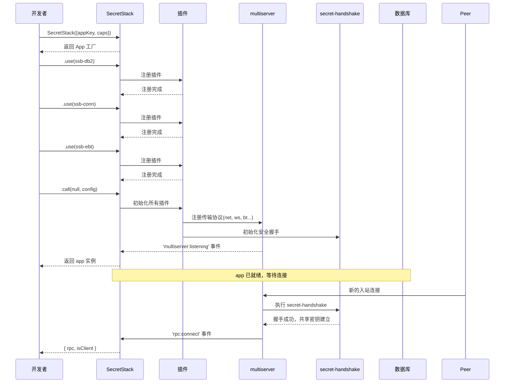
```mermaid
sequenceDiagram
    participant Dev as 开发者
    participant SS as SecretStack
    participant Plugin as 插件
    participant MS as multiserver
    participant SH as secret-handshake
    participant DB as 数据库

    Dev->>SS: SecretStack({appKey, caps})
    SS-->>Dev: 返回 App 工厂

    Dev->>SS: .use(ssb-db2)
    SS->>Plugin: 注册插件
    Plugin-->>SS: 注册完成

    Dev->>SS: .use(ssb-conn)
    SS->>Plugin: 注册插件
    Plugin-->>SS: 注册完成

    Dev->>SS: .use(ssb-ebt)
    SS->>Plugin: 注册插件
    Plugin-->>SS: 注册完成

    Dev->>SS: .call(null, config)
    SS->>Plugin: 初始化所有插件

    Plugin->>MS: 注册传输协议(net, ws, bt...)
    Plugin->>SH: 初始化安全握手

    MS-->>SS: 'multiserver:listening' 事件
    SS-->>Dev: 返回 app 实例

    Note over SS,DB: app 已就绪，等待连接

    Peer->>MS: 新的入站连接
    MS->>SH: 执行 secret-handshake
    SH-->>MS: 握手成功，共享密钥建立
    MS->>SS: 'rpc:connect' 事件
    SS-->>Dev: { rpc, isClient }
```

**核心事件**：
- `'multiserver:listening'`：服务器启动成功，开始监听
- `'rpc:connect'`：与远程对等节点成功建立连接

---

## 4. pull-stream 流式模型

SSB 全面采用 `pull-stream` 作为流式数据处理模型。pull-stream 是一种**背压（backpressure）感知**的流式库。

### 4.1 四种流类型

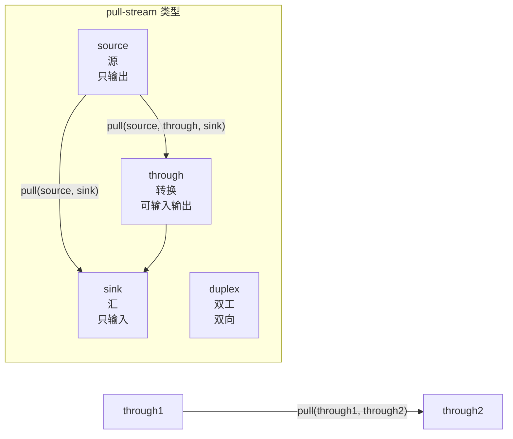
```mermaid
graph LR
    subgraph "pull-stream 类型"
        SRC[source<br/>源<br/>只输出]
        THRU[through<br/>转换<br/>可输入输出]
        SNK[sink<br/>汇<br/>只输入]
        DPLX[duplex<br/>双工<br/>双向]
    end

    SRC -->|"pull(source, sink)"| SNK
    SRC -->|"pull(source, through, sink)"| THRU --> SNK
    THRU1[through1] -->|"pull(through1, through2)"| THRU2[through2]
```

| 类型 | 描述 | 示例 |
|------|------|------|
| **source** | 数据源，只输出 | 数据库查询结果流 |
| **sink** | 数据汇，只输入 | 数据消费端 |
| **through** | 转换，既可输入也可输出 | 数据过滤/转换 |
| **duplex** | 双工，同时支持输入输出 | RPC 双向通信 |

### 4.2 组合方式

```javascript
// source → sink：从源拉取数据到汇
pull(source, sink)        // 返回 undefined

// source → through → sink：经过转换再到汇
pull(source, through, sink)

// through1 → through2：组合多个转换
pull(through1, through2)  // 返回新的 through

// duplex：双工连接
pull(duplex1, duplex2)    // 连接两个双工流
```

pull-stream 的"拉取"模型与 Node.js 内置的 Stream 的"推送"模型不同，它由**接收方主动请求数据**，从而实现自然的背压控制。这在 SSB 的复制过程中非常重要——节点可以在资源受限时控制数据接收速率。

---

## 5. 模块详解

### 5.1 数据库模块

#### ssb-db2（新一代数据库）

ssb-db2 是对旧版 `ssb-db` 的完全重写，旨在解决一些历史设计决策的局限。

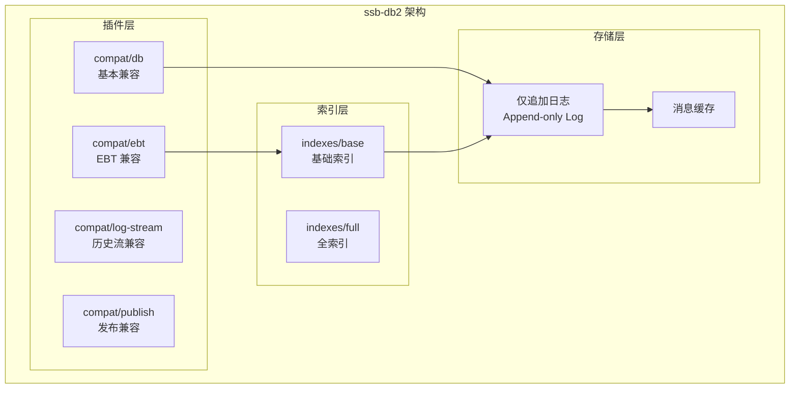
```mermaid
graph TB
    subgraph "ssb-db2 架构"
        subgraph "插件层"
            compat_db[compat/db<br/>基本兼容]
            compat_log[compat/log-stream<br/>历史流兼容]
            compat_ebt[compat/ebt<br/>EBT 兼容]
            compat_publish[compat/publish<br/>发布兼容]
        end

        subgraph "索引层"
            idx_base[indexes/base<br/>基础索引]
            idx_full[indexes/full<br/>全索引]
        end

        subgraph "存储层"
            LOG[仅追加日志<br/>Append-only Log]
            MSG[消息缓存]
        end
    end

    compat_db --> LOG
    compat_ebt --> idx_base
    LOG --> MSG
    idx_base --> LOG
```

**设计目标**：
- 更好的性能
- 更灵活的索引机制
- 模块化设计，允许替换存储后端
- 更好的 TypeScript 支持

**使用方式**：
```javascript
SecretStack({ appKey: require('ssb-caps').shs })
  .use(require('ssb-master'))
  .use(require('ssb-db2'))                            // 核心数据库
  .use(require('ssb-db2/compat/db'))                  // 基本兼容（可选）
  .use(require('ssb-db2/compat/ebt'))                 // EBT 兼容（可选）
  .use(require('ssb-db2/compat/publish'))             // 发布兼容（可选）
  .call(null, config)
```

#### multiblob（多哈希 Blob 存储）

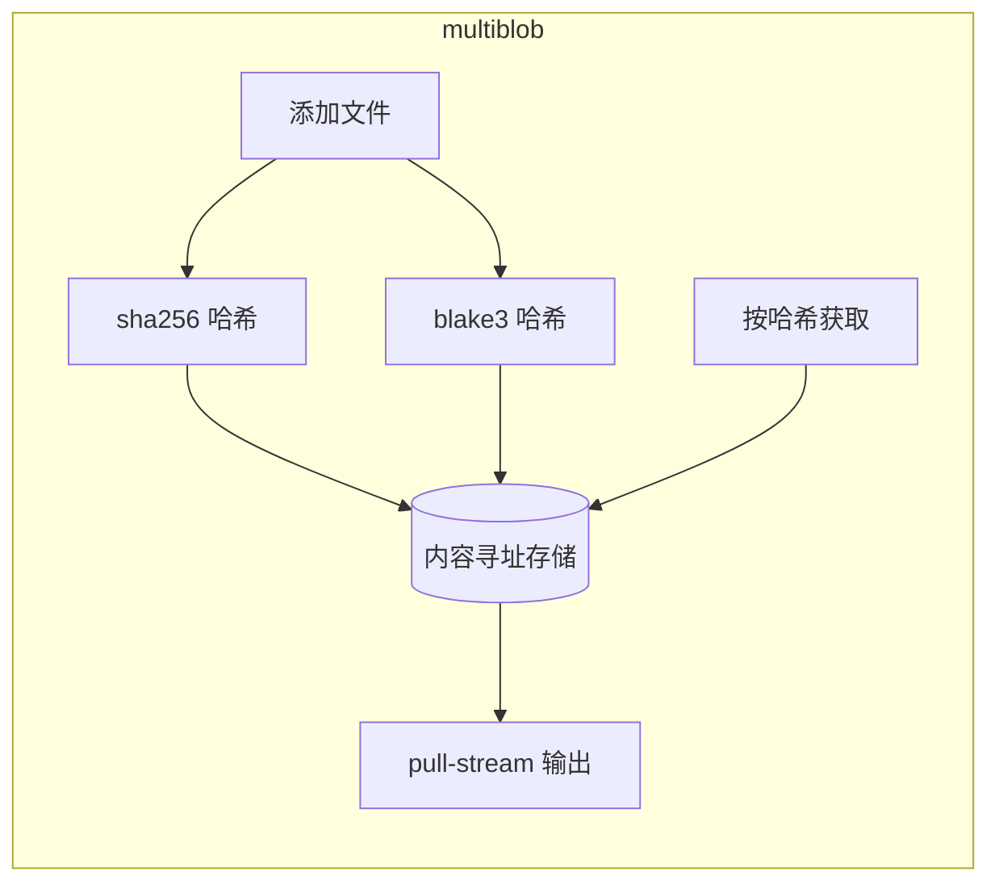
```mermaid
graph LR
    subgraph "multiblob"
        ADD[添加文件] --> HASH1[sha256 哈希]
        ADD --> HASH2[blake3 哈希]
        HASH1 --> STORE[(内容寻址存储)]
        HASH2 --> STORE
        GET[按哈希获取] --> STORE
        STORE --> STREAM[pull-stream 输出]
    end
```

- 支持多种哈希算法的内容寻址存储
- 基于 pull-stream 的流式接口
- 用于管理 SSB 中的二进制大文件（图片、附件等）

---

### 5.2 连接管理模块

#### ssb-conn（连接管理）

CONN（Connections Over Numerous Networks）取代了旧的 `gossip` 插件，是 SSB 连接管理的核心。

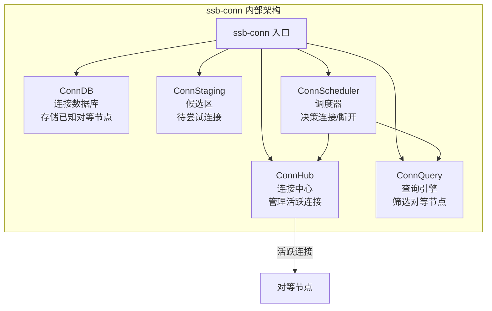
```mermaid
graph TB
    subgraph "ssb-conn 内部架构"
        CONN[ssb-conn 入口]
        DB[ConnDB<br/>连接数据库<br/>存储已知对等节点]
        HUB[ConnHub<br/>连接中心<br/>管理活跃连接]
        STAGING[ConnStaging<br/>候选区<br/>待尝试连接]
        QUERY[ConnQuery<br/>查询引擎<br/>筛选对等节点]
        SCHED[ConnScheduler<br/>调度器<br/>决策连接/断开]
    end

    CONN --> DB
    CONN --> HUB
    CONN --> STAGING
    CONN --> QUERY
    CONN --> SCHED
    SCHED --> QUERY
    SCHED --> HUB
    HUB -->|活跃连接| PEERS[对等节点]
```

**各组件职责**：

| 组件 | 类型 | 描述 |
|------|------|------|
| **ConnDB** | 存储 | 保存所有已知的对等节点地址和元数据 |
| **ConnHub** | 运行时 | 管理当前活跃的连接池 |
| **ConnStaging** | 暂存 | 待尝试连接的候选节点 |
| **ConnQuery** | 查询 | 提供丰富查询能力筛选节点 |
| **ConnScheduler** | 决策 | 内置调度策略，决定何时连接或断开 |

**调度器的工作流程**：
1. 启动时：发现并暂存已知节点
2. 周期性：检查各节点状态，决定连接/断开
3. 背压感知：根据资源情况调整连接数

#### ssb-conn-firewall（连接防火墙）

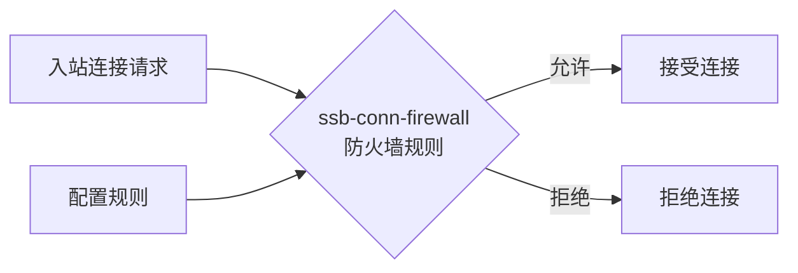
```mermaid
graph LR
    INCOMING[入站连接请求] --> FIREWALL{ssb-conn-firewall<br/>防火墙规则}
    FIREWALL -->|允许| ACCEPT[接受连接]
    FIREWALL -->|拒绝| REJECT[拒绝连接]
    CONFIG[配置规则] --> FIREWALL
```

- 精神继承 `ssb-incoming-guard`
- 与 SSB CONN 系列模块配合使用
- 支持灵活的规则配置（IP 白名单/黑名单、身份过滤等）

#### ssb-lan（局域网发现）

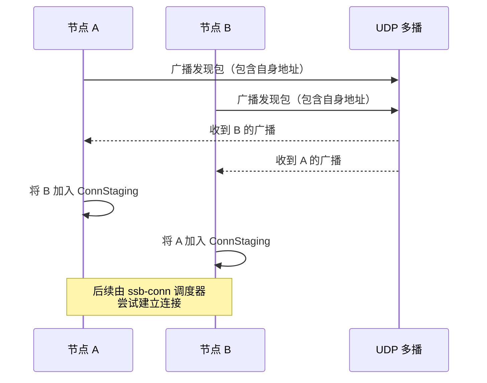
```mermaid
sequenceDiagram
    participant A as 节点 A
    participant B as 节点 B
    participant UDP as UDP 多播

    A->>UDP: 广播发现包（包含自身地址）
    B->>UDP: 广播发现包（包含自身地址）
    UDP-->>A: 收到 B 的广播
    UDP-->>B: 收到 A 的广播
    A->>A: 将 B 加入 ConnStaging
    B->>B: 将 A 加入 ConnStaging
    Note over A,B: 后续由 ssb-conn 调度器<br/>尝试建立连接
```

- 通过 UDP 多播在局域网内自动发现其他 SSB 节点
- 无需任何中心化配置
- 适用于办公室、家庭等本地网络环境

#### ssb-room-client（Room 客户端）

Room 服务器是一种中继服务器，帮助无法直接连接的节点进行通信（如 NAT 穿透）：

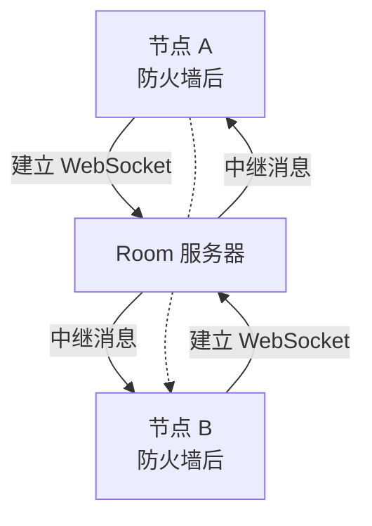
```mermaid
graph TB
    A[节点 A<br/>防火墙后] -->|建立 WebSocket| ROOM[Room 服务器]
    B[节点 B<br/>防火墙后] -->|建立 WebSocket| ROOM
    ROOM -->|中继消息| A
    ROOM -->|中继消息| B
    A <-.-ROOM-.-> B
```

- 解决 NAT 穿透问题
- 本身不存储消息（纯中继）
- 端到端加密（Room 无法解密内容）

---

### 5.3 社交图谱模块

#### ssb-friends（社交图谱计算）

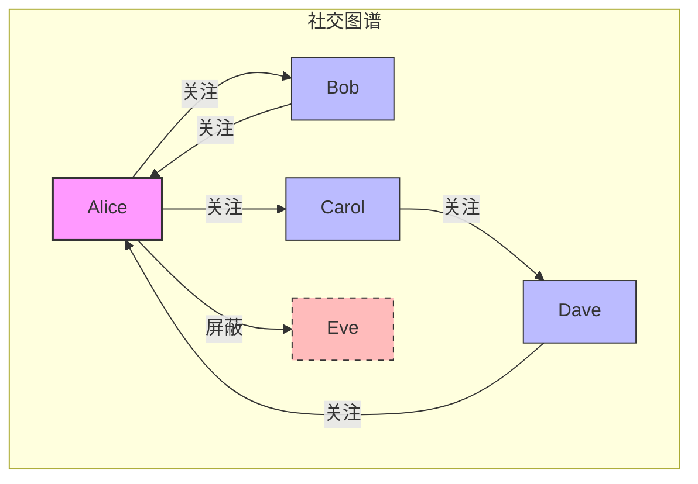
```mermaid
graph TB
    subgraph "社交图谱"
        A[Alice]
        B[Bob]
        C[Carol]
        D[Dave]
        E[Eve]
    end

    A -- 关注 --> B
    B -- 关注 --> A
    A -- 关注 --> C
    C -- 关注 --> D
    A -- 屏蔽 --> E
    D -- 关注 --> A

    style A fill:#f9f,stroke:#333,stroke-width:2
    style B fill:#bbf,stroke:#333
    style C fill:#bbf,stroke:#333
    style D fill:#bbf,stroke:#333
    style E fill:#fbb,stroke:#333,stroke-dasharray: 5 5
```

- 基于 `type: "contact"` 消息构建社交关系
- 支持关注（follow）和屏蔽（block）两种关系
- 提供 API 查询：
  - `ssb.friends.isFollowing(source, dest)` — 是否关注
  - `ssb.friends.isBlocking(source, dest)` — 是否屏蔽
  - `ssb.friends.hops(source)` — N 度人脉关系

#### ssb-replication-scheduler（复制调度器）

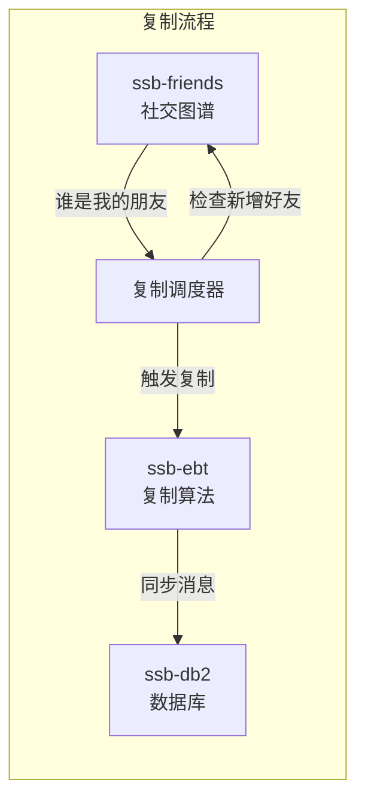
```mermaid
graph LR
    subgraph "复制流程"
        FRIENDS[ssb-friends<br/>社交图谱] -->|谁是我的朋友| SCHED[复制调度器]
        SCHED -->|触发复制| EBT[ssb-ebt<br/>复制算法]
        EBT -->|同步消息| DB[ssb-db2<br/>数据库]
        SCHED -->|检查新增好友| FRIENDS
    end
```

- 依赖 `ssb-friends` 的 API 确定要复制哪些 Feed
- 调用 `ssb-ebt` 的 API 执行实际复制
- 持续监听社交图谱变化，自动触发新好友的复制

---

### 5.4 身份与密钥模块

#### ssb-keys / ssb-keys-neon（密钥管理）

```
ssb-keys（JavaScript 实现）
    ↓ 替代
ssb-keys-neon（Rust 实现，原生模块）
```

- 生成 ed25519 密钥对
- 加载/保存密钥文件
- 签名和验证消息
- `ssb-keys-neon` 使用 Rust 编写，通过 Neon 绑定到 Node.js，性能提升明显

#### ssb-keys-mnemonic / ssb-keys-mnemonic-neon（助记词）


```mermaid
graph LR
    KEY[SSB 密钥<br/>ed25519 密钥对] --> MNEMONIC[BIP39 助记词<br/>12/24 个英文单词]
    MNEMONIC -->|备份/恢复| KEY

    style KEY fill:#f9f
    style MNEMONIC fill:#bbf
```

- 实现 SSB 密钥与 BIP39 助记词的互转
- 方便用户备份和恢复身份
- Rust 版本（neon）提供更高性能

#### ssb-caps（应用 Caps 密钥）

Caps 密钥是 SSB 应用层的安全机制：

```
shs: 用于 secret-handshake 的共享密钥
sign: 用于签名
invite: 用于邀请码
```

- 32 字节的高熵随机密钥
- 不知道此值的节点无法连接到应用实例
- 每个应用可以有自己独立的 Caps 密钥，形成应用隔离

#### ssb-master（Master ID）

```javascript
// 配置示例
{
  master: ["@...="]  // master 的公钥列表
}
```

- 允许在配置中定义 "master" 身份
- Master ID 拥有等同于本地主 ID 的全部权限
- 适用于多设备场景（手机、电脑共用一个身份）

---

### 5.5 复制与同步模块

#### ssb-ebt（流行病广播树复制）

Epidemic Broadcast Trees（EBT）是 SSB 的核心复制算法，取代了旧的 `ssb-replicate`。

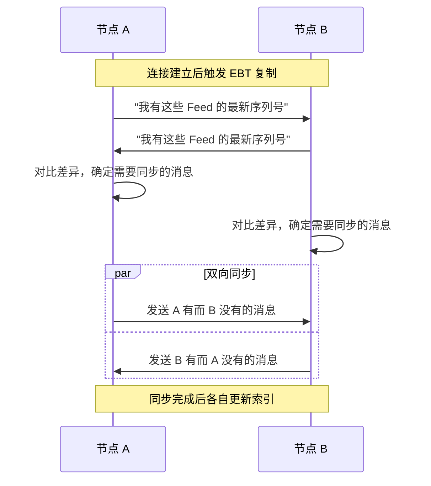
```mermaid
sequenceDiagram
    participant A as 节点 A
    participant B as 节点 B

    Note over A,B: 连接建立后触发 EBT 复制

    A->>B: "我有这些 Feed 的最新序列号"
    B->>A: "我有这些 Feed 的最新序列号"
    A->>A: 对比差异，确定需要同步的消息
    B->>B: 对比差异，确定需要同步的消息

    par 双向同步
        A->>B: 发送 A 有而 B 没有的消息
    and
        B->>A: 发送 B 有而 A 没有的消息
    end

    Note over A,B: 同步完成后各自更新索引
```

**算法特点**：

- 基于流行病传播模型（Gossip）
- 使用广播树减少冗余传输
- 支持断点续传
- 仅同步差异部分（增量复制）

**版本要求**：
- Node.js 10+
- ssb-db 或 ssb-db2 5.0+

```javascript
// ssb.ebt.replicate(opts) 是双向（duplex）muxrpc API
// 内部依赖
//   - epidemic-broadcast-trees ^9.0.2
//   - ssb-classic ^1.1.0
//   - ssb-bendy-butt ^1.0.1
```

---

### 5.6 HTTP/邀请模块

#### ssb-http-auth-client（HTTP 登录）

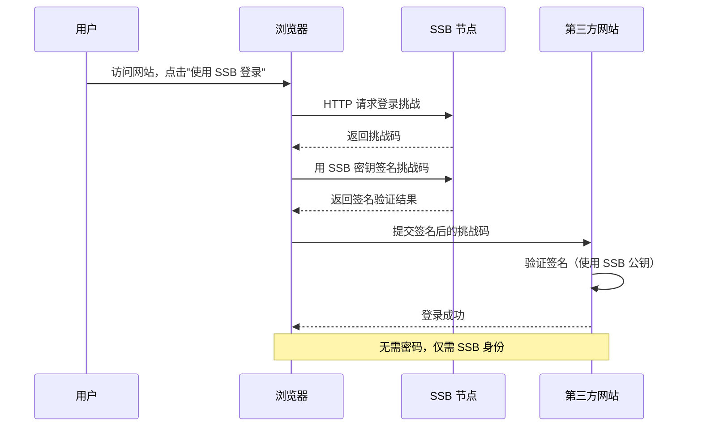
```mermaid
sequenceDiagram
    participant User as 用户
    participant Browser as 浏览器
    participant SSB as SSB 节点
    participant Website as 第三方网站

    User->>Browser: 访问网站，点击"使用 SSB 登录"
    Browser->>SSB: HTTP 请求登录挑战
    SSB-->>Browser: 返回挑战码
    Browser->>SSB: 用 SSB 密钥签名挑战码
    SSB-->>Browser: 返回签名验证结果
    Browser->>Website: 提交签名后的挑战码
    Website->>Website: 验证签名（使用 SSB 公钥）
    Website-->>Browser: 登录成功

    Note over Browser,Website: 无需密码，仅需 SSB 身份
```

- 基于 HTTP 的 SSB 身份验证
- 无需暴露私钥
- 第三方网站可以通过 SSB 公钥验证用户身份

#### ssb-http-invite-client / ssb-invite-client（邀请）

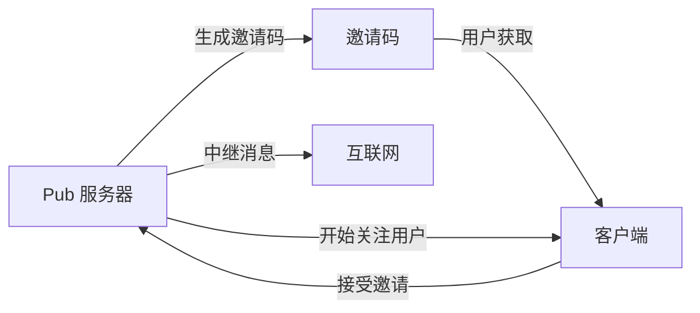
```mermaid
graph LR
    PUB[Pub 服务器] -->|生成邀请码| INVITE[邀请码]
    INVITE -->|用户获取| CLIENT[客户端]
    CLIENT -->|接受邀请| PUB
    PUB -->|开始关注用户| CLIENT
    PUB -->|中继消息| INTERNET[互联网]
```

- Pub 生成邀请码
- 客户端接受邀请后，Pub 开始关注该用户
- 用户通过 Pub 连接到更广泛的 SSB 网络

---

### 5.7 工具与辅助模块

#### ssb-search2（全文搜索）

基于 ssb-db2 构建的全文搜索引擎：

```
ssb-search2
  ├── 索引消息内容
  ├── 支持关键词搜索
  ├── 基于 ssb-db2 索引系统
  └── pull-stream 流式返回结果
```

#### ssb-threads（消息线程）

将扁平的消息流组织成对话线程：

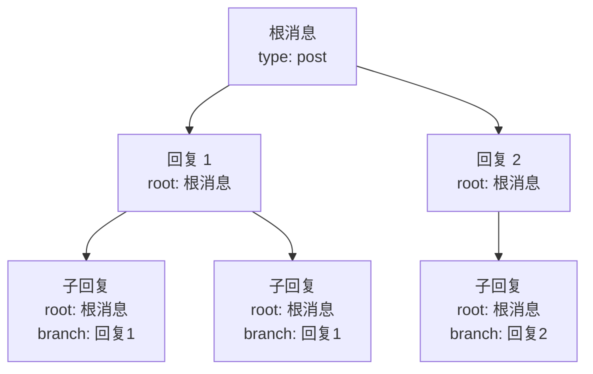
```mermaid
graph TB
    ROOT[根消息<br/>type: post] --> REPLY1[回复 1<br/>root: 根消息]
    ROOT --> REPLY2[回复 2<br/>root: 根消息]
    REPLY1 --> REPLY1_1[子回复<br/>root: 根消息<br/>branch: 回复1]
    REPLY1 --> REPLY1_2[子回复<br/>root: 根消息<br/>branch: 回复1]
    REPLY2 --> REPLY2_1[子回复<br/>root: 根消息<br/>branch: 回复2]
```

- 每个消息通过 `root` 字段关联到线程起始
- 通过 `branch` 字段关联到直接回复的消息
- 支持构建完整的对话树结构

#### ssb-deweird（muxrpc 修复）

```
问题：muxrpc 的 source 流缺乏正常的 pull-stream 背压支持
解决：ssb-deweird 修复此问题，使 source 流具有正确的背压行为
```

#### ssb-blobs-purge（Blob 清理）

```
功能：自动移除老旧和大体积的 Blob
策略：
  - 基于时间（超过一定时间未访问）
  - 基于大小（超过一定体积）
  - 可配置的保留策略
```

#### ssb-serve-blobs（本地 Blob HTTP 服务）

```
端口：26835
功能：通过本地 HTTP 服务器提供 Blob 访问
用途：允许本地应用（如浏览器）通过 HTTP 获取 SSB Blob
```

#### ssb-suggest-lite（作者建议）

```
功能：根据名称匹配 SSB 作者资料
用途：在 UI 中输入 @用户名 时，自动补全匹配的作者
```

#### ssb-typescript（TypeScript 类型）

```
包含 SSB 核心概念的 TypeScript 类型定义：
  - FeedId, MsgId, BlobId
  - SSB 消息类型
  - muxrpc 方法签名
  - 配置类型
```

---

### 5.8 蓝牙相关模块

详见 [第 8 章：SSB 蓝牙模块架构](#8-ssb-蓝牙模块架构)。

---

## 6. React Native SSB Client

### 6.1 整体架构

`react-native-ssb-client` 是一个让 React Native 应用作为 SSB 客户端的前端库，它与在 `nodejs-mobile-react-native` 中运行的后端 SSB 服务器通信。

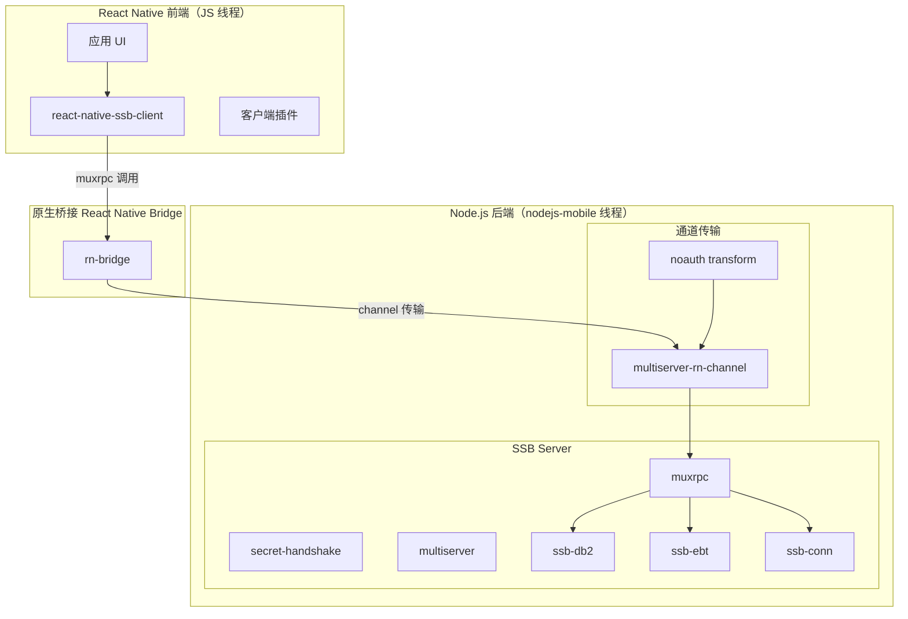
```mermaid
graph TB
    subgraph "React Native 前端（JS 线程）"
        UI[应用 UI]
        CLIENT[react-native-ssb-client]
        CLIENT_PLUGIN[客户端插件]
    end

    subgraph "原生桥接 React Native Bridge"
        RN_BRIDGE[rn-bridge]
    end

    subgraph "Node.js 后端（nodejs-mobile 线程）"
        subgraph "SSB Server"
            SHS[secret-handshake]
            MS[multiserver]
            MUX[muxrpc]
            DB[ssb-db2]
            EBT[ssb-ebt]
            CONN[ssb-conn]
        end
        subgraph "通道传输"
            RN_CH[multiserver-rn-channel]
            NOAUTH[noauth transform]
        end
    end

    UI --> CLIENT
    CLIENT -->|muxrpc 调用| RN_BRIDGE
    RN_BRIDGE -->|channel 传输| RN_CH
    RN_CH --> MUX
    MUX --> DB & EBT & CONN

    NOAUTH --> RN_CH
```

**前后端通信方式**：
- 前端通过 React Native 的 `rn-bridge` 通道向后端发送 muxrpc 调用
- 后端使用 `multiserver-rn-channel` 监听来自前端的通道连接
- 使用 `noauth` 转换（不加密，仅在同设备上使用）

### 6.2 前后端分离模式

```
┌──────────────────────────────────────┐
│          前端（React Native JS）       │
│                                      │
│  import ssbClient from               │
│    'react-native-ssb-client'         │
│                                      │
│  ssbClient(manifest)                 │
│    .use(somePlugin)                  │
│    .call(null, (err, ssb) => {       │
│      // 使用 ssb 调用后端 API         │
│      ssb.publish({type: 'post', ...})│
│    })                                │
└──────────────────┬───────────────────┘
                   │ rn-bridge channel
                   │ (同一设备，无需加密)
┌──────────────────┴───────────────────┐
│       后端（nodejs-mobile 线程）       │
│                                      │
│  SecretStack({appKey: caps.shs})     │
│    .use(rnChannelTransport)          │
│    .use(noAuthTransform)             │
│    .use(ssb-db2)                     │
│    .use(ssb-conn)                    │
│    .use(ssb-ebt)                     │
│    .call(null, config)               │
└──────────────────────────────────────┘
```

**前端 API**：

```javascript
// 创建客户端
ssbClient(manifest)
  .use(plugin)     // 可选：注册客户端插件
  .call(null, cb)  // 回调方式
  .callPromise()   // Promise 方式（备选）
```

### 6.3 依赖树详解

```
react-native-ssb-client@7.1.0
│
├── assert@2.0.0                    ← Node.js assert 的 polyfill
│   ├── es6-object-assign@1.1.0
│   ├── is-nan@1.3.0
│   │   └── define-properties@1.1.3
│   ├── object-is@1.0.2
│   └── util@0.12.2
│       ├── inherits@2.0.4
│       ├── is-arguments@1.0.4
│       ├── is-generator-function@1.0.7
│       └── safe-buffer@5.1.2
│
├── events@3.0.0                    ← Node.js EventEmitter 的 polyfill
│
├── multiserver@3.6.0               ← 多协议统一服务器
│   ├── debug@4.1.1
│   │   └── ms@2.1.2
│   ├── multicb@1.2.2
│   ├── multiserver-scopes@1.0.0
│   ├── pull-cat@1.1.11
│   ├── pull-stream@3.6.14
│   ├── pull-ws@3.3.1               ← WebSocket 传输
│   ├── secret-handshake@1.1.20     ← 安全握手
│   ├── separator-escape@0.0.0
│   ├── socks@2.3.2                 ← SOCKS 代理
│   └── stream-to-pull-stream@1.7.2
│
├── multiserver-rn-channel@1.3.0    ← React Native 通道传输
│   └── pull-rn-channel@1.2.0
│       └── quick-insert@1.0.0
│
├── muxrpc@6.4.2                    ← 多路复用 RPC
│
└── pull-stream@3.6.14              ← 流式库
```

### 6.4 扩展模块详解

#### react-native-ssb-shims@5.1.0（Node.js 兼容层）

```
react-native-ssb-shims
│
├── buffer@5.6.0                    ← Buffer polyfill
├── path@0.12.7                     ← path 模块 polyfill
├── propagate-replacement-fields@1.2.0
├── react-native-os-staltz@2.2.1    ← OS 信息（兼容 React Native）
│
└── react-native-process-shim@1.1.1 ← process 对象 polyfill
    └── react-native-os-staltz@2.2.1
```

- 提供 Node.js 核心模块在 React Native 环境中的替代实现
- 使基于 Node.js 的 SSB 模块能在 RN 中正常运行

#### multiserver-rn-channel@1.3.0（RN 通道）

```mermaid
graph LR
    subgraph "multiserver-rn-channel"
        MS_CHANNEL[multiserver-rn-channel]
        PS_CHANNEL[pull-rn-channel]
        QINSERT[quick-insert]
    end

    MS_CHANNEL -->|创建 Channel 传输| PS_CHANNEL
    PS_CHANNEL -->|使用| QINSERT
    MS_CHANNEL -->|注册到| MS[multiserver]
```

- 将 React Native 的 `rn-bridge` 通道封装为 multiserver 可识别的传输插件
- 使 SSB 的通信管道能穿越 React Native 的 JS ↔ Native 边界

#### multiserver-bluetooth（蓝牙传输）

```
描述：multiserver 的蓝牙传输插件
要求：需要 bluetooth-manager 作为参数
功能：
  - 建立蓝牙连接
  - 断开连接
  - 打开连接流
```

### 6.5 配置示例

```javascript
// 后端配置（nodejs-mobile 线程中）
const rnBridge = require('rn-bridge')
const rnChannelPlugin = require('multiserver-rn-channel')
const NoauthTransformPlugin = require('multiserver/plugins/noauth')

const config = makeConfig('ssb', {
  connections: {
    incoming: {
      net: [{ scope: 'private', transform: 'shs', port: 26831 }],
      channel: [{ scope: 'device', transform: 'noauth' }],   // ← RN 通道
    },
    outgoing: {
      net: [{ transform: 'shs' }],
    },
  },
})

function rnChannelTransport(ssb) {
  ssb.multiserver.transport({
    name: 'channel',
    create: () => rnChannelPlugin(rnBridge.channel),
  })
}

function noAuthTransform(ssb, cfg) {
  ssb.multiserver.transform({
    name: 'noauth',
    create: () =>
      NoauthTransformPlugin({
        keys: { publicKey: Buffer.from(cfg.keys.public, 'base64') },
      }),
  })
}

SecretStack({ appKey: require('ssb-caps').shs })
  .use(noAuthTransform)
  .use(rnChannelTransport)
  .use(require('ssb-db2'))
  .use(require('ssb-master'))
  .use(require('ssb-conn'))
  .use(require('ssb-blobs'))
  .use(require('ssb-ebt'))
  .call(null, config)
```

```javascript
// 前端配置（React Native JS 线程中）
import ssbClient from 'react-native-ssb-client'

const manifest = {
  // ... muxrpc manifest 对象
}

ssbClient(manifest)
  .use({ name: 'some-plugin', init: (ssb) => { /* ... */ } })
  .call(null, (err, ssb) => {
    // ssb.publish(), ssb.get(), ssb.blobs.get() ...
  })
```

---

## 7. SSB 依赖完整性树

以下是 SSB 项目的完整 npm 依赖树中主要依赖的整理。

### 7.1 依赖关系总览

```mermaid
graph TB
    subgraph "顶层依赖"
        BIND[bindings-noderify-nodejs-mobile@10.3.0]
        BUFFERUTIL[bufferutil@4.0.1]
        CACHED[cached-path-relative@1.0.2]
        CHLORIDE[chloride@2.4.0]
        ELECTRON[electron@15.2.0]
    end

    subgraph "chloride 加密库"
        SB[sodium-browserify@1.3.0]
        SBT[sodium-browserify-tweetnacl@0.2.6]
        SC[sodium-chloride@1.1.2]
        SN[sodium-native@3.2.0]
    end

    SB --> LW[libsodium-wrappers@0.7.8]
    LW --> LS[libsodium@0.7.8]
    SB --> SHA[sha.js@2.4.5]
    SB --> TN[tweetnacl@0.14.5]

    SBT --> CT[chloride-test@1.2.4]
    SBT --> ED[ed2curve@0.1.4]
    SBT --> SHA2[sha.js@2.4.11]
    SBT --> TN2[tweetnacl@1.0.3]
    SBT --> TA[tweetnacl-auth@0.3.1]

    SN --> INI[ini@1.3.8]
    SN --> NGB[node-gyp-build@4.2.3]

    CHLORIDE --> SB & SBT & SC & SN

    BUFFERUTIL --> NGB2[node-gyp-build@3.7.0]
```

### 7.2 关键依赖分析

| 依赖 | 版本 | 说明 |
|------|------|------|
| **bindings-noderify-nodejs-mobile** | 10.3.0 | Node.js Mobile 的原生绑定 |
| **bufferutil** | 4.0.1 | WebSocket buffer 操作（需要 `node-gyp-build@3.7.0`） |
| **cached-path-relative** | 1.0.2 | 相对路径缓存 |
| **chloride** | 2.4.0 | NaCl 加密库的高级封装 |
| **electron** | 15.2.0 | Electron 桌面框架（用于桌面版 SSB 应用） |

#### chloride 加密栈详解

`chloride` 是 SSB 的加密基石，它提供了多层次的实现方案：

```mermaid
graph TB
    subgraph "chloride@2.4.0 加密栈"
        API[chloride API<br/>统一加密接口]

        subgraph "浏览器方案"
            SB[sodium-browserify<br/>浏览器 JS 实现]
            SBT[sodium-browserify-tweetnacl<br/>浏览器 TweetNaCl 实现]
        end

        subgraph "Node.js 方案"
            SC[sodium-chloride<br/>纯 JS 实现]
            SN[sodium-native<br/>原生 C 实现]
        end
    end

    API -->|浏览器| SB & SBT
    API -->|Node.js| SC & SN
    SN -->|性能最优| NATIVE[(原生库)]
```

**sodium-browserify 依赖链**：
```
libsodium-wrappers@0.7.8
  └── libsodium@0.7.8          ← libsodium 的 JS 编译版本

sha.js@2.4.5                   ← 哈希算法
tweetnacl@0.14.5               ← TweetNaCl 加密
```

**sodium-browserify-tweetnacl 依赖链**：
```
chloride-test@1.2.4
  └── json-buffer@2.0.11
ed2curve@0.1.4                 ← ed25519 ↔ curve25519 转换
  └── tweetnacl@0.14.5
sha.js@2.4.11                  ← SHA 哈希
tweetnacl@1.0.3                ← TweetNaCl v1
tweetnacl-auth@0.3.1           ← HMAC 认证
  └── tweetnacl@0.14.5
```

#### electron@15.2.0 关键依赖

| 子依赖 | 说明 |
|--------|------|
| @electron/get@1.13.0 | Electron 二进制下载 |
| global-agent@2.2.0 | 全局 HTTP 代理配置 |
| boolean@3.1.4 | 布尔值解析 |
| core-js@3.18.3 | JS 标准库 polyfill |
| matcher@3.0.0 | 字符串模式匹配 |

---

## 8. SSB 蓝牙模块架构

### 8.1 模块分层

蓝牙模块从顶层到底层分为四层：

```mermaid
graph TB
    subgraph "SSB 蓝牙架构"
        subgraph "L1: 顶层插件"
            SSB_BT[ssb-bluetooth]
            DESC1["SSB 蓝牙顶层插件<br/>对外提供完整蓝牙功能 API"]
        end

        subgraph "L2: 传输插件"
            MS_BT[multiserver-bluetooth]
            DESC2["multiserver 蓝牙传输插件<br/>管理蓝牙连接和传输流<br/>需要 bluetooth-manager 参数"]
        end

        subgraph "L3: 管理器"
            MOBILE_BT_MGR[ssb-mobile-bluetooth-manager]
            DESC3["移动端蓝牙管理器<br/>处理设备发现、配对、<br/>连接生命周期管理"]
        end

        subgraph "L4: 桥接层"
            RN_BT_BRIDGE[react-native-bluetooth-socket-bridge]
            DESC4["React Native 蓝牙 Socket 桥接<br/>将原生蓝牙 API 封装为<br/>Socket 接口"]
        end
    end

    SSB_BT --> MS_BT
    MS_BT --> MOBILE_BT_MGR
    MOBILE_BT_MGR --> RN_BT_BRIDGE

    style SSB_BT fill:#e6f3ff,stroke:#333,stroke-width:2px
    style MS_BT fill:#e6f3ff,stroke:#333
    style MOBILE_BT_MGR fill:#e6f3ff,stroke:#333
    style RN_BT_BRIDGE fill:#e6f3ff,stroke:#333
```

### 8.2 Socket 类型与通信

系统定义了 8 种不同类型的 Socket，每种用于特定的通信场景：

```mermaid
graph TB
    subgraph "蓝牙 Socket"
        BT_IN[incoming socket<br/>bluetooth<br/>入站蓝牙连接]
        BT_OUT[outgoing socket<br/>bluetooth<br/>出站蓝牙连接]
        META_SOCK[metaservice socket<br/>Insecure bluetooth<br/>生命周期: discover metaservice]
    end

    subgraph "本地 Socket"
        CMD_SOCK[cmd socket<br/>local<br/>执行蓝牙命令]
        LOCAL1[local socket]
        LOCAL2[local socket]
    end

    subgraph "网络 Socket"
        CTRL_SOCK[controller socket<br/>net server duplex<br/>控制器双工连接]
        NET_IN[incoming socket<br/>net server duplex<br/>入站网络双工]
        NET_OUT[going socket<br/>net server duplex<br/>出站网络双工]
    end

    BT_IN <-->|copy stream| CTRL_SOCK
    BT_OUT <-->|copy stream| NET_OUT
    META_SOCK -->|发现元服务| CMD_SOCK
```

| Socket 类型 | 传输协议 | 连接方向 | 用途 |
|-------------|----------|----------|------|
| **incoming socket (bluetooth)** | 蓝牙 | 入站 | 接收远程设备的蓝牙连接请求 |
| **outgoing socket (bluetooth)** | 蓝牙 | 出站 | 向远程设备发起蓝牙连接 |
| **metaservice socket Insecure** | 蓝牙（不安全） | - | 发现元服务，不加密的生命周期 |
| **controller socket** | 网络双工 | - | 多路复用控制器连接 |
| **cmd socket** | 本地 | - | 执行本地蓝牙命令 |
| **incoming socket (net server duplex)** | 网络双工 | 入站 | 接收网络连接 |
| **going socket (net server duplex)** | 网络双工 | 出站 | 发起网络连接 |
| **local socket** | 本地 | - | 本地进程间通信 |

### 8.3 Socket 命令 API

蓝牙模块提供了 6 个 Socket 命令：

```mermaid
graph LR
    subgraph "Socket 命令集"
        START[startMetadataService<br/>启动元数据服务]
        DISCOVER[discoverDevices<br/>发现设备]
        MAKE_DISC[makeDiscoverable<br/>设为可发现]
        GET_META[getMetadata<br/>获取元数据]
        IS_ENABLED[isEnabled<br/>检查蓝牙状态]
        CONNECT[connect<br/>建立连接]
    end

    CMD_SOCK[cmd socket] --> START
    CMD_SOCK --> DISCOVER
    CMD_SOCK --> MAKE_DISC
    CMD_SOCK --> GET_META
    CMD_SOCK --> IS_ENABLED
    CMD_SOCK --> CONNECT
```

| 命令 | 功能 | 详细说明 |
|------|------|----------|
| **startMetadataService** | 启动元数据服务 | 开始广播设备信息（名称、SSB ID 等），使其他设备能发现本设备 |
| **discoverDevices** | 发现设备 | 扫描周围的蓝牙设备，获取设备列表 |
| **makeDiscoverable** | 设为可发现 | 将本设备设为蓝牙可发现模式，允许其他设备找到本设备 |
| **getMetadata** | 获取元数据 | 获取特定设备的元数据信息（SSB ID、设备名等） |
| **isEnabled** | 检查蓝牙状态 | 检查本设备的蓝牙功能是否已开启 |
| **connect** | 建立连接 | 向指定设备发起蓝牙连接 |

### 8.4 蓝牙连接建立流程

```mermaid
sequenceDiagram
    participant A as 设备 A
    participant BT_A as 蓝牙管理器 A
    participant BT_B as 蓝牙管理器 B
    participant B as 设备 B

    Note over A,B: 发现阶段

    A->>BT_A: startMetadataService()
    BT_A-->>A: 元数据服务已启动
    B->>BT_B: startMetadataService()
    BT_B-->>B: 元数据服务已启动

    A->>BT_A: discoverDevices()
    BT_A->>BT_B: 蓝牙广播扫描
    BT_B-->>BT_A: 返回设备 B 信息
    BT_A-->>A: 发现设备 B

    Note over A,B: 元数据交换阶段

    A->>BT_A: getMetadata(设备 B)
    BT_A->>BT_B: 请求元数据
    BT_B-->>BT_A: 返回设备 B 的 SSB ID
    BT_A-->>A: 设备 B 的元数据

    Note over A,B: 连接阶段

    A->>BT_A: connect(设备 B)
    BT_A->>BT_B: 发起蓝牙连接请求
    BT_B-->>BT_A: 连接已建立
    BT_A-->>A: 蓝牙连接成功

    Note over A,B: SSB 协议阶段

    A->>BT_A: 创建 incoming socket (bluetooth)
    BT_A-->>A: socket 就绪
    A->>BT_A: 通过 copy stream 桥接到 controller socket

    Note over A,B: secret-handshake + muxrpc
    A->>B: 通过蓝牙通道进行 SSB 协议通信
```

### 8.5 完整数据流

```mermaid
graph TB
    subgraph "设备 A"
        subgraph "SSB 核心"
            APP[SSB App]
            SS[secret-stack]
        end

        subgraph "蓝牙模块"
            BT_MGR[蓝牙管理器]
            CMD[cmd socket]
            LOCAL_A[local socket]
        end

        subgraph "Socket 层"
            BT_IN_A[incoming socket bluetooth]
            BT_OUT_A[outgoing socket bluetooth]
            META_A[metaservice socket Insecure]
        end

        APP --> SS
        SS --> CMD
        CMD --> BT_MGR
        BT_MGR --> BT_OUT_A
        BT_MGR --> BT_IN_A
        BT_MGR --> META_A
        BT_MGR --> LOCAL_A
    end

    subgraph "传输桥接"
        COPY[copy stream]
        BRIDGE[bridge]
        NATIVE[native api]
        MANAGER[manager]
    end

    subgraph "设备 B"
        BT_IN_B[incoming socket bluetooth]
        BT_OUT_B[outgoing socket bluetooth]
        SS_B[SSB 核心 B]
    end

    BT_OUT_A -->|蓝牙连接| BT_IN_B
    BT_IN_A -->|蓝牙连接| BT_OUT_B
    BT_OUT_A --> COPY
    BT_IN_A --> COPY
    COPY --> NATIVE
    NATIVE --> BRIDGE
    BRIDGE --> MANAGER
    MANAGER --> LOCAL_A
    META_A -->|发现元服务| BT_OUT_B
```

**数据流路径说明**：

```
1. 常规蓝牙连接：
   远程设备 → incoming socket (bluetooth) → copy stream
   → controller socket (net server duplex) → SSB 核心

2. 本地命令执行：
   用户操作 → cmd socket (local) → 蓝牙管理器 → native API

3. 蓝牙广播发现：
   metaservice socket (Insecure bluetooth) → 发现元服务
   → 建立连接 → 升级为安全连接

4. 内部桥接：
   native API → get ssb id → bridge → manager → local socket
```

---

## 9. 附录

### 9.1 相关组织与链接汇总

| 组织/仓库 | 描述 | 链接 |
|-----------|------|------|
| **ssb-js** | SSB JavaScript 实现 | https://github.com/ssb-js |
| **ssbc** | 分布式安全点对点社交网络 | https://github.com/ssbc |
| **ssb-ngi-pointer** | SSB NGI Pointer 团队 | https://github.com/ssb-ngi-pointer |
| **scuttlebutt-eu** | SSB 欧洲组织 | https://github.com/scuttlebutt-eu |
| **pull-stream** | pull-stream 流式库 | https://github.com/pull-stream |
| | SSB 官网 | https://scuttlebutt.nz/ |
| | SSB 开发者地图 | https://dev.scuttlebutt.nz/ |
| | SSB 手册 | https://handbook.scuttlebutt.nz/ |
| | SSB NGI Pointer | https://ssb-ngi-pointer.github.io/ |
| | SSB 欧洲 | https://scuttlebutt.eu/ |

### 9.2 术语表

| 术语 | 英文 | 说明 |
|------|------|------|
| **Feed** | Feed | 单个身份的消息链，仅追加的区块链 |
| **Blob** | Blob | 二进制大文件（图片、附件等） |
| **Pub** | Pub | 运行在公网 IP 的 SSB 节点，充当消息中继 |
| **Room** | Room | 中继服务器，帮助 NAT 后的节点通信 |
| **SHS** | Secret Handshake | 安全握手协议，SSB 的传输层安全 |
| **EBT** | Epidemic Broadcast Trees | 流行病广播树复制算法 |
| **Caps** | Capabilities | 应用级共享密钥，隔离不同 SSB 应用 |
| **Gossip** | Gossip | 八卦协议，节点间传播和复制消息 |
| **muxrpc** | Multiplexed RPC | 多路复用远程过程调用 |
| **multiserver** | Multiserver | 多协议统一服务器接口 |
| **Secret-stack** | Secret-stack | SSB 插件化应用框架 |
| **Box** | Private Box | 端到端加密协议 |
| **Mnemonic** | Mnemonic | BIP39 助记词，用于密钥备份 |
| **Neon** | Neon | Rust 与 Node.js 的绑定框架 |

### 9.3 常用命令速查

#### secret-stack 生命周期方法

```javascript
const App = SecretStack(opts)     // 创建 App 工厂
App.use(plugin)                    // 注册插件
App(config)                        // 启动应用（返回 app 实例）
app.connect(address, cb)           // 连接到远程节点
app.auth(publicKey, cb)            // 查询权限
```

#### ssb-conn 查询方法

```javascript
ssb.conn.db()                      // 获取 ConnDB 实例
ssb.conn.hub()                     // 获取 ConnHub 实例
ssb.conn.staging()                 // 获取 ConnStaging 实例
ssb.conn.query()                   // 获取 ConnQuery 实例
ssb.conn.ping()                    // 双向 ping（兼容旧 gossip）
```

#### react-native-ssb-client 方法

```javascript
ssbClient(manifest)                // 创建客户端
  .use(plugin)                     // 注册客户端插件
  .call(null, cb)                  // 启动（回调方式）
  .callPromise()                   // 启动（Promise 方式）
```

---

> **图表工具**：Mermaid
