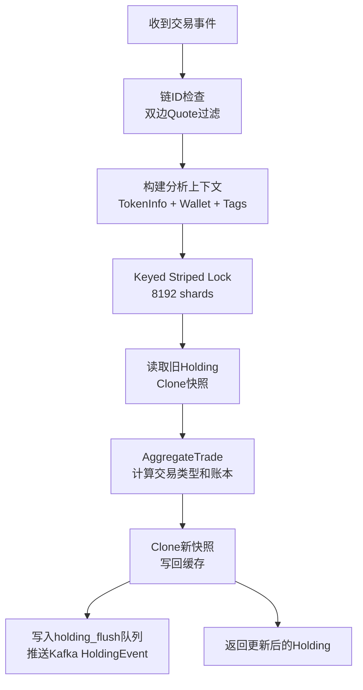
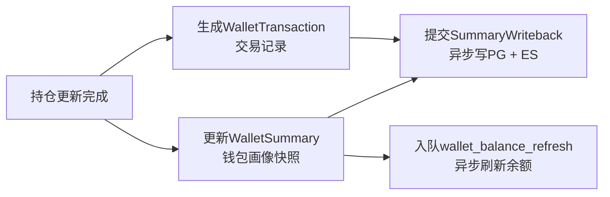
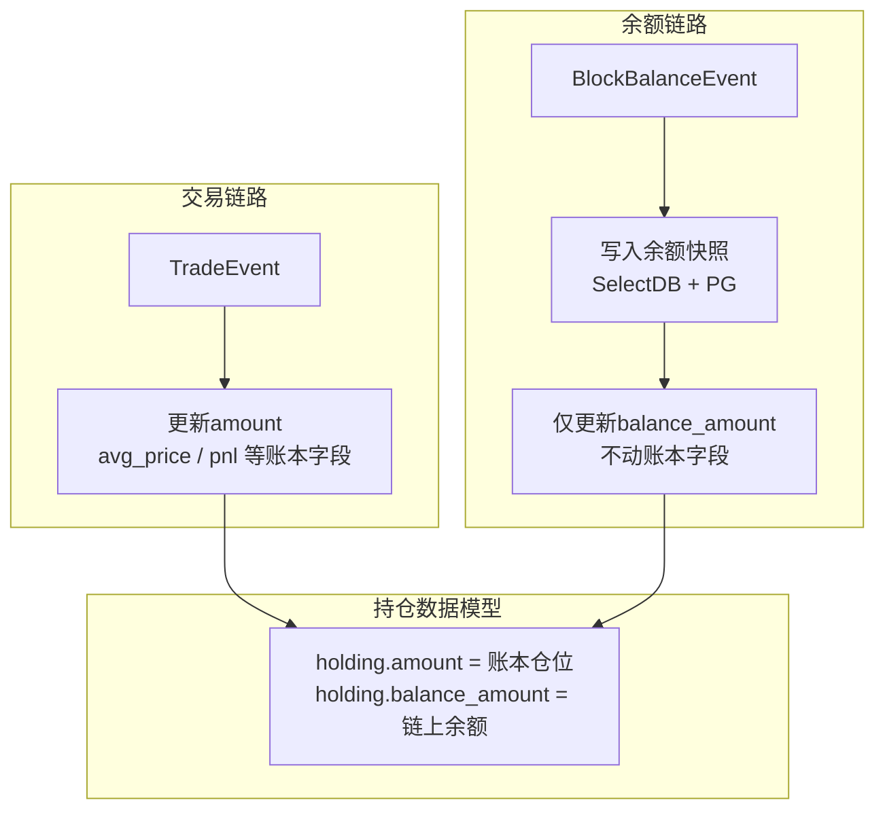
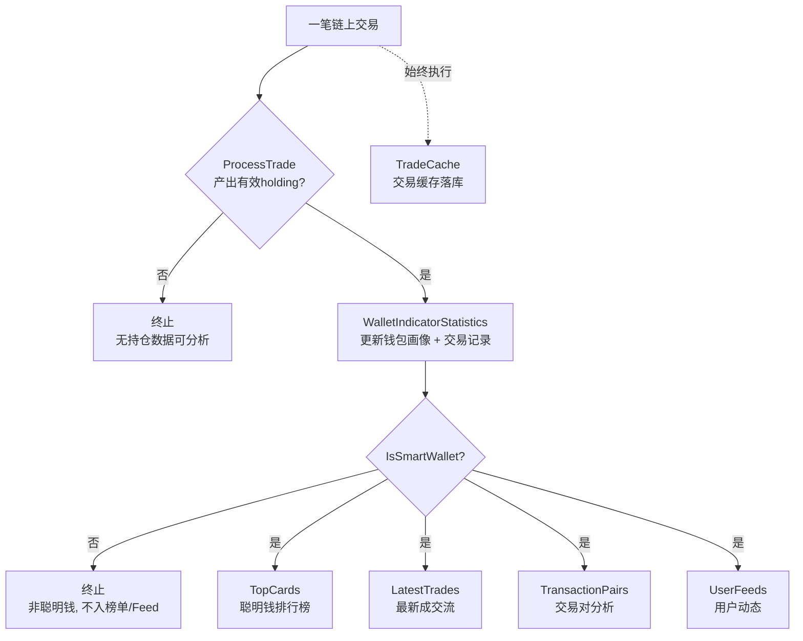
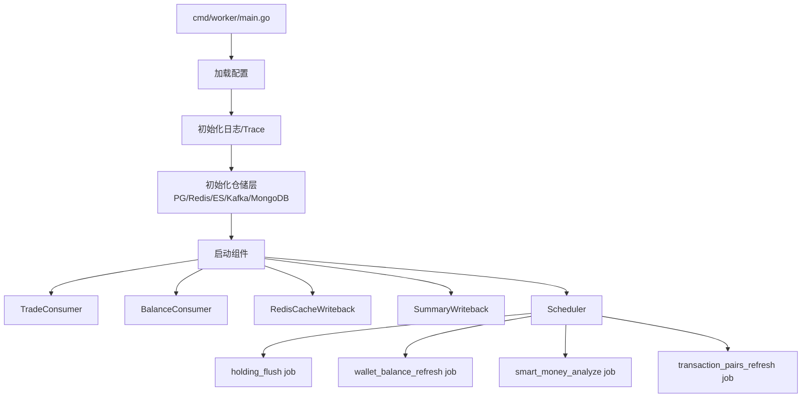
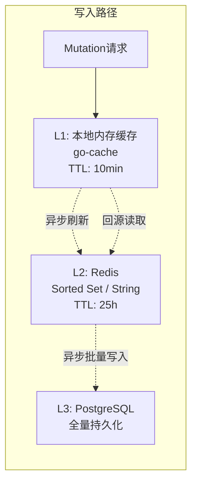
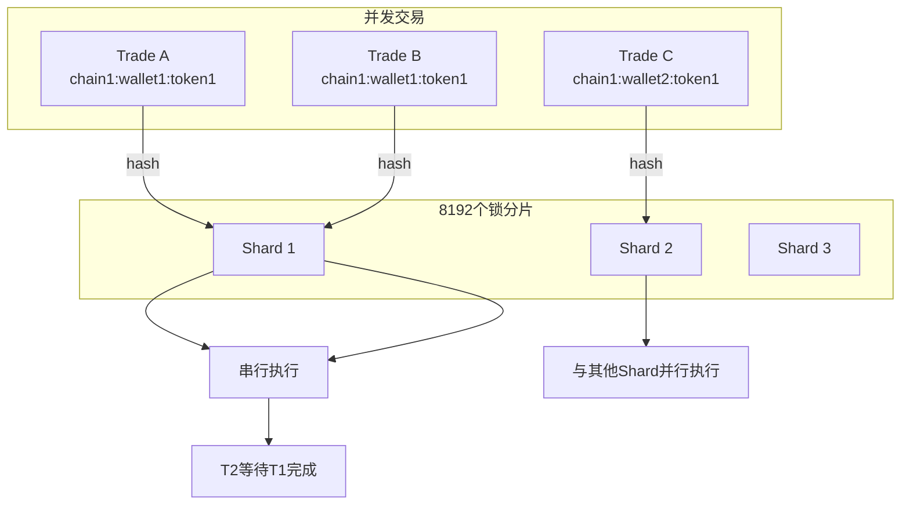
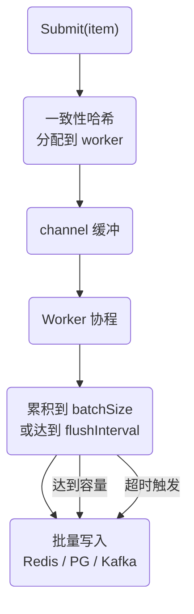
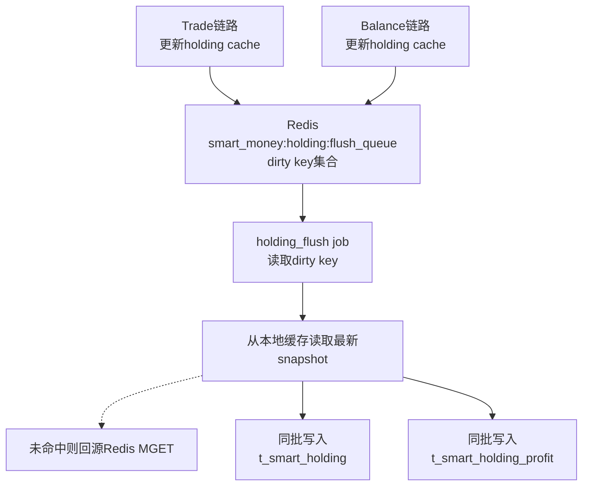

## 前言

"聪明钱"（Smart Money）指在链上交易中持续表现出色的钱包地址：它们买什么，什么就涨。实时追踪这些钱包的交易行为，可以发现潜力代币、学习交易策略、获得风险预警。

但构建一个实时聪明钱追踪系统面临三重挑战：

- **数据真实性问题**：链上存在两种"真相"——交易账本推导的仓位，和链上实际余额。转账、空投、跨链会导致两者不一致。
- **并发一致性问题**：同一笔持仓可能被多笔交易并发修改，需要严格的串行化控制。
- **实时性问题**：从交易到达 → 持仓更新 → 钱包画像 → 榜单/Feed，需要在秒级完成。

本文从一笔链上交易进入系统开始，逐步讲解它如何经过处理、聚合、衍生，最终变成聪明钱信号，再到整体架构设计。

## 一、从一笔交易到持仓更新

### 1.1 输入：原始交易事件

Kafka 中的每一条消息代表一次链上交易，核心字段如下：

```
{
  "event": {
    "time":         1717660800,     // 交易时间(秒)
    "network":      "bsc",          // 链
    "tokenAddress": "0xABC...",     // 代币地址
    "poolAddress":  "0xDEF...",     // 交易池地址
    "address":      "0x123...",     // 交易者钱包地址
    "price":        1.2345,         // 成交价格
    "volumeUsd":    50000.0,        // 成交量(USD)
    "side":         "buy",          // 方向
    "baseMint":     "0x...",        // 基础代币
    "quoteMint":    "0x...",        // 报价代币
  }
}
```

### 1.2 前置过滤

系统首先过滤两类无意义交易：

- **无法识别链**：`chainID == 0`，直接丢弃
- **双边 USD 稳定币**：输入和输出都是 USDT/USDC 等稳定币，对持仓分析无意义

<!-- more -->
### 1.3 构建分析上下文

通过过滤后，系统依次获取三组信息：

```
tokenInfo  → 从 ES/Redis 查询代币信息（符号、精度、合约）
wallet     → 从本地缓存/Redis/PG 查询钱包画像
tags       → 判断是否为 dev（代币创建者）、sniper 等
```

### 1.4 核心链路：MutateHolding + AggregateTrade

这是整条链路最核心的环节。系统通过 `MutateHolding` 对 `(chain, wallet, token)` 加细粒度锁，确保同一笔持仓不会被并发修改。



#### AggregateTrade 账本计算

单笔交易融入持仓的完整过程：

| 字段 | 计算方式 |
|------|---------|
| **amount** | buy 时增加，sell 时减少 |
| **avg_price** | 加权平均买入价：`(现有成本 + 新买入金额) / 总量` |
| **current_total_cost** | 累计买入金额的 `sum(amount_i * avg_price_i)` |
| **realized_pnl** | 卖出时：`sell_value - sell_amount * avg_price` |
| **unrealized_pnl** | `(当前价 - avg_price) * 当前持仓量` |

#### 完整计算示例

假设 Wallet A 对 Token X 的交易序列如下：

```
时间(s)  | side | amount | price  | volume_usd
---------|------|--------|--------|-----------
1717660800 | buy  | 100    | 1.0    | 100
1717660802 | buy  | 50     | 1.2    | 60
1717660804 | sell | 30     | 1.5    | 45
```

分步计算持仓变化：

| 步骤 | amount | avg_price | total_cost | realized_pnl |
|------|--------|-----------|------------|-------------|
| 初始 | 0 | 0 | 0 | 0 |
| buy 100@1.0 | 100 | 1.0 | 100 | 0 |
| buy 50@1.2 | 150 | 1.067 | 160 | 0 |
| sell 30@1.5 | 120 | 1.067 | 160 | +13 |

第三步 sell 时，卖出成本 = 30 × 1.067 = 32，卖出收入 = 45，`realized_pnl = 45 - 32 = +13`。

### 1.5 异步写入和事件推送

持仓更新成功后：

1. `MutateHolding` 已在锁内把克隆快照写回本地缓存
2. 把 `chain_id:wallet:token` 写入 Redis `smart_money:holding:flush_queue`
3. `holding_flush` 后台 job 合并 dirty key，读取缓存最新 snapshot
4. 通过 `combined_db` 同批写入 PostgreSQL 的两张表：`t_smart_holding` 和 `t_smart_holding_profit`
5. 推送 holding event 到 Kafka，供下游消费

## 二、从持仓到钱包画像

完成单笔交易的持仓更新后，系统需要更新钱包维度的统计指标。



### WalletSummary 包含哪些数据

| 维度 | 字段 | 含义 |
|------|------|------|
| **余额** | native_balance, balance_usd | 链上余额和美元估值 |
| **交易表现** | pnl_1d, pnl_7d, pnl_30d | 近 1/7/30 天盈亏 |
| **交易统计** | total_buy_vol, total_sell_vol, trade_count | 买卖总量和次数 |
| **标签** | tags | 聪明钱/KOL/鲸鱼/狙击手等 |
| **最新交易** | last_trade_token, last_trade_time | 最近交易信息 |

### SummaryWriteback 统一回写

钱包快照不是每笔交易都直接落库，而是提交到 `SummaryWriteback` 聚合器：

1. 按 `chain_id:wallet_address` 分片
2. 同一分片内保留最新快照
3. 定时批量写入 PostgreSQL `t_smart_wallet` 和 Elasticsearch wallets 索引

这样可以避免高频交易场景下对数据库的写入压力。

## 三、聪明钱标签体系

系统维护一套多维度标签体系，用于刻画钱包的行为特征：

### 3.1 标签定义

| 标签 | 含义 | 判断条件 |
|------|------|---------|
| `smart_wallet` | 聪明钱 | 综合评分达标 |
| `top_trader` | 顶级交易员 | 累计收益排名靠前 |
| `early_sniper` | 早期狙击手 | 代币上线即买入 |
| `hunter100x` | 百倍猎手 | 捕获过百倍代币 |
| `new_star` | 新人王 | 近期表现突出的新钱包 |
| `giant_whale` | 巨鲸 | 持仓规模极大 |
| `whale` | 鲸鱼 | 持仓规模较大 |
| `kol` | KOL | 社交媒体影响者 |
| `dev` | 开发者 | 代币创建者钱包 |
| `sniper` | 狙击手 | 高频抢跑交易 |
| `bot` | 机器人 | 自动化交易地址 |
| `long_term_holder` | 长期持有者 | 持仓超过阈值时间 |
| `fresh_wallet` | 新钱包 | 创建时间短 |
| `clearance_seller` | 清仓卖家 | 一次性清空持仓 |
| `large_scale_seller` | 大额卖家 | 卖出量极大 |

### 3.2 标签计算时机

标签在两种时机计算：

**实时计算**（交易触发）：
```
ProcessTrade 中：
  1. tokenInfo.Creator == trader → 打 dev 标签
  2. 交易模式检测 → sniper / clearance_seller
  3. 结合钱包已有标签和当前交易行为

Statistics 中：
  1. 更新 WalletSummary 的 tags
  2. 标签到交易类型的映射
```

**定时批量计算**（SmartMoneyAnalyzer Job）：
```
定时扫描所有活跃钱包：
  1. 重算 pnl、胜率、收益排名
  2. 更新 top_trader / smart_wallet 等综合标签
  3. 补投 wallet_balance_refresh 队列
```

### 3.3 标签到交易类型的映射

不同标签会影响交易事件的分类：

```go
var Tag2Type = map[string]string{
    TAG_SMART_MONEY:           "trade_type_smart_money",
    TAG_TOP_TRADER:            "trade_type_smart_money",
    TAG_KOL:                   "trade_type_kol",
    TAG_GIANT_WHALE:           "trade_type_scale_of_funds",
    TAG_SNIPER:                "trade_type_sniper",
    TAG_DEV:                   "trade_type_dev",
    TAG_CLEARANCE_SELLER:      "trade_type_real_time_signal",
    TAG_LONG_TERM_HOLDER:      "trade_type_long_term_holder",
    TAG_BOT:                   "trade_type_bot",
}
```

## 四、双轨余额：账本仓位 vs 链上余额

这是本系统最核心的设计决策之一。

### 4.1 两种"真相"

链上数据存在两种口径：

| 口径 | 含义 | 来源 | 更新方式 |
|------|------|------|---------|
| **amount** | 交易推导的账本仓位 | TradeEvent 累加/扣除 | 每笔交易实时更新 |
| **balance_amount** | 链上实际余额快照 | 区块余额事件 | 每个区块结束更新 |

### 4.2 为什么需要双轨？

问题在于：**账本推导 ≠ 链上真相**。

转账、空投、手动转入/转出、跨链桥等非交易行为，会导致 `amount` 与链上实际余额产生偏差：

```
场景：Wallet A 持有 100 Token X（账本位）
      → 从另一个钱包转入 50 Token X（非交易行为）
      → amount 仍为 100（账本未更新），但链上余额已是 150
      → balance_amount 正确反映为 150
```

### 4.3 双轨处理流程



**两条链路互不干扰**：
- 交易链路只改账本字段（amount/avg_price/pnl）
- 余额链路只写快照和同步 `balance_amount`
- 旧的 `HoldingBalanceUpdate` 修正链路已删除

### 4.4 对外口径：effective_amount

下游读取时，使用 `effective_amount` 统一口径：

```sql
effective_amount = COALESCE(balance_amount, amount)
```

| 接口 | 口径 |
|------|------|
| `/holding` | 只展示 `balance_amount > 0` 的记录 |
| `/holding_analysis` | 按 `effective_amount` 计算数量和市值 |
| `/holding/profit_addresses` | 按 `effective_amount` 计算盈亏 |

这确保了即使账本和链上存在偏差，用户始终看到最接近真实的余额。

## 五、实时榜单与 Feed 生成

一笔交易进入系统后，会按两级条件触发衍生链路：

**第一级（所有交易）**：

- `TradeCache.ProcessTrade`：写入 MongoDB 交易缓存和 TradeTagEvent Kafka

**第二级（有有效 holding 的交易）**：

- `WalletIndicatorStatistics.Statistics`：更新钱包画像、生成交易记录、提交写库

**第三级（聪明钱专属）**：

- `TopCardsService.HandleSmartTrade`：聪明钱排行榜
- `LatestTradesService.Record`：最新成交流
- `TransactionPairsService.Record`：交易对分析
- `UserFeedsService.Record`：用户关注动态



### 5.1 TopCards：聪明钱排行榜

核心语义：**某个时间窗口内，被最多聪明钱买过的代币排名**。

| 操作 | 对榜单影响 |
|------|-----------|
| buy / build | 增加 unique_wallet 计数，推动排名 |
| sell / clean | 不推动排名，只补充 sell_value / sell_count 详情 |

榜单数据存储在 Redis 中，key 模式：

```
smart_money:monitor:top_cards:<chain_id>:<period>:leaderboard
smart_money:monitor:top_cards:<chain_id>:<token>:<period>:detail
smart_money:monitor:top_cards:<chain_id>:<token>:<period>:stats
```

### 5.2 LatestTrades：最新成交流

维护一个 24 小时滚动窗口的聪明钱最新成交列表，支持按链、按价值层级、按交易类型筛选：

```
smart_money:monitor:latest_trades:<chain_id>:24h
smart_money:monitor:latest_trades:<chain_id>:<value_tier>:<tx_type>:24h
```

### 5.3 TransactionPairs：交易对分析

交易对榜单的更新过程分为两步：

1. **实时更新榜单 zset**：Trade 到来时直接更新 24h 排名
2. **异步刷新详情**：将代币丢入 `refresh_queue`，由每 5 秒运行的 `transaction_pairs_refresh` job 生成详情 JSON

```
榜单不必等详情生成 → 用户先看到排名变化
详情稍后补齐 → 减轻单次 Trade 的处理压力
```

### 5.4 UserFeeds：用户关注动态

当聪明钱地址发生交易时，系统会：

1. 查询 `moonx.t_web3_favorite` 找到当前关注该地址的所有用户
2. 将 `(uid, smart_tx_id)` 写入 `t_smart_user_feeds` 展开表
3. API 查询时直接从 `t_smart_user_feeds` 反查交易详情

> 注意：这是"交易发生时展开"而非"用户查询时实时拼装"。如果用户是在交易发生后关注该地址，不会自动补出历史 Feed。

## 六、系统架构总览

```mermaid
flowchart LR
    subgraph Input [数据源]
        TE[TradeEvent<br/>Kafka]
        BE[BlockBalance<br/>Kafka]
    end

    subgraph Consumer [消费层]
        TC[TradeConsumer<br/>一致性哈希分发]
        BC[BalanceConsumer]
    end

    subgraph Handler [处理层]
        TH[TradeHandler]
        BH[BalanceHandler]
    end

    subgraph Service [服务层]
        WPA[WalletPositonAnalyze<br/>交易分析主流程]
        WIS[WalletIndicatorStatistics<br/>钱包统计聚合]
        BU[BalanceUpdate<br/>余额快照写入]
        HB[HoldingBalanceAmountUpdate<br/>balance_amount同步]
        LC[LatestTradesService]
        TC2[TopCardsService]
        TP[TransactionPairsService]
        UF[UserFeedsService]
    end

    subgraph Storage [持久化]
        PG[(PostgreSQL<br/>t_smart_holding/wallet/transaction)]
        RD[(Redis<br/>缓存/榜单/队列)]
        ES[(Elasticsearch<br/>wallets索引)]
        SD[(SelectDB<br/>余额快照)]
        MG[(MongoDB<br/>交易缓存)]
    end

    subgraph AsyncWriter [异步写入器]
        HW[HoldingWriter]
        PW[ProfitWriter]
        KW[KafkaWriter]
        SW[SummaryWriteback]
    end

    Input --> Consumer
    Consumer --> Handler
    Handler --> Service
    Service --> Storage
    Service <--> AsyncWriter
    AsyncWriter --> Storage
```



### 核心组件职责

| 组件 | 位置 | 职责 |
|------|------|------|
| TradeConsumer | `consumer/trade.go` | 消费 Kafka trade 事件，按 `network:wallet:token` hash 分发 |
| BalanceConsumer | `consumer/balance.go` | 消费 Kafka block balance 事件 |
| TradeHandler | `handler/trade.go` | 编排交易处理流程，触发衍生链路 |
| WalletPositonAnalyze | `service/wallet_positon_analyze.go` | 交易分析主流程，通过 MutateHolding 更新持仓 |
| WalletIndicatorStatistics | `service/wallet_indicator_statistics.go` | 钱包级统计聚合 |
| holding_flush | `job/holding_flush.go` | 合并 dirty holding 异步落库 |
| wallet_balance_refresh | `job/wallet_balance_refresh.go` | 异步刷新钱包链上余额 |

### 运行时结构

Worker 启动后运行三类组件：

1. **Kafka 消费者**：TradeConsumer、BalanceConsumer（常驻监听）
2. **仓储写回器**：RedisCacheWriteback、SummaryWriteback（后台批量写入）
3. **定时调度器 Scheduler**：周期任务 + 常驻 once job



## 七、快照缓存与异步写入设计

系统的实时性要求和高吞吐特性，决定了不能每笔交易都直接读写数据库。

### 7.1 三级存储架构



### 7.2 Snapshot Cache（快照缓存）

为防止并发读写共享指针导致数据竞争和 `sonic.Marshal` panic，DAO 层采用快照语义：

```
读操作：返回 Clone()，调用方获得独立副本
写操作：Clone 后写入缓存，不修改已有对象
```

```go
// 读时 Clone
func (s *HoldingCacheDAO) GetHolding(key string) *WalletHolding {
    s.mu.RLock()
    defer s.mu.RUnlock()
    if h, ok := s.cache[key]; ok {
        return h.Clone() // 返回快照
    }
    return nil
}

// 写时 Clone
func (s *HoldingCacheDAO) SetHolding(key string, h *WalletHolding) {
    s.mu.Lock()
    defer s.mu.Unlock()
    s.cache[key] = h.Clone() // 存快照
}
```

### 7.3 Keyed Striped Lock（分片细粒度锁）

系统使用 8192 个分片的 striped lock，确保 `(chain_id, wallet, token)` 维度内的所有操作串行执行：



### 7.4 异步批量写入器

系统基于 Go 泛型实现了通用的 `AsyncBatchWriter[T]`：



设计要点：

```
- 泛型参数：AsyncBatchWriter[T any]，支持任意数据类型
- 多个 worker 协程，通过 hash 保证相同 key 有序写入
- 触发条件：达到 batchSize 或 flushInterval
- channel 满时提供 backpressure
- 写入失败时重试，持续失败标记异常
```

系统中运行着多个写入器实例：

| 写入器 | 写入目标 | batchSize | flushInterval |
|--------|---------|-----------|-------------|
| holding_flush_queue_writer | Redis | 1000 | 100ms |
| holding_kafka_writer | Kafka | 1000 | 300ms |
| holding_db_writer | PostgreSQL | 1000 | 100ms |
| profit_db_writer | PostgreSQL | 1000 | 100ms |
| missing_tokeninfo_writer | Redis | 100 | 300ms |

### 7.5 最佳实践：holding_flush 合并落库

trade 链路和 balance 链路都会向 Redis 写入 dirty holding key，`holding_flush` job 负责合并写入：



这使得多次修改可以合并为一次 DB 写入，大幅降低数据库压力。

## 八、工程取舍总结

| 取舍点 | 选择 | 理由 |
|--------|------|------|
| **余额口径** | 账本 + 链上双轨 | 转账/空投等非交易行为导致两者不一致，各自维护避免污染 |
| **并发控制** | Keyed Striped Lock | 同 key 串行、不同 key 并发，单实例下足够；未来多实例需加乐观锁 |
| **缓存策略** | 快照缓存 + 最终一致性 | 读返 Clone，写前 Clone；Redis 异步写回是 best-effort |
| **写入模式** | 异步批量 | 单笔写入 QPS 过高，batch 大幅降低存储压力 |
| **幂等控制** | 已移除 | Redis 幂等移除，重复 trade 风险当前接受；已知问题，暂不修复 |
| **跨实例扩展** | 暂不支持 | 无 version 字段，无分布式锁；多实例同 key 并发需后续补 |
| **价格修正** | 不修正 | 账本保持交易价格原值，不做价格异常检测（K 线系统做） |
| **实时榜单** | 最终一致 | 榜单先更新，详情稍后补齐；短暂滞后是符合设计的 |

---

以上就是一个实时链上聪明钱系统的核心设计。从一笔交易如何变成持仓账本，到双轨余额设计，再到实时榜单和系统架构，每个环节都有独特的工程考量。
