## 前言

在 Web3 领域,链上交易数据是上层应用的基础。无论是聪明钱追踪、代币数据服务、还是实时 K 线系统,都依赖同一个底层能力:**
将区块链上的原始交易数据解析成结构化、可消费的业务事件。**

但构建这样的解析层面临几个核心挑战:

- **多链异构**:Solana 和 EVM 链(BSC、Base)的区块结构、交易模型、RPC 接口完全不同。Solana 有 Account Model、指令嵌套和 CPI(Cross-Program Invocation);EVM 链有 `types.Block`、Receipt、Event Log。解析器需要统一这两种范式。
- **协议多样性**:仅 Solana 生态就有 Raydium、Meteora、PumpFun、Orca、Pancake 等十几种 DEX 协议,每种协议的指令编码方式(Borsh/自定)和账本结构各不相同。
- **实时性要求高**:从区块产生 → 扫链 → 解析 → 发送下游,需要在秒级完成。区块不能积压,解析失败需自动重试。
- **可观测性**:生产环境需要监控解析延迟、失败率、Kafka 生产速率、RPC 可用性等指标。

本文介绍一个用 Golang 构建的生产级多链交易解析服务。该服务已覆盖 Solana、BSC、Base、Polygon 四条链,支持 12+ DEX 协议,每日处理百万级交易。

## 一、系统架构

### 1.1 整体架构

整个系统分为两个独立微服务:**Scanner**(扫链)和 **Parser**(解析),通过 Kafka 解耦。
另外对于高实时要求的链如Solana会有**GRPC**(监听)，redis里用lua脚本去重存到待解析tx队列，解析都是基于tx，而扫链也会结合ws监听出块已减少rpc请求(rpc节点压力过大性能会下降)。

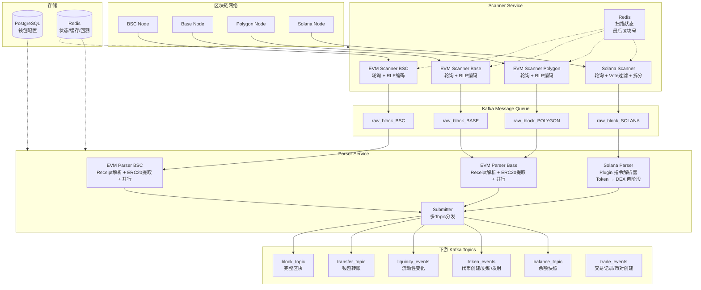

### 1.2 Scanner 服务 — 扫链

Scanner 职责单一:轮询区块链节点、获取新区块、序列化后发送到 Kafka。

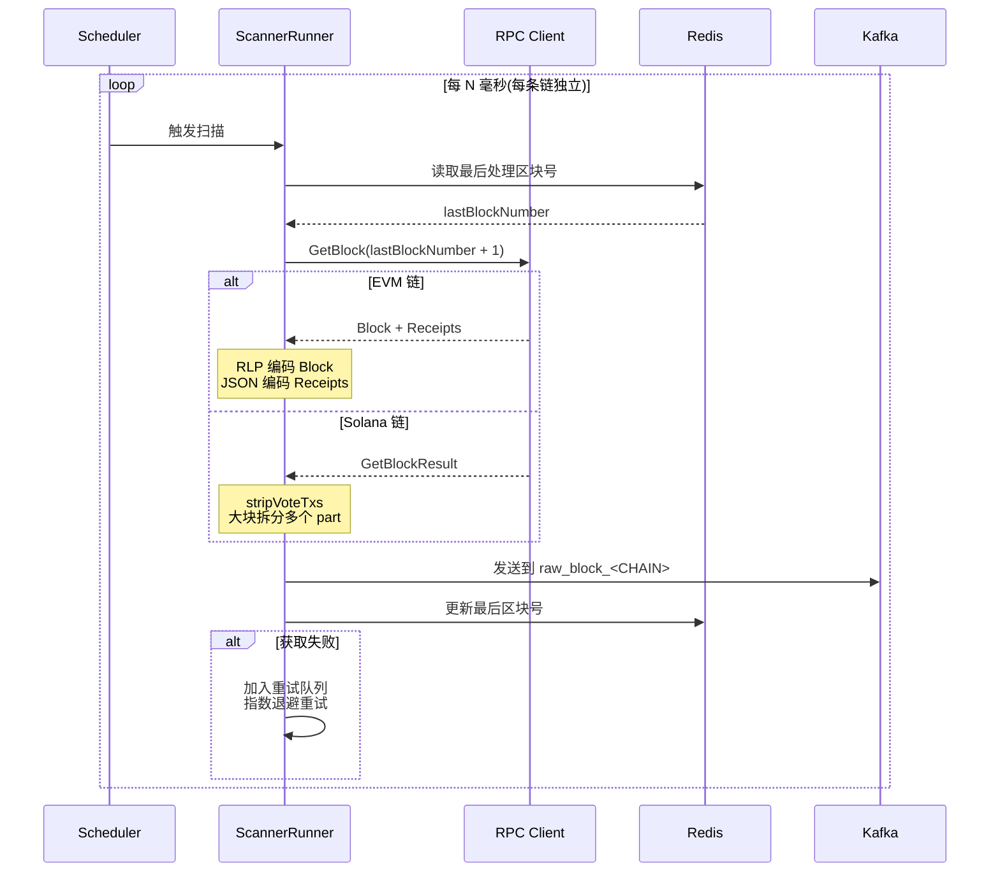

关键设计要点:

**Multi-RPC Client**:每条链配置多个 RPC 端点,自动负载均衡和故障切换。当主节点限流或断连时,透明切换到备用节点。

```
ClientPool 结构(简化):
┌─────────────────────────────┐
│       ClientPool            │
│  ├─ primary RPC URL         │
│  ├─ backup RPC URLs         │
│  ├─ rate limiter (per sec)  │
│  ├─ timeout (per request)   │
│  └─ health check            │
└─────────────────────────────┘
```

**Scan State 持久化**:通过 Redis 记录每个链的最后处理区块,重启后自动续扫,不会重复或遗漏。

```
Redis Key 格式:
  byd_scanner_status_<CHAIN>_<CHAIN_ID>
  ─────────────────────────────────────
  Value: {"Running":false, "LastBlockNumber":356414005}
```

**Vote 交易优化**:Solana 的 Vote 交易占块内交易的 80%+。Scanner 通过 `stripVoteTxs` 将 vote 交易的 `Transaction` 和 `Meta` 置为 nil,保留数组位置以维持其他交易的 index 不变。对于超大区块(非 nil 交易超过阈值),还会自动拆分为多个 Kafka 消息。

```go
// internal/scanner/solana/scan.go
func stripVoteTxs(block *rpc.GetBlockResult) {
    for i, tx := range block.Transactions {
        if tx.Transaction == nil || tx.Meta == nil {
            continue
        }
        transaction, err := tx.GetTransaction()
        if err != nil {
            continue
        }
        if len(transaction.Message.AccountKeys) == 3 &&
            transaction.Message.AccountKeys[2].String() == voteProgramID {
            block.Transactions[i].Transaction = nil // 只保留占位
            block.Transactions[i].Meta = nil
        }
    }
}
```

**RLP 编码**:EVM 的 `types.Block` 使用 RLP(Recursive Length Prefix)编码为二进制格式,比 JSON 节省约 60% 体积。

```go
// internal/common/block_wire.go
type evmBlockWire struct {
    Chain    string            `json:"chain"`
    ChainId  int64             `json:"chain_id"`
    Block    []byte            `json:"block"`    // RLP encoded
    Receipts []json.RawMessage `json:"receipts"` // JSON encoded
}
```

### 1.3 Parser 服务 — 解析

Parser 是核心服务,从 Kafka 消费原始区块,解析出结构化事件,再发到不同的下游 Topic。

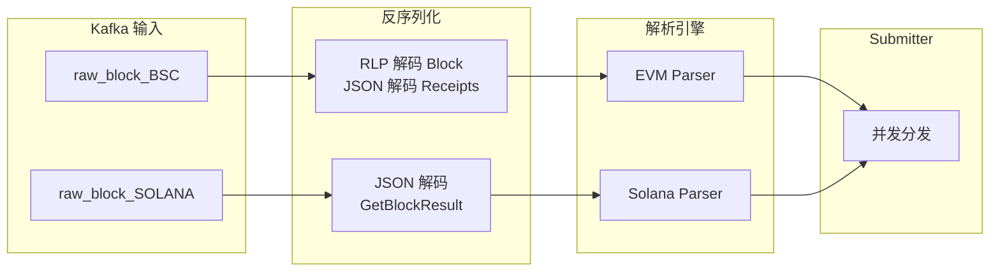

## 二、核心技术

### 2.1 EVM 交易解析

#### 2.1.1 解析流程

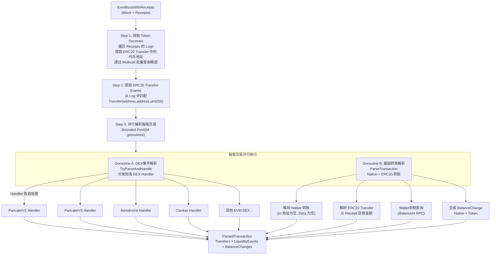

#### 2.1.2 核心代码

```go
// internal/parser/evm/parser.go - parseBlockOnce 核心逻辑
func (ep *evmParserImpl) parseBlockOnce(ctx context.Context, block *common.EvmBlockWithReceipts) error {
    // Step 1: 批量获取代币精度
    decimals, _ = evm_utils.GetTokenDecimals(ctx, ep.chain, ep.rpcClient, block.Receipts)

    // Step 2: 提取 ERC20 Transfer Events
    erc20TransferEvents = evm_utils.GetERC20TransferEvents(block.Receipts, decimals)

    // Step 3: 并行解析, 64 并发上限
    txPool := pool.New().WithMaxGoroutines(64)
    for i := range transactions {
        if block.Receipts[i].Status != 1 {
            continue // 只处理成功交易
        }
        // Goroutine A: DEX 事件
        txPool.Go(func() {
            ep.TryParseAndHandle(ctx, ep.rpcClient, block.Receipts[i],
                block.Block.Time(), from, ep.isTrackback)
        })
        // Goroutine B: 基础转账 + 余额
        txPool.Go(func() {
            extract := evm_utils.BuildBlockTransactionExtractor(transactions[i], chainID)
            parsedInfo := ep.ParseTransaction(ctx, extract, ep.rpcClient, wallets)
            // 写入 parsedBlockInfo
        })
    }
    txPool.Wait()

    // Step 4: 批量获取 ERC20 余额(用于修复 BalanceAfter)
    if ep.chain != "POLYGON" {
        ep.fetchBalance(ctx, &parsedBlockInfo, ep.rpcClient)
    }

    // Step 5: 提交到 Kafka
    return ep.submitter.SubmitParsedBlock(ctx, &parsedBlockInfo)
}
```

#### 2.1.3 ERC20 Transfer Event 提取细节

```go
// 从 Receipt Log 中匹配 ERC20 Transfer 事件
// 事件签名: keccak256("Transfer(address,address,uint256)")
const ERC20TransferEvent = "0xddf252ad1be2c89b69c2b068fc378daa952ba7f163c4a11628f55a4df523b3ef"

// 提取流程:
// 1. 遍历所有 Receipt 的所有 Log
// 2. 匹配 Log.Topics[0] == ERC20TransferEvent 签名
// 3. Topics[1] → from( indexed)
// 4. Topics[2] → to ( indexed)
// 5. Data → amount( unpadded)
// 6. Log.Address → token 合约地址
// 7. 用之前查询的 decimals 映射补全精度
```

#### 2.1.4 EVM DEX 事件流

`TryParseAndHandle` 实际是通过 `EvmEnventHander` 的事件分发机制,将 Receipt 中的 Log 匹配到注册的 DEX Handler。每个 Handler 负责特定协议的事件解析:

```
TryParseAndHandle(receipt)
  │
  ├─ Match Log Topics → 识别 DEX 协议
  │
  ├─ PancakeV2 Handler: 解析 Swap/Liquidity 事件
  │   └─ 从 PoolCreated/Swap 等 Event Log 提取
  │
  ├─ PancakeV3 Handler: 解析集中流动性事件
  │   └─ 从 Collect/IncreaseLiquidity 等提取
  │
  ├─ Aerodrome Handler: Base 链 DEX
  │
  ├─ Clanker Handler: Base 链 Meme 代币创建
  │
  └─ 其他 Handler...
```

### 2.2 Solana 指令解析 — Plugin 架构

Solana 的解析比 EVM 复杂一个数量级。核心原因是 Solana 交易是**指令嵌套**结构:

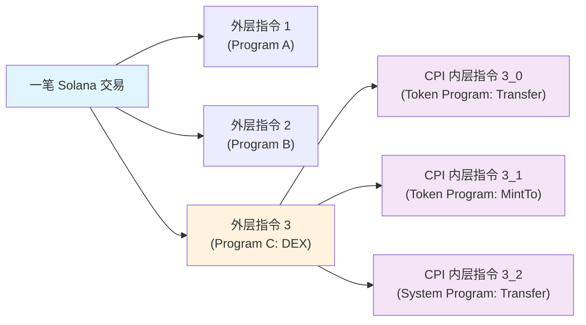

外层指令(Outer Instructions)是交易中显式调用的指令;内层指令(Inner Instructions)是 CPI 调用触发的子指令。Token 转账通常发生在内层指令中,而 DEX 协议的外层指令决定了业务语义(如 Swap、AddLiquidity)。

项目设计了 **Plugin 式指令解析器管理器**:

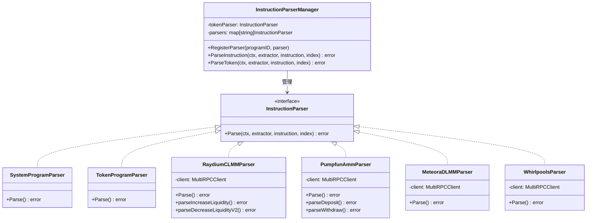

```go
// internal/parser/solana/instructionParser/instruction_parser.go
type InstructionParser interface {
    Parse(ctx context.Context, e *Extractor, instruction solana.CompiledInstruction, instructionIndex string) error
}

type InstructionParserManager struct {
    tokenParser InstructionParser           // 专门解析 Token 指令
    parsers     map[string]InstructionParser // programID → parser
}

func NewInstructionParserManager(client MultiRPCClient) *InstructionParserManager {
    // 注册系统程序解析器(通用)
    systemParser := &SystemProgramParser{}
    for _, programID := range common.SystemPrograms {
        manager.RegisterParser(programID, systemParser)
    }
    // 注册 Token 解析器
    manager.tokenParser = NewTokenProgramParser()

    // 注册各 DEX 解析器(插件)
    manager.RegisterParser(RaydiumCLMMProgramID, NewRaydiumCLMMProgramParser(client))
    manager.RegisterParser(PumpfunAmmProgramID, NewPumpfunAmmProgramParser(client))
    manager.RegisterParser(MeteoraDLMMProgramID, NewMeteoraDLMMProgramParser(client))
    manager.RegisterParser(WhirlpoolsProgramID, NewWhirlpoolsProgramParser(client))
    manager.RegisterParser(OrcaTokenSwapv2ProgramID, NewOrcaTokenSwapv2ProgramParser(client))
    // ... 注册其余 DEX
    return manager
}
```

#### 2.2.1 两阶段解析流程

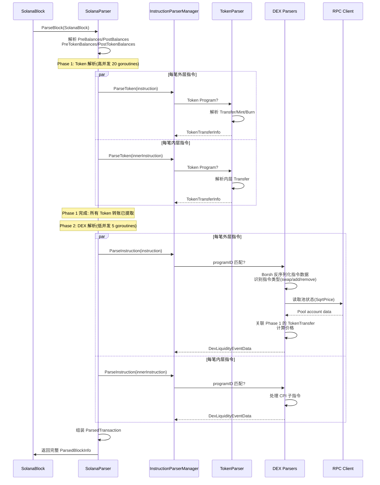

#### 2.2.2 DEX Parser 内部流程(以 Raydium CLMM 为例)

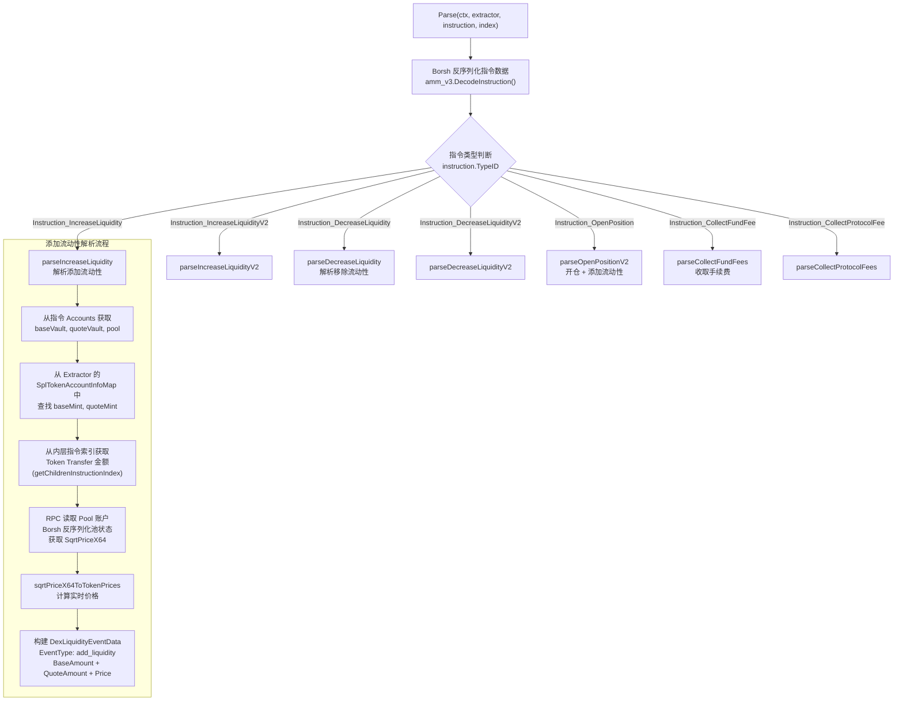

**关键数据结构 — Raydium CLMM Pool State:**

```go
type RaydiumPoolInfo struct {
    Bump            [1]uint8      //  PDA bump
    AMMConfig       PublicKey     //  AMM 配置
    TokenMint0      PublicKey     //  代币 A
    TokenMint1      PublicKey     //  代币 B
    TokenVault0     PublicKey     //  代币 A 金库
    TokenVault1     PublicKey     //  代币 B 金库
    Liquidity       Uint128       //  当前流动性
    SqrtPriceX64    Uint128       //  当前 sqrt 价格(定点数)
    TickCurrent     int32         //  当前 tick
    FeeGrowthGlobal0X64 Uint128   //  全局费用增长
    // ...
}
```

**价格计算:**

```go
// sqrtPriceX64ToTokenPrices 将 sqrt 定点数转换为实际 token 价格
// sqrtPriceX64 = sqrt(price) * 2^64
// price = (sqrtPriceX64 / 2^64)^2
// 考虑 Decimals 差异调整
func sqrtPriceX64ToTokenPrices(sqrtPriceX64 string, decimal0, decimal1 int64) decimal.Decimal {
    price := // sqrtPriceX64^2 / 2^128
    adjustDecimal := decimal.NewFromInt(10).Pow(decimal.NewFromInt(decimal1 - decimal0))
    return price.Mul(adjustDecimal)
}
```

### 2.3 余额提取

#### 2.3.1 Solana — 内置余额变化

Solana 相比 EVM 的一大优势:节点直接在交易 meta 中提供余额变化,无需额外 RPC 调用。

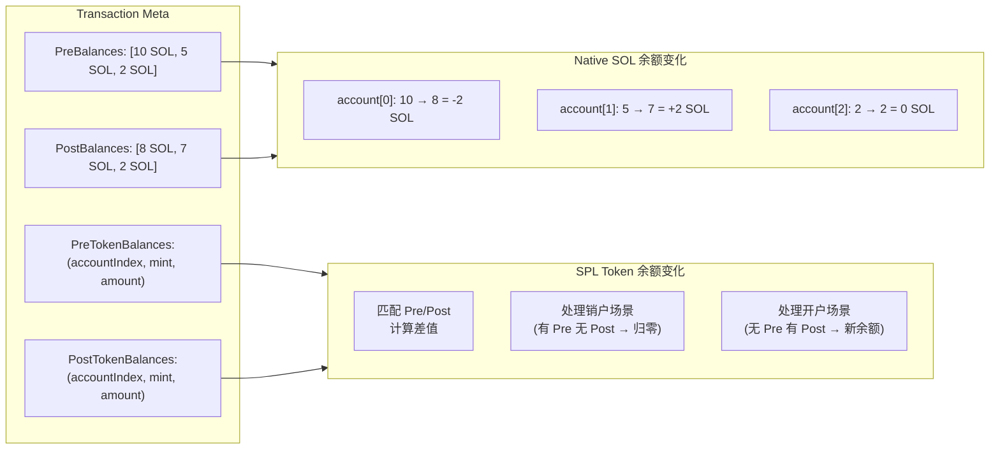

```go
// internal/parser/solana/parser.go - ExtractBalanceChanges
func ExtractBalanceChanges(e *solana_utils.Extractor, parsedInfo common.ParsedTransaction) common.ParsedTransaction {
    // 1. Native 余额: 直接遍历 PreBalances/PostBalances
    for index, accountKey := range e.AllAccountKeys {
        parsedInfo.NativeBalanceChange[accountKey.String()] = NativeBalanceChange{
            BalanceBefore: new(big.Int).SetUint64(e.TxMeta.PreBalances[index]),
            BalanceAfter:  new(big.Int).SetUint64(e.TxMeta.PostBalances[index]),
            BalanceChange: new(big.Int).Sub(post, pre),
        }
    }

    // 2. Token 余额: 匹配 Pre/Post
    // 有 Pre 无 Post → 销户, 余额归零
    // 有 Post 无 Pre → 新开户, 余额从 0 开始
    // 都有 → 正常变化
    for _, pre := range e.TxMeta.PreTokenBalances {
        if post, ok := postBalance[pre.AccountIndex]; ok {
            // 正常变化
            parsedInfo.TokenBalanceChange[address] = TokenBalanceChange{
                BalanceBefore: preAmount,
                BalanceAfter:  parseBigInt(post),
                BalanceChange: new(big.Int).Sub(postAmount, preAmount),
            }
            delete(postBalance, pre.AccountIndex)
        } else {
            // 销户
            parsedInfo.TokenBalanceChange[address] = TokenBalanceChange{
                BalanceBefore: preAmount,
                BalanceAfter:  big.NewInt(0),
                BalanceChange: new(big.Int).Neg(preAmount),
            }
        }
    }
    // 剩余 Post → 新开户
    for _, post := range e.TxMeta.PostTokenBalances {
        if _, ok := postBalance[post.AccountIndex]; ok {
            parsedInfo.TokenBalanceChange[address] = append(..., TokenBalanceChange{
                BalanceBefore: big.NewInt(0),
                BalanceAfter:  parseBigInt(post.UiTokenAmount.Amount),
            })
        }
    }
    return parsedInfo
}
```

#### 2.3.2 EVM — 按需查询

EVM 不提供交易级余额变化,只能按需查询:

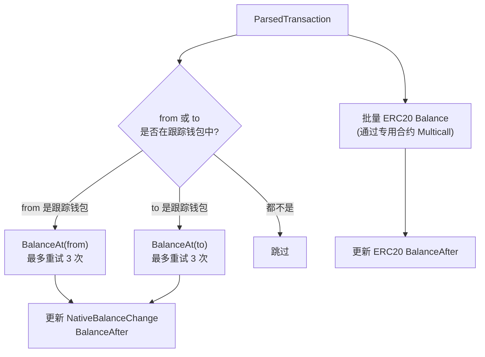

### 2.4 区块序列化与反序列化

Scanner 和 Parser 通过 Kafka 传输区块数据,序列化方案直接影响性能和带宽:

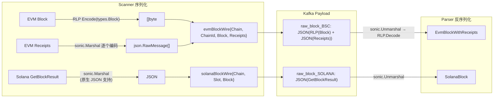

**为什么 EVM 用 RLP + JSON 混合?**

- `types.Block` 包含完整的区块头(32个字段)+ 交易列表,RLP 编码后体积约为 JSON 的 40%
- `types.Receipt` 需要按交易逐笔访问,JSON 编码更方便逐个反序列化
- `bytedance/sonic` 是 Go 最快的 JSON 库之一,比 `encoding/json` 快 3-5 倍

```go
// internal/common/block_wire.go
func MarshalEvmBlock(b *EvmBlockWithReceipts) ([]byte, error) {
    var buf bytes.Buffer
    rlp.Encode(&buf, b.Block)                   // Block → RLP binary
    
    receipts := make([]json.RawMessage, len(b.Receipts))
    for i, r := range b.Receipts {
        rJSON, _ := sonic.Marshal(r)            // Receipt → JSON
        receipts[i] = rJSON
    }
    
    return sonic.Marshal(evmBlockWire{           // 整体包装
        Chain: b.Chain, ChainId: b.ChainId,
        Block: buf.Bytes(), Receipts: receipts,
    })
}

func UnmarshalEvmBlock(data []byte) (*EvmBlockWithReceipts, error) {
    var wire evmBlockWire
    sonic.Unmarshal(data, &wire)                  // 外层 JSON
    
    block := new(types.Block)
    rlp.Decode(bytes.NewReader(wire.Block), block) // Block → RLP decode
    
    receipts := make([]*types.Receipt, len(wire.Receipts))
    for i, r := range wire.Receipts {
        sonic.Unmarshal(r, receipts[i])            // Receipt → JSON decode
    }
    return &EvmBlockWithReceipts{...}, nil
}
```

### 2.5 Submitter — 多 Topic 分发

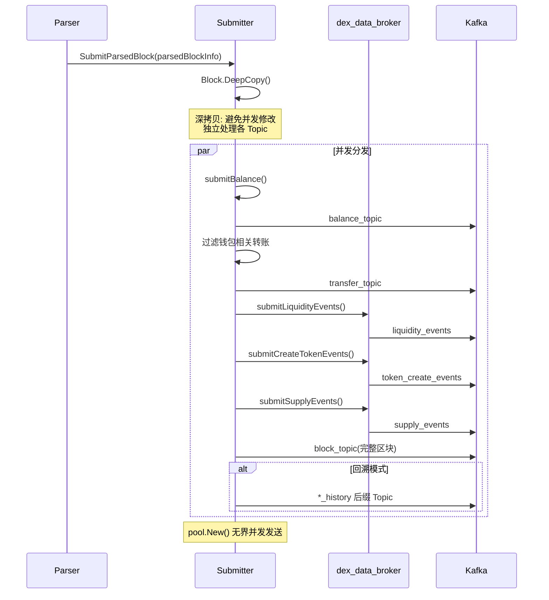

**Topic 设计:**

| Topic | 内容 | 消费者 | 过滤逻辑 |
|-------|------|--------|---------|
| `block_topic` | 完整区块(所有交易) | 数据仓库、全量索引 | 无过滤 |
| `transfer_topic` | 仅钱包转账 | 聪明钱系统、通知服务 | `CheckAddress(from) || CheckAddress(to)` |
| `liquidity_events` | DEX 流动性事件 | 代币数据服务、K线 | 全部 |
| `token_create_events` | 代币创建 | 代币收录服务 | 全部 |
| `supply_events` | 供应量变更 | 代币数据服务 | 全部 |
| `balance_topic` | 余额快照 | 持仓同步 | 仅跟踪钱包 |
| `pair_payload_topic` | Pair 更新 | 池管理服务 | 全部 |

**深度拷贝的目的:**

同一批解析结果需要分发到多个 Kafka Topic,每个 Topic 对数据有不同的裁剪要求。例如 `transfer_topic` 只需要转账数据,不需要余额快照。`ParsedTransaction` 和 `ParsedBlockInfo` 包含 `big.Int`、切片、map 等引用类型,直接浅拷贝会导致多个消费者共享内部状态,修改一个影响另一个。

```go
// internal/submitter/submitter.go - 裁剪示例
transferBlock := block.DeepCopy()
transferBlock.Transactions = []common.ParsedTransaction{} // 清空
for i := range block.Transactions {
    haveWallet := false
    for _, t := range block.Transactions[i].Transfers {
        if s.wallets.CheckAddress(t.From) || s.wallets.CheckAddress(t.To) {
            haveWallet = true
            break
        }
    }
    if haveWallet {
        // 只保留钱包相关交易
        transferBlock.Transactions = append(transferBlock.Transactions, block.Transactions[i])
    }
}
```

## 三、工程实践

### 3.1 错误处理 — 三层保护

区块链节点不稳定、RPC 限流、区块数据异常是常态。系统设计了三层保护:

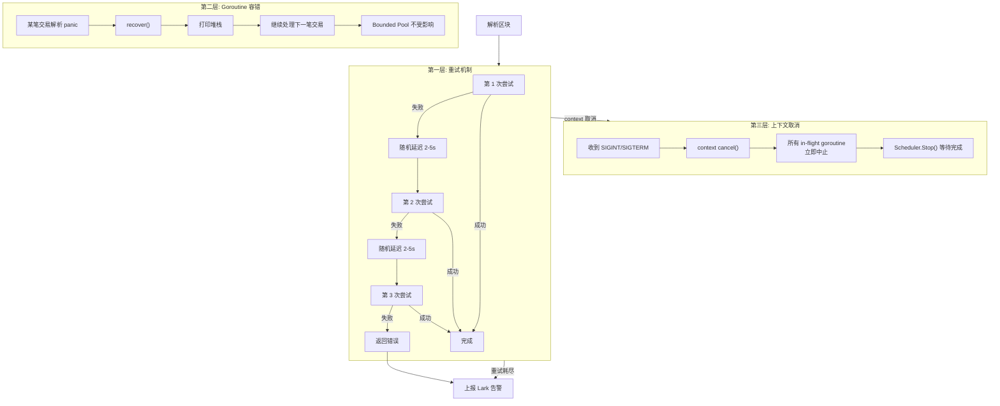

**重试实现:**

```go
func parseBlockRetryDelay() time.Duration {
    delta := parseBlockRetryMaxDelay - parseBlockRetryMinDelay
    return parseBlockRetryMinDelay + time.Duration(rand.Int64N(int64(delta)+1))
}

for attempt := 1; attempt <= 3; attempt++ {
    err = parseBlockOnce(ctx, block)
    if err == nil {
        return nil
    }
    delay := parseBlockRetryDelay()
    // 等待期间可被 context 取消
    select {
    case <-ctx.Done():
        return ctx.Err()
    case <-timer.C:
    }
}
```

### 3.2 并发控制

系统大量使用 `sourcegraph/conc/pool` 的 bounded goroutine pool,避免无限创建 goroutine 导致 OOM:

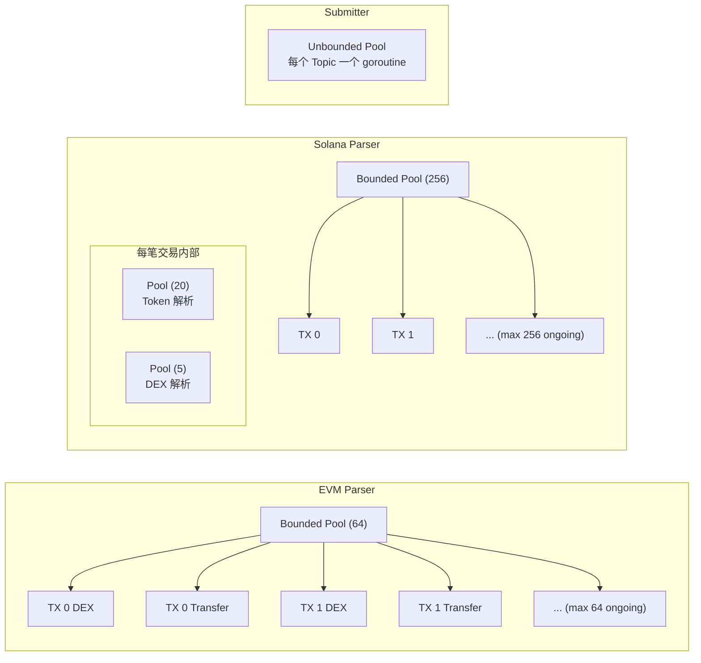

| 场景 | Pool 大小 | 说明 |
|------|----------|------|
| EVM 交易级解析 | 64 | 包含 DEX + Transfer + Balance 查询,RPC 调用多,限制防止积压 |
| Solana 交易级 | 256 | 主要是本地计算 + 少量 RPC,可以更高并发 |
| Solana Token 解析 | 20 | 全部本地计算(从已解码的 meta 提取) |
| Solana DEX 解析 | 5 | 需要额外 RPC 读取池状态,低并发减少节点压力 |
| Submitter 分发 | 无界 | 固定 5-7 个 goroutine,不会无限增长 |

### 3.3 依赖注入

项目采用依赖注入方式组织代码。`Dependencies` 结构体集中管理所有外部依赖:

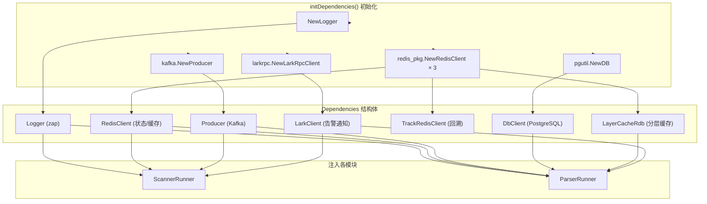

这使得:
- 各模块可独立测试(Mock 替换真实依赖)
- 启动和关闭顺序可控(`initDependencies` → `stop`)
- 切换链或数据源只需修改配置

### 3.4 可观测性

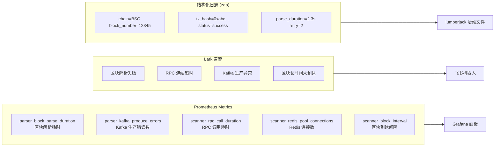

### 3.5 Trackback 模式

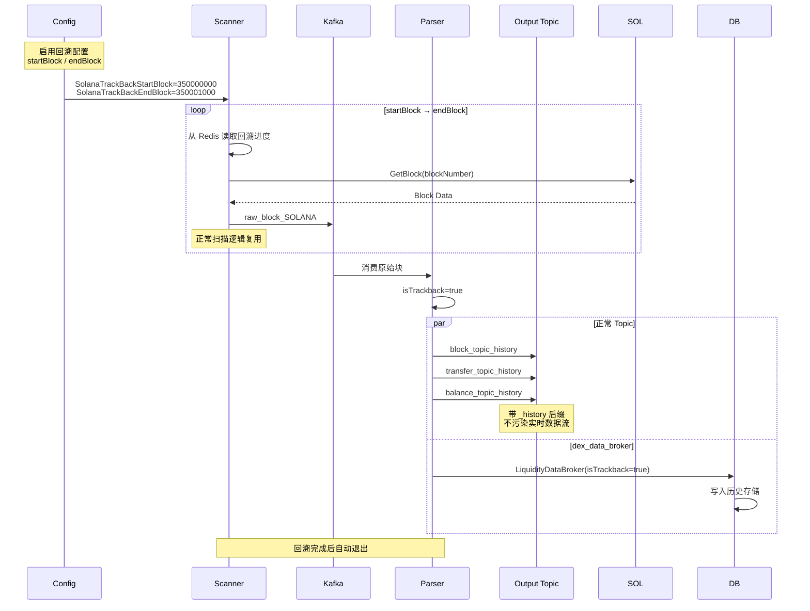

Trackback 模式的核心设计:**
复用同一套扫描和解析逻辑,通过 `isTrackback` 标志控制数据路由。** 这保证了:

- 回溯行为和实时行为完全一致(相同的解析逻辑、相同的错误处理)
- 回溯数据不污染实时数据流(不同的 Kafka Topic)
- 支持中 continued 断点续扫(Redis 记录进度)

## 四、支持协议一览

### EVM

| 链 | 协议 | 解析内容 | 解析方式 |
|----|------|---------|---------|
| BSC | PancakeSwap V2 | Swap、Add/Remove Liquidity | Event Log 解析 |
| BSC | PancakeSwap V3 | 集中流动性事件 | Event Log 解析 |
| BASE | Aerodrome | Swap、Add/Remove Liquidity | Event Log 解析 |
| BASE | Clanker | Token 创建事件 | Event Log 解析 |
| BASE | Flap | Swap | Event Log 解析 |
| BASE | Dopper | Swap | Event Log 解析 |
| BASE/ZORA | Zora | NFT 铸造 | Event Log 解析 |
| BASE | FourMeme | Meme 代币交易 | Event Log 解析 |
| BASE | Polymarket | 预测市场事件 | Event Log 解析 |
| Polygon | QuickSwap/UniswapV3 等 | 通用 ERC20 事件 | Event Log 解析 |

### Solana

| 协议 | 程序 ID | 解析内容 | 编码方式 |
|------|---------|---------|---------|
| Raydium CLMM | `CAMMCzo5YL8w4VFF8KVHrK22GGUsp5VTaW7grrKgrWqK` | 集中流动性添加/移除、Swap | Borsh |
| Raydium CPMM | `CPMMoo8L3F4NbTegBCKVNunggL7H1ZpdTHKxQB5qKP1C` | 恒定乘积池交易 | Borsh |
| Raydium PoolV4 | `675kPX9MHTjS2zt1iDB1BT4W4PHU4tNmNsLu8j6Tteo` | AMM 池交易 | Borsh |
| Meteora DLMM | `LBUZKhRdB2Ua3mLqLT8rpBgLzXKfbPcBMhR2R2r9GAs` | 动态流动性做市 | Borsh |
| Meteora AMM | `Eo7WjgDUJL3T4r7J8R4KJ8wN7Bz4vTtLpP3D9WwqR8` | AMM 池交易 | Borsh |
| Meteora AMMV2 | `M2SD9R8KEmL5LVkpAMRzKxqZF6oXmiGWHcFgjqpVZcP` | AMM V2 池交易 | Borsh |
| PumpFun AMM | `pAMMBay6oceH9fJKBRHGP5D4bD4sWpmSwMn52FMfXEA` | Meme 代币 AMM 流动性 | Borsh |
| Orca Whirlpools | `whirLbMiicVdio4qvUfM5KAg6Ct8VwpYzGff3uctyCc` | 集中流动性池 | Borsh |
| Orca TokenSwapV2 | `9W959DqEETiGZocYWCQPaJ6sBmUzgfxXfqGeTEdp3FaP` | 经典 AMM 池 | Borsh |
| PancakeSwap | `PcKFoK...` | 流动性事件 | Borsh |
| Heaven | `heaven...` | 流动性事件 | Borsh |
| DBC | `DBC...` | 流动性事件 | Borsh |
| Metaplex | `metaqbxxUerdq28cj1RbAWkYQm3ybzjb6a8bt518x1s` | Token Metadata | Borsh |

## 五、总结

### 核心设计理念

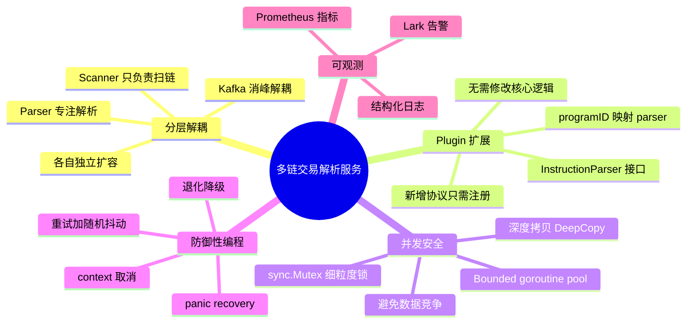

1. **分层解耦**:Scanner → Kafka → Parser 的经典 Pipeline 架构,Scanner 只负责扫链,Parser 专注解析,通过 Kafka 消峰解耦。两层可以独立扩缩容。

2. **Plugin 扩展**:Solana 指令解析器采用插件注册模式,新增协议只需实现 `InstructionParser` 接口并调用 `RegisterParser` 注册,完全不需要修改核心解析循环。

3. **并发安全**:通过 bounded goroutine pool + 深度拷贝 + sync.Mutex 组合策略,在保证吞吐的同时避免数据竞争。

4. **防御性编程**:重试、panic recovery、context 取消、退化降级(recoverable error 不阻断全块),让系统在不可靠的公链环境中稳定运行。
