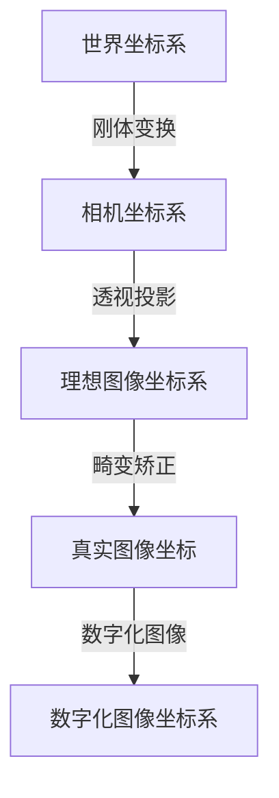

## 引言
之前做工业机器人公司搞视觉接触了很多3D相机，这里记录一下这些相机点云的生成，以及各种类型相机的一些基础实现原理。我用过的有单目结构光相机，双目结构光，TOF相机，线扫相机(自研)，多视角相机(自研)。
首先深度相机一般畸变都比较小，当然如果自己不放心可以标定看看结果。如果深度相机是自己买模组然后调教生成点云那就一定逃不了校准标定了。
### 相机成像原理



相机的图像有时候会出现
修正图像需要相机两种参数：
- 相机的内部参数。例如镜头的焦距，光学中心和径向畸变系数。
- 外部参数：这是指摄像机相对于某些世界坐标系的方向（旋转和平移）

### 相机校准
OpenCV给出了非常详细的操作步骤可以参考[这里](https://docs.opencv.org/2.4/doc/tutorials/calib3d/camera_calibration/camera_calibration.html)，下载棋盘格去opencv官网如下：
。
<!-- more -->
大概过程如下：
- 采集棋盘格图像（10张以上），并预处理
- 找出棋盘格角点坐标
- 进一步提取亚像素角点信息
- 计算出相机内参数矩阵和畸变系数
- 畸变图像校准

上面主要是代码化开发相关功能要做的，当然也可以直接matlab直接干，从生成棋盘格开始就可以选择matlab。
matlab生成，然后打印去
```
J = (checkerboard(300,4,5)>0.5);
figure, imshow(J);
```
随后使用matlab->工具箱->camera calibrator，导入拍的棋盘格照片，设置棋盘格真实的大小不是照片里是实物，然后按自己需要配置Options，点击Caibrate基本就完事了，最后点击Export Camera Parameters导出参数
## 结构光相机
结构光相机（Structured Light Camera）是一种主动式三维测量相机，它利用光学投影原理，通过投射具有特定编码的结构光（例如条纹、格点等）在目标物体表面上，然后通过相机捕捉和分析结构光在物体表面的形变，从而测量物体的三维形状和表面信息。

具体来说，结构光相机通常包括一个投影器和一个相机。投影器发射结构光并照射到目标物体上，形成具有一定编码模式的结构光图案。然后，相机接收到反射回来的结构光图案，并利用计算机视觉算法进行处理，得到物体的三维坐标信息。

结构光相机的精度主要取决于编码的结构光的数量、形状和分布等因素。通常情况下，结构光相机的精度可以达到数百微米或更高的级别，具体取决于相机和投影器的分辨率、几何标定精度和运动稳定性等因素。同时，由于结构光相机可以实现非接触式、快速且准确的三维测量，因此广泛应用于机器视觉、自动化制造、医疗影像、虚拟现实和增强现实等领域。

需要注意的是，结构光相机对于一些表面光滑、反射性强的物体可能会存在一定的测量误差，而且在光线较暗的环境下，相机可能会出现读取图像失败的情况。因此，在实际应用中需要针对具体场景选择合适的结构光相机，并进行充分的光线照明和环境控制等工作，以提高测量精度和可靠性。

总结一下优点：
- 精度高可以达到亚微米级别
- 适用于复杂形状的物体
- 对环境要求较低，精度受环境光影响较小，适用于室内光照较强的环境。

缺点则是：
- 测量速度相对较慢，一般在数千像素/秒左右
- 测量距离较短，一般在几米以内
- 对表面反射率要求较高

实现的代码逻辑如下：
```C++
#include <iostream>
#include <opencv2/opencv.hpp>
#include <opencv2/highgui.hpp>
#include <opencv2/core/utility.hpp>
#include <opencv2/rgbd.hpp>

using namespace std;
using namespace cv;

int main()
{
    // 加载图像
    Mat img = imread("img.png");

    // 提取光条
    Mat gray;

    //图像转灰度图
    cvtColor(img, gray, COLOR_BGR2GRAY);
    Mat thresh;
    
    int threshold_value = 127;
    int max_binary_value = 255;
    //二值化
    threshold(gray, thresh, threshold_value, max_binary_value, THRESH_BINARY);

    vector<vector<Point>> contours;
    vector<Vec4i> hierarchy;
    //轮廓提取
    findContours(thresh, contours, hierarchy, RETR_TREE, CHAIN_APPROX_SIMPLE);

    // 计算光条三维坐标
    float fx = 100.0f;  // 摄像机内参
    float baseline = 100.0f;  // 摄像机基线长度
    vector<Point3f> points;
    for (auto& contour : contours)
    {
        for (auto& pt : contour)
        {
            int u = pt.x;
            int v = pt.y;
            float z = fx * baseline / (gray.at<uchar>(v, u) + 1e-10);  // 根据亮度计算深度
            float x = (u - img.cols / 2) * z / fx;
            float y = (v - img.rows / 2) * z / fx;
            points.emplace_back(x, y, z);
        }
    }

    // 对点云进行双边滤波
    Mat filtered_points;
    cv::fastBilateralFilter(Mat(points), filtered_points, 10, 100, 100);


    return 0;
}

```


一般提供SDK支持导出各类格式，点云文件或流拿来就能用，我们当时用国内的原因就是便宜，图漾，奥比中光这两家的都还行，国外的都很贵。

### 双目结构光相机
效果跟单目的结构光相机差不多，价钱其实有时也差不多看下面代码实现就能了解原因但通常对像素有要求，速度相对会快一点。

```C++
#include <iostream>
#include <opencv2/opencv.hpp>

int main()
{
    // 读取左右相机图像
    cv::Mat left_img, right_img;

    // 创建结构光解码器
    // cv::Ptr<cv::StructuredLightPattern> pattern = cv::StructuredLightPattern::create(cv::STRUCTURED_LIGHT_PATTERN_SINUSOIDAL);
    
    // 创建BM视差计算器
    cv::Ptr<cv::StereoBM> bm = cv::StereoBM::create(16, 15);

    // 计算视差图像
    cv::Mat disp_img;
    bm->compute(left_img, right_img, disp_img);

    // 计算深度图像
    cv::Mat depth_img;
    cv::reprojectImageTo3D(disp_img, depth_img, cv::Matx33f(1, 0, 0, 0, 1, 0, 0, 0, 1));
}

```
## TOF相机
TOF相机（Time-of-Flight Camera），也称飞行时间相机，是一种主动式三维测量相机，通过测量光线从相机发射到物体表面反射回来所需要的时间，从而计算物体与相机的距离信息，实现三维空间的测量。

TOF相机的工作原理基于飞行时间测量原理，即光线在空气中的传播速度是一个已知的常量。相机发射一个光脉冲，光线从相机发射到目标物体表面，然后反射回来被相机接收。通过测量光线从发射到接收所需的时间（即飞行时间），相机可以计算出物体与相机之间的距离。

TOF相机的精度受到多个因素的影响，包括光源强度、相机帧速率、测量距离、环境光等。通常情况下，TOF相机的测量精度可以达到数毫米到数厘米的级别，但对于较远距离的物体，精度可能会有所下降。

TOF相机具有非接触式、快速且准确的三维测量能力，并且对于光线强度变化、表面反射率不均等情况的鲁棒性较强。因此，TOF相机被广泛应用于机器人、自动驾驶、智能安防、虚拟现实和增强现实等领域。

需要注意的是，TOF相机在光线暗弱、光线反射性差、测量距离远等情况下，可能会出现精度不足、信噪比低等问题。因此，在实际应用中需要针对具体场景选择合适的TOF相机，并进行充分的光线照明和环境控制等工作，以提高测量精度和可靠性。

总结一下优点:
- 测量速度快，可以达到数十万像素/秒，适用于高速物体的三维测量
- 测量距离远，可以测量较远距离的物体，甚至可以达到几百米的范围
- 适用于光线不足的环境，对于光线强度变化、表面反射率不均等情况的鲁棒性较强
- 硬件和算法实现相对简单，具有一定的成本优势，简单说就是便宜！！！！

缺点则是
- 精度相对较低，通常在数毫米到数厘米的级别
- 环境要求较高，测量精度受到环境光线和表面反射率的影响，需要进行一定的环境控制

实现代码如下：
```C++
#include <iostream>
#include <pcl/io/io.h>
#include <pcl/io/pcd_io.h>
#include <pcl/point_types.h>
#include <pcl/visualization/cloud_viewer.h>
#include <pcl/visualization/pcl_visualizer.h>
#include <pcl/tof/tof_amplitude_to_distance.h>

int main()
{
    // 初始化相机
    pcl::tof::AmplitudeToDistance a2d;
    a2d.setSensorType(pcl::tof::PCL_TOF_SENSOR_MM_2400);
    a2d.setAmplitudeThreshold(30);

    // 打开相机
    pcl::io::OpenNI2Grabber grabber;
    grabber.setDeviceID(0);
    grabber.start();

    // 创建点云对象
    pcl::PointCloud<pcl::PointXYZ>::Ptr cloud(new pcl::PointCloud<pcl::PointXYZ>);

    // 创建可视化对象
    pcl::visualization::PCLVisualizer viewer("Point Cloud");

    // 循环读取相机帧
    while (!viewer.wasStopped())
    {
        //根据深度图像计算点云

        // 读取帧
        pcl::PointCloud<pcl::PointXYZI>::Ptr frame(new pcl::PointCloud<pcl::PointXYZI>);
        if (grabber.grabber_.get() && grabber.grabber_->isRunning())
        {
            pcl::io::DepthImage::Ptr depth_image(new pcl::io::DepthImage);
            //获取深度图像
            grabber.grabDepthImage(*depth_image);
            a2d.setInputDepthImage(depth_image);
            a2d.compute(*frame);
        }

        // 转换为XYZ格式的点云
        cloud->clear();
        cloud->resize(frame->size());
        for (int i = 0; i < frame->size(); ++i)
        {
            pcl::PointXYZI& p = frame->at(i);
            cloud->at(i).x = p.x;
            cloud->at(i).y = p.y;
            cloud->at(i).z = p.z;
        }

        // 可视化点云
        viewer.removeAllPointClouds();
        viewer.addPointCloud(cloud);
        viewer.spinOnce(1);
    }

    // 关闭相机
    grabber.stop();

    return 0;
}
```

一般提供SDK也支持导出各类格式，点云文件或流拿来就能用，我们当时用了Intel的L515，价格吊打了差不多性能的散班，关键对光线要求没那么高速度还快，能解决很多以前要用线扫才能解决的场景。

## 多视角相机
这种就是用结构光相机或TOF相机围着工位放，我们当时就3个，生成的点云用pcl走个配准合成把矩阵记录一下，以后过来的工件走配准的矩阵直接合成即可，生成的点云非常完整。一开始校准找个不同视角都有显著特点的物件扔中即可，至于用几个相机，什么相机完全没限制，把两两配准的到的矩阵拿来旋转点云加一起集合。

## 线扫相机
线扫相机是一种常用于高速运动物体的图像采集设备，相比面阵相机，它的采集速度更快，能够捕捉到高速运动物体的运动轨迹和细节。

线扫相机的实现原理是将物体图像沿着一个方向逐行扫描，然后组合成完整的图像。具体来说，线扫相机会通过一个线阵列传感器或者CCD传感器，将物体图像沿着一个方向分成一行一行的像素，每一行的像素点按照一定的时间间隔依次被传感器读取并转化为数字信号，经过处理后再形成完整的图像。因此，线扫相机需要一个相对稳定的物体运动方向，以保证图像不会失真或者缺失。

线扫相机的精度主要受到传感器分辨率和采集速度的限制。分辨率越高，图像细节表现越清晰，精度也越高。同时，采集速度越快，图像中的细节和动态表现就越精确。一般来说，线扫相机的分辨率可达数百万像素，采集速度可达数千帧每秒，能够满足很多高速场景下的图像采集需求。

需要注意的是，在线扫相机的应用过程中，物体的运动速度、光源强度、背景噪声等因素都会对图像质量和精度产生影响，需要进行合适的参数设置和光学调试，以保证采集到的图像质量和精度达到应用要求。

总结一下优点：
- 高速度，可以实现高速采集，每秒可以采集数千帧图像，适用于高速运动的物体的三维测量
- 高分辨率，分辨率一般比较高，可以实现亚像素级别的精度，适用于需要高精度测量的场合
- 稳定性好，工作原理比较简单，结构比较稳定，不容易受到环境变化的影响，可以实现较为稳定的三维测量

缺点则是：
- 受物体运动速度限制，如果物体运动速度过快，就无法实现精确测量
- 对光照条件和背景影响敏感，如果环境变化较大，可能会影响测量精度
- 空间分辨率有限，难以获取物体表面的微小细节信息

我们当时买了个黑白的海康工业相机，配一个激光笔，外面包个盒。

激光通过透镜聚焦后，可以形成一束非常强的、几乎平行的光线。如果要在平面上射出直线，可以使用一个平面反射镜（也叫做平面反射器或直角棱镜）。

将激光光束照射到平面反射镜上，光线会被反射成90度，从而垂直于平面反射镜的表面。如果将平面反射镜旋转一个角度，反射出来的光线就会在平面上形成一条直线。

具体来说，可以将激光光束从激光器发出，经过一个透镜聚焦，然后射到平面反射镜上。平面反射镜可以调节角度，使反射出来的光线在平面上形成一条直线。注意，使用平面反射镜时需要注意避免光路中的反射和散射，以确保测量精度。

然后外部PLC伺服给信号开启扫描和关闭扫描，扫描期间持续拿图像，根据内参计算点云。

实现的代码逻辑大致如下：
```C++
#include <iostream>
#include <opencv2/opencv.hpp>
#include <opencv2/highgui.hpp>
#include <opencv2/core/utility.hpp>
#include <opencv2/rgbd.hpp>

using namespace std;
using namespace cv;

int main()
{
    // 打开相机
    VideoCapture cap(0);
    if (!cap.isOpened())
    {
        cout << "Failed to open camera" << endl;
        return -1;
    }

    // 设置相机参数
    cap.set(CAP_PROP_FRAME_WIDTH, 640);
    cap.set(CAP_PROP_FRAME_HEIGHT, 480);
    cap.set(CAP_PROP_FOURCC, VideoWriter::fourcc('M', 'J', 'P', 'G'));
    cap.set(CAP_PROP_EXPOSURE, -8);
    cap.set(CAP_PROP_GAIN, 0);
    cap.set(CAP_PROP_CONVERT_RGB, false);

    //外部IO信号
    bool inputIO = true;

    while (inputIO)
    {
        // 读取一行像素
        Mat row;
        cap >> row;
        if (row.empty())
            break;

        // 提取深度信息
        vector<float> depth;
        int num_pixels = row.cols;
        const uint16_t* data = row.ptr<uint16_t>();
        for (int i = 0; i < num_pixels; ++i)
        {
            uint16_t d = data[i];
            if (d == 0)
                depth.push_back(nanf(""));
            else
                depth.push_back(d / 1000.0f);  // 单位为米
        }

        // 计算点云
        vector<Point3f> points;
        float fx = 1000.0f;  // 摄像机内参
        float baseline = 100.0f;  // 摄像机基线长度
        for (int i = 0; i < num_pixels; ++i)
        {
            float z = depth[i];
            if (!isnan(z))
            {
                float x = (i - num_pixels / 2) * z / fx;
                float y = 0;
                points.emplace_back(x, y, z);
            }
        }

        // 对点云进行双边滤波
        Mat filtered_points;
        cv::fastBilateralFilter(Mat(points), filtered_points, 10, 100, 100);

    }

    return 0;
}
```
