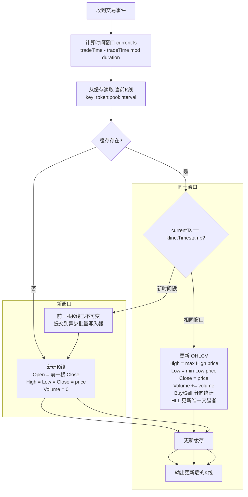
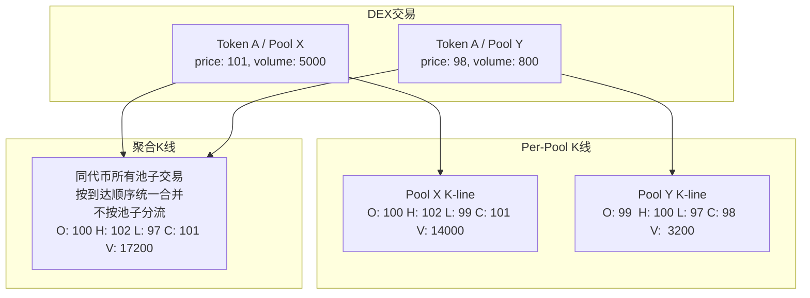
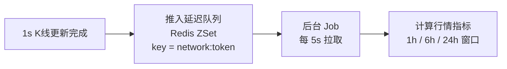
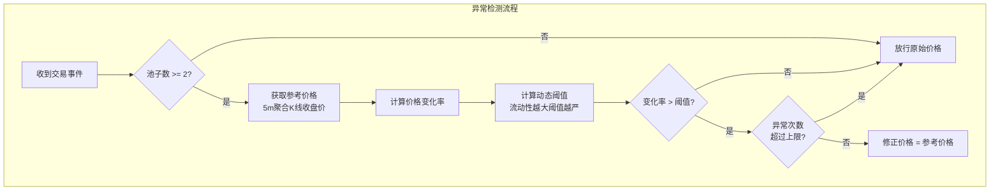
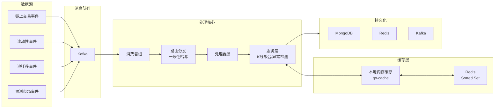
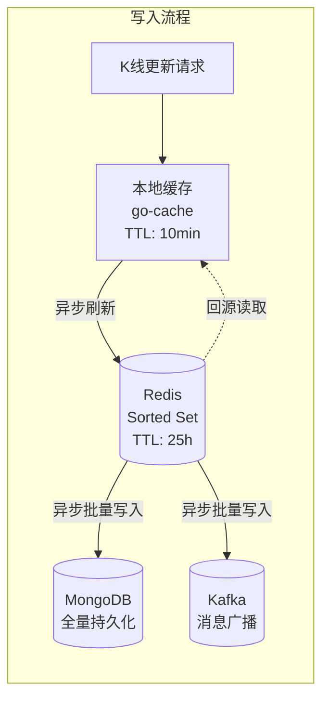
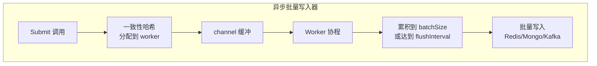

## 前言

去中心化交易所(DEX)的链上交易数据具有实时性高、数据量大、来源分散的特点。如何将这些原始的链上交易事件转化为标准化的 OHLCV K 线数据，并支持价格异常检测、流动性追踪、多维度统计等能力，是一个兼具工程挑战和业务价值的课题。

本文从一条交易数据进入系统开始，逐步讲解它如何变成 K 线和行情指标，再到整体架构设计。

## 一、从一条交易到一根 K 线：OHLCV 计算过程

### 1.1 输入：原始交易事件

Kafka 中的每一条消息代表一次链上交易，核心字段如下：

```
{
  "event": {
    "time":         1717660800,     // 交易时间(秒)
    "tokenAddress": "0xABC...",     // 代币地址
    "poolAddress":  "0xDEF...",     // 交易池地址
    "network":      "ethereum",     // 链
    "price":        1.2345,         // 成交价格
    "volumeUsd":    50000.0,        // 成交量(USD)
    "side":         "buy",          // 买卖方向
    "address":      "0x123...",     // 交易者地址
  }
}
```

### 1.2 时间窗口定位

系统配置了多个 K 线周期（如 1s、5m、15m、1h 等），每个周期有对应的毫秒级 duration。对于每条交易，先计算它属于哪个时间窗口：

```
currentTs = tradeTime - (tradeTime % duration)
```

例如 `tradeTime = 1717660803`，对于 `5m` 周期（`duration = 300s`）：
- `currentTs = 1717660803 - (1717660803 % 300) = 1717660800`
- 即该交易属于 5m K 线中 `[1717660800, 1717661100)` 这个窗口

### 1.3 从缓存中获取当前 K 线状态

每个 `(token, pool, interval)` 组合在 Redis 中维护一条"进行中"的 K 线。系统先尝试从本地内存缓存读取，未命中则回源 Redis：

```
cacheKey = "kline:{token}:{pool}:{interval}"
```

<!-- more -->
### 1.4 K 线更新逻辑（核心）

这是单条交易合并到 K 线的完整过程：



### 1.5 OHLCV 四价的含义

在这个系统中，OHLCV 的生成规则如下：

| 字段 | 计算方式 |
|------|---------|
| **Open** | 窗口内第一笔交易的价格，或上一窗口的 Close |
| **High** | `max(当前 High, 当前交易 price)`，初始为 Open |
| **Low** | `min(当前 Low, 当前交易 price)`，初始为 Open |
| **Close** | 窗口内最后一笔交易的价格，每笔交易都会更新 |
| **Volume** | 窗口内所有交易的 `volumeUsd` 之和 |

与中心化交易所(CEX)的重要区别：由于链上交易是离散的区块打包而非连续撮合，K 线数据按**区块时间**而非系统时间整理，且需要处理多池价格分歧。

### 1.6 完整计算示例

假设 Token A 在 Pool X 中的交易序列如下：

```
时间(s)  | price  | volume  | side
---------|--------|---------|------
1717660800 | 100.0 |  5000  | buy
1717660802 | 102.0 |  3000  | buy
1717660804 |  99.0 |  2000  | sell
1717660806 | 101.0 |  4000  | buy
```

对于 5m 窗口 `[1717660800, 1717661100)`：

| 步骤 | Open | High | Low | Close | Volume | BuyVol | SellVol | Txns |
|------|------|------|-----|-------|--------|--------|---------|------|
| t=0 交易来 | 100 | 100 | 100 | 100 | 5000 | 5000 | 0 | 1 |
| t=2 合并后 | 100 | 102 | 100 | 102 | 8000 | 8000 | 0 | 2 |
| t=4 合并后 | 100 | 102 | 99 | 99 | 10000 | 8000 | 2000 | 3 |
| t=6 合并后 | 100 | 102 | 99 | 101 | 14000 | 12000 | 2000 | 4 |

最终 K 线输出：`Open=100, High=102, Low=99, Close=101, Volume=14000`

### 1.7 同一代币跨池聚合

当 Token A 同时在 Pool X（流动性 $1M）和 Pool Y（流动性 $100K）交易时，系统会额外维护一层**按代币聚合**的 K 线：



聚合 K 线不对各池价格做加权平均，而是将所有池子的交易视为同一流合并，保留全局的真实价格极值和累计成交量。

## 二、从 K 线到行情指标：Ticker 数据的生成

完成 K 线聚合后，系统还需要生成类似 CEX 中的 24h Ticker 数据（当前价、涨跌幅、成交量等）。

### 2.1 触发时机

每条 1s 周期的 K 线更新完成后，会被推入一个**延迟队列**（Redis Sorted Set），由后台 Job 定时拉取处理：



为什么需要延迟队列？因为链上交易可能延迟到达，等待一段时间后再计算能覆盖尽可能多的数据。

### 2.2 Ticker 计算公式

系统维护三个滚动时间窗口，每个窗口跟踪：

```
H1  (1小时窗口):  Open = 1小时前K线的开盘价
                     Close = 当前最新价
                     High = 窗口内最高价
                     Low  = 窗口内最低价
                     Volume = 窗口内累计成交量

H6  (6小时窗口):  同上，时间范围为 6h
H24 (24小时窗口): 同上，时间范围为 24h
```

输出到 Kafka 的 TickerEvent 包含：

| 字段 | 含义 | 计算方式 |
|------|------|---------|
| `close` | 当前价 | 最新 K 线的 Close |
| `h1.open` | 1h 开盘价 | 1h 前第一根 1m 聚合 K 线的 Open |
| `h1.change` | 1h 涨跌幅 | `(close - h1.open) / h1.open` |
| `h1.high` | 1h 最高 | 窗口内所有交易的最大 price |
| `h1.low` | 1h 最低 | 窗口内所有交易的最小 price |
| `h1.volume` | 1h 成交量 | 窗口内累计 Volume |
| `h6.*` | 6h 数据 | 同上，6h 窗口 |
| `h24.*` | 24h 数据 | 同上，24h 窗口 |

### 2.3 开盘价的精确校准

窗口开盘价不是简单地取"当前时间 - 1h"时的价格，而是从 MongoDB 中查询对应时间点的 1m K 线数据，获取其 Open 作为开盘参考价。这样可以避免因缓存中数据不完整导致的计算偏差。

## 三、价格异常检测与插针修正

链上交易中，插针（价格瞬时剧烈偏离）经常由 MEV、闪电贷、三明治攻击等因素引发。系统采用了一种流动性感知的动态阈值算法：



关键技术点：

- **参考价格**：使用 5m 聚合 K 线的收盘价作为基准，而非瞬时价格
- **动态阈值**：流动性越高，阈值越严格（大池的插针容忍度更低），流动性越低则宽松放行
- **异常计数**：连续高频异常可能意味着价格确实在变化（如重大消息），此时放行避免误杀

## 四、系统架构总览



### 核心特性

- **双维度K线**：同时维护 per-pool（按交易对）和 per-token（按代币聚合）两种 K 线
- **价格异常检测**：基于流动性感知的动态阈值算法，自动识别并修正插针
- **多级缓存**：本地内存 + Redis 两级缓存，减少写入放大
- **异步批量写入**：泛型异步批量写入器，支持 Redis / MongoDB / Kafka 多 sink
- **HyperLogLog 去重统计**：高效统计唯一交易者数量
- **延迟队列兜底**：确保窗口关闭前的最后一根 K 线不会被遗漏

## 五、多级缓存与异步写入

系统使用三级存储架构，平衡实时性和持久化：



### 异步批量写入器



设计要点：

- 基于 Go 泛型的 `AsyncBatchWriter[T]`，支持任意数据类型
- 每个 writer 有多个 worker 协程，通过 hash key 保证相同 key 有序写入
- 同时满足两个条件触发写入：达到 batch size 或达到 flush interval
- channel 满时提供 backpressure，防止内存爆炸

## 六、HyperLogLog 在链上统计中的应用

链上交易需要统计每个 K 线周期内的**唯一交易者数量**(Unique Traders)：

- Buy Makers：买入的独立地址数
- Sell Makers：卖出的独立地址数
- Total Makers：总的独立地址数

使用 HyperLogLog 而非精确 HashSet 的原因：

| 方案 | 内存 | 精度 | 适用场景 |
|------|------|------|---------|
| HashSet | O(n) | 精确 | 小众代币 |
| HyperLogLog | ~12KB | ~2% 误差 | 热门代币，亿级地址 |

HLL 的估计误差在工程上可接受，尤其在高频交易场景下，内存收益远超精度损失。每个 K 线对象内包含三个 HLL Sketch，分别追踪 buy/sell/total 的去重地址。

## 七、预测市场 K 线（Polymarket）

预测市场（如 Polymarket）的 K 线构建与传统 DEX 有本质差异：

- **价格含义不同**：价格为"事件发生概率"，范围 [0, 1]，而非代币价格
- **方向语义**：buy = 预测会发生的交易，sell = 预测不会发生的交易
- **成交量**：以事件份额的张数而非 USD 计价

系统通过适配器层将预测市场事件映射为统一的 `TradeEvent` 结构，复用 K 线聚合引擎。

## 八、工程取舍总结

| 取舍点 | 选择 | 理由 |
|--------|------|------|
| 缓存策略 | 最终一致性 | 链上数据天然存在延迟，强一致性成本过高 |
| 写入模式 | 异步批量 | 单条写入 QPS 过高，批量化大幅降低存储压力 |
| 价格修正 | 保守修正 | 宁可漏修不可误修，异常计数兜底 |
| 聚合粒度 | 秒级 K 线 | 链上出块时间 ~12s，秒级已足够精细 |
| HLL vs 精确 | HLL | 亿级地址场景下，12KB vs GB 级内存差距 |

以上就是一个链上实时 K 线系统的核心设计。从一条链上交易如何变成 OHLCV K 线，再到跨池聚合、异常检测、指标计算、缓存策略，每个环节都有独特的工程考量。
